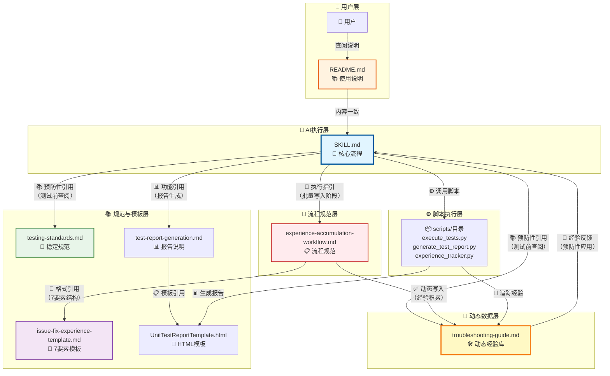

# Java单元测试技能使用说明

## 📋 技能概述

java-unit-test-skill 是一个专业的 Java 单元测试生成与执行技能，帮助开发人员快速生成高质量的单元测试代码。

### 核心能力

✅ **自动框架检测与调整**：强制使用 JUnit 5 + Mockito 框架，自动检测项目框架并升级  
✅ **智能测试代码生成**：基于被测类自动生成完整的测试代码，包含正常流程、异常场景、边界条件  
✅ **高覆盖率保证**：确保 100% 类覆盖率、90% 方法覆盖率、80% 行覆盖率  
✅ **经验即时积累**：每解决一个问题立即沉淀经验，避免重复踩坑  
✅ **自动报告生成**：测试通过后自动生成 HTML 格式的专业测试报告

---

## 🚀 快速开始

### 1. 基本使用

```bash
# 为指定类生成单元测试
/java-unit-test-skill 为 UserService 生成单元测试

# 为指定文件生成单元测试
/java-unit-test-skill 对 src/main/java/com/example/service/UserService.java 执行单元测试
```

### 2. 自动触发场景

该技能会在以下场景自动触发（无需手动调用）：

- 用户提到"生成单元测试"
- 用户提到"执行单元测试"
- 用户提到"补充单元测试"
- 用户提到"完善单元测试"
- 用户提到"编写单元测试"

### 3. 执行流程

```
检测项目框架 → 调整为JUnit 5 → 生成测试代码 → 编译测试 
→ 执行测试 → 修复错误 → 积累经验 → 生成报告
```

---

## 📁 文档结构

### 完整目录结构

```
java-unit-test-skill/
├── SKILL.md                                      # 核心工作流程（AI执行指南）
├── README.md                                     # 用户使用说明（本文档）
├── references/                                   # 参考文档目录
│   ├── testing-standards.md                      # 测试规范与最佳实践（稳定规范）
│   ├── troubleshooting-guide.md                  # 问题排查与经验积累（动态经验库）
│   ├── experience-accumulation-workflow.md       # 经验积累工作流程规范
│   ├── issue-fix-experience-template.md          # 问题修复经验模板（7要素格式）
│   ├── test-report-generation.md                 # 报告生成功能说明
│   └── UnitTestReportTemplate.html               # 单元测试报告HTML模板
└── scripts/                                      # 执行脚本目录（由技能自动调用）
    ├── execute_tests.py                          # 测试执行主脚本
    ├── generate_test_report.py                   # 报告生成脚本
    ├── experience_tracker.py                     # 经验追踪脚本
    ├── record_experience_summary.py              # 经验摘要记录脚本
    └── package_skill.py                          # 技能打包脚本（内部使用）
```

> 📌 **注意**：`scripts/` 目录下的脚本由技能自动调用，用户无需手动执行。

### 文档职责与关系

| 文档 | 性质 | 主要用途 | 更新频率 | 引用关系 |
|-----|------|---------|---------|----------|
| **SKILL.md** | 核心流程 | AI执行指南：框架检测、测试生成、经验积累机制、报告生成 | 低 | 引用所有references文档 |
| **README.md** | 用户说明 | 功能介绍、快速开始、使用示例、常见问题 | 低 | 与SKILL.md保持一致 |
| **testing-standards.md** | 稳定规范 | Mockito使用规范、测试设计规范、断言指南、命名规范 | 低（需评审） | 被SKILL.md预防性引用 |
| **troubleshooting-guide.md** | 动态经验库 | 常见问题速查表、Mockito异常处理经验（7要素格式）、最新案例 | 高（即时更新） | 被SKILL.md预防性引用和动态更新 |
| **experience-accumulation-workflow.md** | 流程规范 | 批量写入阶段详细流程、7要素格式说明、章节映射规则 | 低 | 被SKILL.md引用执行 |
| **issue-fix-experience-template.md** | 格式模板 | 7要素经验格式定义、模板示例、标签库 | 低 | 被workflow引用 |
| **test-report-generation.md** | 功能说明 | 报告内容、生成方式、跨平台配置、完整性校验清单 | 低 | 被SKILL.md引用 |
| **UnitTestReportTemplate.html** | 报告模板 | HTML报告结构、样式定义、12个必需章节 | 低 | 被脚本使用 |

---

## 🔗 文档关联关系链路图

### 整体架构图



### 关系说明

#### 1、👥 **用户层**
- **README.md**：用户面向的使用说明，与SKILL.md保持内容一致
- 用户通过README.md快速了解功能和使用方法

#### 2、🤖 **AI执行层**
- **SKILL.md**：核心执行指南，定义完整的测试生成流程
- 包含三大机制：
  - 📚 **预防性标准应用**：测试前查阅standards和troubleshooting
  - 📝 **经验积累机制**：测试后执行workflow批量写入
  - 📊 **报告生成**：调用脚本生成HTML报告

#### 3、📚 **规范与模板层**
- **testing-standards.md**：稳定的测试规范，低频更新，需团队评审
- **issue-fix-experience-template.md**：7要素经验格式模板
- **test-report-generation.md**：报告生成功能说明和校验清单
- **UnitTestReportTemplate.html**：12个章节的HTML报告模板

#### 4、💾 **动态数据层**
- **troubleshooting-guide.md**：动态经验库，高频更新
  - 包含：常见问题速查表、Mockito异常处理经验（7要素格式）
  - 形成闭环：预防性引用 → 动态写入 → 经验反馈

#### 5、🔄 **流程规范层**
- **experience-accumulation-workflow.md**：经验积累流程规范
  - 定义批量写入阶段的详细步骤
  - 引用template定义7要素格式
  - 向troubleshooting动态写入经验

#### 6、⚙️ **脚本执行层**
- **scripts/目录**：由AI自动调用，用户无需手动执行
  - `execute_tests.py`：执行测试
  - `generate_test_report.py`：生成HTML报告
  - `experience_tracker.py`：追踪经验积累

### 核心流转路径

```
1. 🔵 预防性应用路径：
   SKILL.md → testing-standards.md → troubleshooting-guide.md
   （生成测试前查阅规范和已有经验，预防重复犯错）

2. 🟢 经验积累路径：
   SKILL.md → experience-accumulation-workflow.md → issue-fix-experience-template.md → troubleshooting-guide.md
   （测试通过后批量整理7要素经验，写入动态经验库）

3. 🟡 报告生成路径：
   SKILL.md → test-report-generation.md → scripts/generate_test_report.py → UnitTestReportTemplate.html
   （调用脚本生成符合模板的HTML报告）

4. 🔄 闭环反馈路径：
   troubleshooting-guide.md → SKILL.md （预防性应用）
   （已积累的经验在下次执行时被预防性应用，形成持续改进）
```

---

## 🎓 核心特性详解

### 1. 框架自动检测与调整

**强制使用 JUnit 5 + Mockito 框架**

#### 检测内容
- pom.xml 依赖检查（junit-jupiter、mockito-junit-jupiter、**mockito-inline**）
- maven-surefire-plugin 版本检查（需 >= 2.22.0）
- **jacoco-maven-plugin 插件检查（必须，用于生成覆盖率报告）**
- 已有测试类注解风格检查

#### 自动调整策略
| 情况 | 操作 |
|-----|------|
| **缺失框架** | 自动添加 JUnit 5 + Mockito 依赖 + **mockito-inline** |
| **JUnit 4** | 移除 JUnit 4，添加 JUnit 5，迁移已有测试 |
| **版本过低** | 升级到推荐版本（JUnit 5.9.3, Mockito 4.11.0） |
| **Surefire过低** | 升级到 2.22.2+ |
| **缺少 mockito-inline** | **自动添加 mockito-inline 依赖（支持静态Mock）** |
| **缺少 jacoco** | **自动添加 jacoco-maven-plugin（生成覆盖率报告）** |

> ⚠️ **重要**：mockito-inline 和 jacoco-maven-plugin 是**强制要求**，如缺失则自动添加，确保：
> - 所有测试都能使用静态Mock功能
> - 自动生成准确的代码覆盖率报告
> - 避免在生成测试报告时因缺失配置而无法获取覆盖率数据

---

### 2. 智能测试代码生成

#### 生成的测试类结构

```java
@ExtendWith(MockitoExtension.class)
class UserServiceTest {

    @Mock
    private UserMapper userMapper;
    
    @InjectMocks
    private UserService userService;

    @BeforeEach
    void setUp() {
        MockitoAnnotations.openMocks(this);
    }
    
    /**
     * 测试目的：验证正常情况下能正确获取用户信息
     */
    @Test
    void getUser_Normal() {
        // Arrange - 准备测试数据
        // Act - 执行被测方法
        // Assert - 验证结果
    }
}
```

#### 自动覆盖的测试场景

✅ **基础场景**
- 正常流程（有数据返回）
- 空结果（返回空集合）
- Null值处理（返回null）

✅ **边界条件**
- 空集合输入
- 零值、负值
- BigDecimal精度处理

✅ **异常场景**
- 参数为null
- 业务异常
- 依赖调用失败

✅ **特殊逻辑**
- 分区逻辑（超过999个元素）
- 精度计算（四舍五入）
- 多条件分支

---

## 3. 经验即时积累机制

**核心原则**：问题修复后立即快速标记，测试通过后批量写入文档。

#### 轻量化立即积累策略

**阶段1：问题修复后的快速标记**（每次问题修复后立即执行）
```
✅ 修复问题成功
 ↓
📝 立即在对话中快速标记（10秒内完成，不打断主流程）：
   - 错误：[复制完整错误信息]
   - 原因：[一句话根本原因]
   - 解决：[一句话解决方案]
 ↓
▶️ 继续下一步（重新编译或测试，不暂停）
```

**阶段2：测试通过后的批量写入**（所有测试通过后一次性执行）
```
步骤1：遍历对话中的所有"问题记录"
 ↓
步骤2：调用 read_file 查看 troubleshooting-guide.md（1次）
 ↓
步骤3：从对话历史重建完整上下文（错误堆栈、代码对比、适用场景）
 ↓
步骤4：按7要素格式整理每个问题
 ↓
步骤5：调用 search_replace 一次性更新所有问题到对应章节（1次）
 ↓
步骤6：检查工具返回结果，确认保存成功
 ↓
步骤7：告知用户："已将 {N} 个问题的经验更新到 troubleshooting-guide.md"
```

#### 积累内容

1. **常见问题速查表**：错误信息、根本原因、解决方案
2. **Mockito异常处理经验**：详细的问题场景和代码示例（按7要素格式）
3. **已积累的测试模式**：分区逻辑、精度计算、Null处理等
4. **最新经验记录**：按日期记录的实际案例

---

### 4. 自动报告生成

**触发条件**：所有测试通过 且 经验已批量写入文档

#### 报告内容（12个部分）

| 序号 | 部分 | 内容 |
|-----|------|------|
| 1 | 项目信息 | 测试人员、JDK版本、构建工具 |
| 2 | 测试概述 | 所有被测方法列表 |
| 3 | 测试环境 | Mock框架版本 |
| 4 | 测试执行结果 | 总体情况 + 详细结果表（含预期/实际） |
| 5 | 代码覆盖率 | 统计 + 方法级详情 + 分析 |
| 6 | 测试用例设计亮点 | 重点功能、精度测试、异常覆盖 |
| 7 | Mock配置说明 | Mock对象和配置要点 |
| 8 | 发现的问题及修复 | 问题记录和解决方案 |
| 9 | 经验总结 | 本次测试的经验提炼 |
| 10 | 改进建议 | 后续优化方向 |
| 11 | 测试结论 | 测试质量评估 |
| 12 | 总结 | 整体总结 |

#### 报告存放位置

```
默认位置：<项目根目录>/document/单元测试报告/
文件名格式：{类名}_单元测试报告_YYYYMMDD_HHMMSS.html
```

---

## 📊 覆盖率标准

| 覆盖率类型 | 目标值 | 说明 |
|-----------|-------|------|
| **类覆盖率** | 100% | 所有被测类都生成测试 |
| **方法覆盖率** | 90% | 至少覆盖90%的方法 |
| **分支覆盖率** | 70% | 覆盖主要分支逻辑 |
| **行覆盖率** | 80% | 覆盖80%的代码行 |

---

## 🛠️ 使用示例

### 示例1：为Service生成测试

```bash
# 输入
/java-unit-test-skill 为 UserService 生成单元测试

# 技能执行流程
1. 检测项目框架：发现使用 JUnit 4
2. 自动升级：移除 JUnit 4，添加 JUnit 5
3. 生成测试代码：UserServiceTest.java（15个测试方法）
4. 编译测试：通过
5. 执行测试：15个测试全部通过
6. 经验积累：批量写入所有问题记录到 troubleshooting-guide.md
7. 覆盖率分析：类100%、方法95%、行85%
8. 生成报告：document/单元测试报告/UserService_单元测试报告_20260128_143022.html
```

### 示例2：修复测试错误

```bash
# 场景：测试执行失败
错误：UnnecessaryStubbingException

# 技能自动处理
1. 分析错误：定义了但未被调用的 stubbing
2. 修复方案：添加 lenient() 标记
3. 快速标记：在对话中记录（错误+原因+解决，10秒内）
4. 重新执行：测试通过
5. 批量写入：所有测试通过后，统一更新到 troubleshooting-guide.md
```

---

## 📚 详细文档导航

### 快速查阅指南

| 需求场景 | 查看文档 | 具体章节 | 文档性质 |
|---------|---------|---------|----------|
| **核心流程** | | | |
| 了解AI执行流程 | SKILL.md | 核心工作流程 | AI执行指南 |
| 了解经验积累机制 | SKILL.md | 经验积累机制（强制执行） | AI执行指南 |
| 了解预防性标准应用 | SKILL.md | 预防性标准应用（必须执行） | AI执行指南 |
| **测试规范** | | | |
| 查看命名规范 | testing-standards.md | 测试用例设计规范 > 命名规范 | 稳定规范 |
| 学习Mockito用法 | testing-standards.md | Mockito使用规范 | 稳定规范 |
| 了解必测场景清单 | testing-standards.md | 必测场景清单 | 稳定规范 |
| **问题排查** | | | |
| 遇到测试失败 | troubleshooting-guide.md | 常见问题速查表（15个问题） | 动态经验库 |
| UnnecessaryStubbingException | troubleshooting-guide.md | Mockito异常处理经验 > 1 | 动态经验库 |
| 静态Mock不支持 | troubleshooting-guide.md | Mockito异常处理经验 > 静态方法Mock | 动态经验库 |
| ResponseVO导致错误 | troubleshooting-guide.md | Mockito异常处理经验 > ResponseVO问题 | 动态经验库 |
| 分区逻辑如何测试 | troubleshooting-guide.md | 已积累的测试模式 > 1 | 动态经验库 |
| 精度计算如何测试 | troubleshooting-guide.md | 已积累的测试模式 > 2 | 动态经验库 |
| **经验积累** | | | |
| 了解经验积累流程 | experience-accumulation-workflow.md | 流程总览 | 流程规范 |
| 了解7要素格式 | experience-accumulation-workflow.md | 步骤1：按模板总结经验 | 流程规范 |
| 查看经验模板 | issue-fix-experience-template.md | 完整模板格式 | 格式模板 |
| 了解问题类型分类 | issue-fix-experience-template.md | 问题类型（Issue-Type） | 格式模板 |
| **报告生成** | | | |
| 如何生成报告 | test-report-generation.md | 功能介绍 | 功能说明 |
| 报告完整性要求 | test-report-generation.md | 报告完整性校验清单 | 功能说明 |
| Windows环境配置 | test-report-generation.md | 跨平台环境说明 | 功能说明 |
| 报告生成失败处理 | test-report-generation.md | 脚本失败降级方案 | 功能说明 |

---

## ⚙️ 环境要求

### 必需环境

- **Java**: JDK 8+
- **Maven**: 3.6+
- **Python**: 3.7+（用于报告生成）

### 推荐配置

```xml
<!-- JUnit 5 -->
<dependency>
    <groupId>org.junit.jupiter</groupId>
    <artifactId>junit-jupiter</artifactId>
    <version>5.9.3</version>
    <scope>test</scope>
</dependency>

<!-- Mockito JUnit 5 支持 -->
<dependency>
    <groupId>org.mockito</groupId>
    <artifactId>mockito-junit-jupiter</artifactId>
    <version>4.11.0</version>
    <scope>test</scope>
</dependency>

<!-- Maven Surefire Plugin -->
<plugin>
    <groupId>org.apache.maven.plugins</groupId>
    <artifactId>maven-surefire-plugin</artifactId>
    <version>2.22.2</version>
</plugin>
```

---

## 🔧 跨平台说明

### Windows环境

**Python命令**：
```bash
py -3 generate_test_report.py
```

**PowerShell多命令**：
```powershell
# 使用分号连接
cd "<项目路径>"; py -3 generate_test_report.py
```

**Maven参数**：
```powershell
# 必须加双引号
mvn test "-Dtest=UserServiceTest" "-DfailIfNoTests=false"
```

### Mac/Linux环境

**Python命令**：
```bash
python3 generate_test_report.py
```

**Bash/Zsh多命令**：
```bash
# 使用 && 或 ; 连接
cd "<项目路径>" && python3 generate_test_report.py
```

---

## 🐛 常见问题

### Q1: Tests run: 0，没有执行任何测试？

**原因**：maven-surefire-plugin 版本过低，不支持 JUnit 5

**解决方案**：
```xml
<plugin>
    <groupId>org.apache.maven.plugins</groupId>
    <artifactId>maven-surefire-plugin</artifactId>
    <version>2.22.2</version>
</plugin>
```

---

### Q2: ExceptionInInitializerError 错误？

**原因**：静态方法依赖 Spring 容器（如 `ResponseVO.success()`）

**解决方案**：
```java
// ❌ 错误方式
when(service.call()).thenReturn(ResponseVO.success(true));

// ✅ 正确方式
ResponseVO<Boolean> mockResponse = mock(ResponseVO.class);
when(mockResponse.isSuccess()).thenReturn(true);
doReturn(mockResponse).when(service).call();
```

---

### Q3: UnnecessaryStubbingException 错误？

**原因**：定义了但未被调用的 stubbing

**解决方案**：
```java
// 方案1：使用 lenient()
lenient().when(mockService.optionalMethod()).thenReturn("value");

// 方案2：使用 doReturn().when()（更稳定）
doReturn("value").when(mockService).optionalMethod();
```

---

### Q4: 如何提高测试覆盖率？

**策略**：
1. 补充异常分支测试
2. 补充边界条件测试（null、零、负数、空集合）
3. 补充多条件分支测试
4. 使用 JaCoCo 报告定位未覆盖代码

**查看覆盖率**：
```bash
mvn test jacoco:report
# 打开 target/site/jacoco/index.html
```

---

### Q5: 如何测试私有方法？

**推荐方式**：通过公共方法间接测试

**反射方式**（仅复杂场景）：
```java
@Test
void testPrivateMethod() throws Exception {
    Method method = ServiceClass.class.getDeclaredMethod("privateMethodName", String.class);
    method.setAccessible(true);
    Object result = method.invoke(serviceClass, "testInput");
    assertEquals("expectedResult", result);
}
```

---

## 📈 最佳实践

### 1. 测试方法命名

```java
// ✅ 推荐
void getUser_Normal()              // 正常流程
void getUser_EmptyResult()         // 空结果
void getUser_NullId()              // null参数
void getLoginCount_PartitionLogic() // 分区逻辑

// ❌ 不推荐
void test1()
void testGetUser()
```

### 2. 测试注释

```java
/**
 * 测试目的：验证当用户ID为null时，方法返回null而不是抛出异常
 */
@Test
void getUser_NullId() {
    User result = userService.getUser(null);
    assertNull(result);
}
```

### 3. Mock配置

```java
// ✅ 推荐：逐层Mock链式调用
HistoricTaskInstanceQuery query = mock(HistoricTaskInstanceQuery.class);
when(historyService.createHistoricTaskInstanceQuery()).thenReturn(query);
when(query.taskId(anyString())).thenReturn(query);

// ❌ 不推荐：直接Mock链式调用
when(historyService.createHistoricTaskInstanceQuery().taskId(taskId).singleResult())
    .thenReturn(task);
```

### 4. 参数匹配器

```java
// ✅ 推荐：全部使用匹配器
when(mapper.query(anyList(), any(Date.class))).thenReturn(result);

// ✅ 或全部使用具体值
when(mapper.query(specificList, specificDate)).thenReturn(result);

// ❌ 不推荐：混合使用（需要加eq）
when(mapper.query(specificList, any(Date.class))).thenReturn(result);
```

---

## 🤝 贡献与反馈

### 经验积累

每次使用该技能遇到新问题并解决后，经验会自动积累到 `troubleshooting-guide.md`。

### 规范更新

如需更新测试规范，请修改 `testing-standards.md` 并提交团队评审。

---

## 📞 技术支持

如遇到问题，请按以下顺序排查：

1. 查看 `troubleshooting-guide.md` 的常见问题速查表
2. 查看 `testing-standards.md` 的规范说明
3. 查看 `SKILL.md` 的核心流程
4. 查看生成的测试报告中的"发现的问题及修复"部分

---

## 📄 许可证

本技能遵循项目统一的许可证协议。

---

## 🔖 版本历史

- **v2.1** (2026-02-01): 文档结构重新梳理，新增文档关联关系链路图，完善文档导航
- **v2.0** (2026-01-28): 文档结构重构，规范与经验分离，统一经验积累策略
- **v1.5** (2026-01-27): 添加报告生成功能
- **v1.0** (2026-01-20): 初始版本，支持 JUnit 5 + Mockito

---

**最后更新**：2026-02-01
