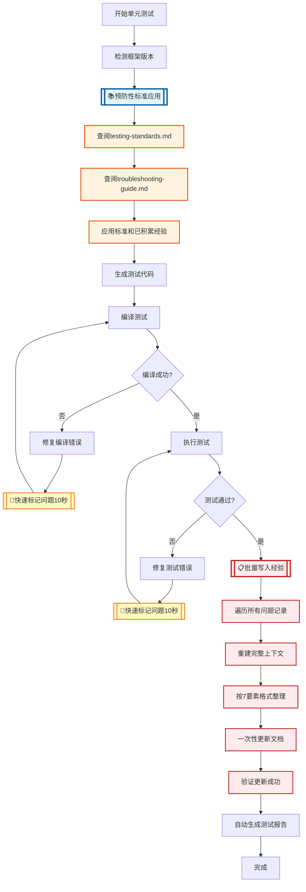

# Java单元测试技能

## 🚨 核心执行原则（AI必读）

**本 Skill 的核心价值在于"经验积累"机制，必须严格遵守以下执行原则。**

### 强制执行规则

#### 1. 立即性原则
每解决一个问题，**立即**积累经验，**不得延后**。

```
✅ 正确：修复编译错误 → ⏸️ 立即暂停 → 调用search_replace更新文档 → ✅ 继续
❌ 错误：修复编译错误 → 继续下一步 → ... → 最后总结（❌ 太晚了！）
```

#### 2. 工具调用原则
必须使用 `search_replace` 工具写入文档，**不能只是说"已记录"**。

```
✅ 正确：调用 search_replace 工具更新 troubleshooting-guide.md
❌ 错误：说"我已经记录了经验"但没有实际调用工具
❌ 错误：说"稍后总结"而继续其他工作
```

#### 3. 验证原则
确认文档更新成功后才能继续，**不能假设更新成功**。

```
✅ 正确：调用工具 → 检查返回结果 → 确认成功 → 继续
❌ 错误：调用工具后立即继续，不检查结果
```

#### 4. 完整性原则
所有问题都必须积累，**不得遗漏任何问题**。

```
✅ 正确：每个编译错误、每个测试失败都立即积累
❌ 错误：只积累"重要"问题，忽略"小问题"
```

---

### ⚠️ 违反规则的典型表现（必须避免）

| 违规行为 | 表现 | 后果 |
|---------|------|------|
| **延迟积累** | 修复问题后说"稍后总结"继续工作 | 遗忘问题细节，无法准确记录 |
| **虚假记录** | 说"已记录"但没有调用工具 | 文档未更新，经验丢失 |
| **跳过验证** | 调用工具后不检查结果 | 更新可能失败但不知道 |
| **选择性积累** | 只记录"重要"问题 | 经验不完整，问题重复出现 |
| **批量总结** | 测试全部通过后才开始积累 | 遗漏大部分细节和上下文 |

---

## ✅ 正确的执行方式（必须遵循）

**采用“轻量化立即积累策略”：问题修复后立即快速标记，测试通过后批量写入文档。**

> 💡 **策略说明**：本策略的完整流程和执行细节请参考本文档的 [经验积累机制（强制执行）](#经验积累机制强制执行) 章节。

### 简要流程

#### 场景1：编译错误修复后

```markdown
1. ✅ 修复编译错误（如：添加缺失依赖）
2. 📝 在对话中快速标记（错误 + 原因 + 解决，10秒内）
3. ▶️ 继续下一步（重新编译，不打断主流程）
```

#### 场景2：测试失败修复后

```markdown
1. ✅ 修复测试失败（如：调整Mock配置）
2. 📝 在对话中快速标记（错误 + 原因 + 解决，10秒内）
3. ▶️ 继续下一步（重新执行测试，不打断主流程）
```

#### 场景3：所有测试通过后

```markdown
1. ✅ 所有测试执行成功
2. 📋 批量写入经验（一次性完成）：
   - 🔍 遍历对话中的所有“问题记录”
   - 📖 调用 read_file 查看 troubleshooting-guide.md
   - ✍️ 从对话历史重建完整上下文
   - 📑 按7要素格式整理每个问题
   - 💾 调用 search_replace 一次性更新所有问题
   - ✅ 检查工具返回结果，确认保存成功
3. 💬 告知用户：“已将 {N} 个问题的经验更新到 troubleshooting-guide.md”
4. ▶️ 继续询问是否生成测试报告
```

> ⚠️ **注意**：由于Skill本身没有集成自动调用脚本的机制，需要在测试执行完成后主动询问用户是否需要报告。

---

### 🔍 执行过程自检清单

#### 阶段1：问题修复后的快速标记（每次问题修复后）

- [ ] 📝 **我是否立即在对话中快速标记了问题？**
  - ✅ 必须包含：错误信息 + 原因 + 解决方案
  - ❌ 如果没有 → 立即标记
  
- [ ] ▶️ **我是否继续了主流程？**
  - ✅ 标记后立即继续编译/测试
  - ❌ 不要暂停，不要等待

#### 阶段2：测试通过后的批量写入（所有测试通过后）

- [ ] 🔍 **我是否遍历了对话中的所有“问题记录”？**
  - ❌ 如果没有 → 立即遍历
  
- [ ] 📖 **我是否调用了 `read_file` 查看文档当前内容？**
  - ❌ 如果没有 → 立即调用，确认更新位置
  
- [ ] ✍️ **我是否调用了 `search_replace` 更新文档？**
  - ✅ 必须一次性更新所有问题
  - ❌ 如果没有 → 立即调用，写入经验
  
- [ ] ✅ **我是否验证了更新成功？**
  - ❌ 如果没有 → 检查工具返回结果
  
- [ ] 💬 **我是否明确告知用户已更新文档？**
  - ✅ 必须说明更新了多少个问题
  - ❌ 如果没有 → 明确说明更新内容

**如果任何一项为“否”，立即停止并执行该步骤。**

---

### 📊 强制执行节点标识（轻量化版本）

在工作流程中，以下节点是**快速标记节点**，必须完成标记才能继续：

```
📝 **快速标记节点1**：编译错误修复成功
   ↓
   立即在对话中快速标记（错误+原因+解决，10秒内）
   ↓
   ✅ 立即继续编译（不暂停，不调用工具）

📝 **快速标记节点2**：测试失败修复成功
   ↓
   立即在对话中快速标记（错误+原因+解决，10秒内）
   ↓
   ✅ 立即继续执行测试（不暂停，不调用工具）

📝 **快速标记节点3**：发现新问题并解决
   ↓
   立即在对话中快速标记（错误+原因+解决，10秒内）
   ↓
   ✅ 立即继续后续工作（不暂停，不调用工具）

📋 **批量写入节点**：所有测试通过
   ↓
   步骤1：遍历对话中的所有"问题记录"
   ↓
   步骤2：调用 read_file 查看 troubleshooting-guide.md
   ↓
   步骤3：从对话历史重建完整上下文（错误堆栈、代码、场景）
   ↓
   步骤4：按7要素格式整理每个问题
   ↓
   步骤5：调用 search_replace 一次性更新所有问题到对应章节
   ↓
   步骤6：验证更新成功
   ↓
   步骤7：告知用户"已将 {N} 个问题的经验更新到文档"
   ↓
   ✅ 继续生成报告
```

**关键优化点**：
- ✅ 快速标记：10秒内完成，不打断主流程
- ✅ 批量写入：一次性处理所有问题，减少工具调用
- ✅ 上下文保留：对话历史重建，经验质量95%+

---

## 核心工作流程

### 0. 检测并调整项目单元测试框架（首要步骤）

**本 skill 强制使用 JUnit 5 + Mockito 框架。在生成任何测试代码之前，必须先检测并调整项目单元测试框架！**

#### 框架检测方法

1. **检查 `pom.xml` 中的依赖**：
   - 查找 `junit-jupiter` 或 `junit-jupiter-api` → 已有 JUnit 5 ✓
   - 查找 `junit` (version 4.x) → 存在 JUnit 4，需要升级
   - 查找 `mockito-junit-jupiter` → 已有 Mockito JUnit 5 支持 ✓
   - 查找 `mockito-core` → 检查版本是否 >= 4.0
   - **查找 `mockito-inline`（必须）→ 支持静态方法Mock，如缺失则自动添加**

2. **检查 `maven-surefire-plugin` 版本**：
   - **版本 < 2.22.0**：不支持 JUnit 5，必须升级至 2.22.0+
   - **版本 >= 2.22.0**：支持 JUnit 5 ✓

3. **检查 `jacoco-maven-plugin` 插件（必须）**：
   - **查找 `jacoco-maven-plugin` → 用于生成代码覆盖率报告，如缺失则自动添加**
   - **必须包含 `prepare-agent` 和 `report` 两个 execution**
   - **版本建议 >= 0.8.8**

4. **查看项目已有测试类的注解风格**：
   - `@RunWith(MockitoJUnitRunner.class)` → JUnit 4，需要迁移
   - `@ExtendWith(MockitoExtension.class)` → JUnit 5 ✓

#### 框架调整策略

##### 情况 1：项目缺失单元测试框架
在 `pom.xml` 的 `<dependencies>` 中添加：

```xml
<!-- JUnit 5 -->
<dependency>
    <groupId>org.junit.jupiter</groupId>
    <artifactId>junit-jupiter</artifactId>
    <version>5.9.3</version>
    <scope>test</scope>
</dependency>
<!-- Mockito JUnit 5 支持 -->
<dependency>
    <groupId>org.mockito</groupId>
    <artifactId>mockito-junit-jupiter</artifactId>
    <version>4.11.0</version>
    <scope>test</scope>
</dependency>
<!-- Mockito inline 支持静态Mock（必须） -->
<dependency>
   <groupId>org.mockito</groupId>
   <artifactId>mockito-inline</artifactId>
   <version>4.11.0</version>
   <scope>test</scope>
</dependency>
```

在 `<build><plugins>` 中添加或修改：

```xml
<!-- Maven Surefire 插件（支持JUnit 5） -->
<plugin>
    <groupId>org.apache.maven.plugins</groupId>
    <artifactId>maven-surefire-plugin</artifactId>
    <version>2.22.2</version>
</plugin>

<!-- Jacoco 代码覆盖率插件（必须） -->
<plugin>
    <groupId>org.jacoco</groupId>
    <artifactId>jacoco-maven-plugin</artifactId>
    <version>0.8.8</version>
    <executions>
        <execution>
            <id>prepare-agent</id>
            <goals>
                <goal>prepare-agent</goal>
            </goals>
        </execution>
        <execution>
            <id>report</id>
            <phase>test</phase>
            <goals>
                <goal>report</goal>
            </goals>
        </execution>
    </executions>
</plugin>
```

##### 情况 2：项目使用 JUnit 4
需要升级到 JUnit 5：

1. **移除 JUnit 4 依赖**，添加 JUnit 5 依赖（同上）
2. **升级 maven-surefire-plugin** 至 2.22.0+（同上）
3. **迁移已有测试类**（如果存在）：
   - `@RunWith(MockitoJUnitRunner.class)` → `@ExtendWith(MockitoExtension.class)`
   - `@Before` → `@BeforeEach`
   - `@After` → `@AfterEach`
   - `import org.junit.Test` → `import org.junit.jupiter.api.Test`
   - `import org.junit.Assert.*` → `import org.junit.jupiter.api.Assertions.*`

##### 情况 3：项目已使用 JUnit 5
验证版本是否足够新，确保：
- `junit-jupiter` >= 5.8.0
- `mockito-junit-jupiter` >= 4.0.0
- **`mockito-inline` >= 4.0.0（如缺失则自动添加）**
- **`jacoco-maven-plugin` >= 0.8.8（如缺失则自动添加）**

#### 自动化检查流程

**在执行单元测试前，必须按以下顺序自动检查并添加配置：**

1. **读取项目 pom.xml 文件**
2. **检查并添加必需依赖**：
   - 搜索 `mockito-inline`，如不存在则添加到 `<dependencies>` 标签内
3. **检查并添加必需插件**：
   - 搜索 `jacoco-maven-plugin`，如不存在则添加到 `<build><plugins>` 标签内
   - 确保包含 `prepare-agent` 和 `report` 两个 execution
4. **保存 pom.xml 并通知用户**
5. **继续执行后续测试步骤**

> ⚠️ **重要**：这些配置是**强制要求**，确保：
> - 所有测试都能使用静态Mock功能（mockito-inline）
> - 自动生成准确的代码覆盖率报告（jacoco）
> - 避免在生成测试报告时因缺失配置而无法获取覆盖率数据

### 1. 预防性标准应用（必须执行）

**在生成任何测试代码之前，必须先查阅并应用已有标准和经验，防止重复犯错！**

#### 1.1 查阅标准规范（必读）

打开并查阅以下文档的关键章节：

1. **[testing-standards.md](references/testing-standards.md)**
   - **命名规范**：确认使用标准场景后缀（14个）
   - **必测场景清单**：数据查询类（3个场景）、计数类（2个场景）、百分比计算（5个场景）、时间格式化（5个场景）
   - **Mockito使用规范**：链式调用、参数匹配器、lenient()使用

2. **[troubleshooting-guide.md](references/troubleshooting-guide.md)**
   - **常见问题速查表**：检查15个常见问题，确保不重复犯错
   - **Mockito异常处理经验**：UnnecessaryStubbingException、NullPointerException、Spring容器依赖、参数匹配器混合使用、静态Mock、静态枚举Mock、ResponseVO导致StackOverflow等7个问题

3. **[test-report-generation.md](references/test-report-generation.md)**
   - **报告必须包含的部分**：12个必须部分，严格对照模板
   - **跨平台环境说明**：Windows/Mac/Linux的命令差异

#### 1.2 应用标准清单（强制检查）

在生成测试代码前，必须确认已应用以下标准：

- [ ] 已查阅 testing-standards.md 的命名规范和必测场景
- [ ] 已查阅 troubleshooting-guide.md 的常见问题和Mockito异常处理经验
- [ ] 已确认被测类是否涉及已知的特殊逻辑（分区、精度计算、时间格式化等）
- [ ] 已确认是否需要使用 lenient() 或 doReturn().when()
- [ ] 已确认是否涉及 Spring 容器依赖问题
- [ ] 已确认参数匹配器使用规范（避免混合使用）

> ⚠️ **重要**：不查阅标准直接生成测试，必然会重复遇到已解决过的问题！

### 2. 分析被测类
- 识别所有依赖项（@Autowired/@Resource字段，如Mapper、Service等）
- 分析所有方法（public/private）及其参数类型和返回值
- 识别特殊逻辑（分区处理、BigDecimal计算、日期处理等）
- 检查是否有批量处理逻辑（如ListUtil.partition分区处理）
- **对照 troubleshooting-guide.md 的「Mockito异常处理经验」，确认是否有已知问题需要预防**

### 3. 生成测试类结构

**本 skill 统一使用 JUnit 5 + Mockito 框架模板**

#### JUnit 5 测试类模板

**必需 import 语句**
```java
import org.junit.jupiter.api.BeforeEach;
import org.junit.jupiter.api.Test;
import org.junit.jupiter.api.extension.ExtendWith;
import org.mockito.InjectMocks;
import org.mockito.Mock;
import org.mockito.MockitoAnnotations;
import org.mockito.junit.jupiter.MockitoExtension;

import java.util.*;

import static org.junit.jupiter.api.Assertions.*;
import static org.mockito.Mockito.*;
```

**测试类结构**
```java
@ExtendWith(MockitoExtension.class)
class ServiceNameTest {

    @Mock
    private DependencyMapper dependencyMapper;

    @InjectMocks
    private ServiceClass serviceClass;

    @BeforeEach
    void setUp() {
        MockitoAnnotations.openMocks(this);
    }
    
    // 测试方法...
}
```

#### JUnit 5 核心注解说明

| 注解 | 用途 | 说明 |
|-----|------|------|
| `@ExtendWith(MockitoExtension.class)` | 启用 Mockito | 自动初始化 Mock 对象 |
| `@Mock` | 创建 Mock 对象 | 模拟依赖项 |
| `@InjectMocks` | 注入被测对象 | 自动注入 @Mock 标注的依赖 |
| `@BeforeEach` | 每个测试前执行 | 初始化测试环境 |
| `@AfterEach` | 每个测试后执行 | 清理测试环境 |
| `@Test` | 标记测试方法 | 无需 public 修饰符 |

### 4. 生成测试方法

#### 命名规范

**基本格式**：`方法名()` 或 `方法名_场景后缀()`

**常用场景后缀示例**：
- `_Normal` - 正常流程
- `_EmptyResult` - 空结果
- `_NullResult` - Null返回值
- `_PartitionLogic` - 分区逻辑
- `_ZeroValue`、`_NegativeValue` - 边界条件

> 📚 **完整的场景后缀列表（14个）**，请参考：
> - [testing-standards.md](references/testing-standards.md) - 测试方法命名规范

#### AAA模式结构
```java
@Test
void getLoginCountByBeforCurYear_Normal() {
    // Arrange - 准备测试数据
    Set<String> userNoSet = new HashSet<>(Arrays.asList("user1", "user2"));
    Date currYearDate = new Date();
    
    UserCountVo vo1 = new UserCountVo();
    vo1.setUserNo("user1");
    vo1.setCount(5);
    List<UserCountVo> countList = Arrays.asList(vo1);
    
    when(mapper.getLoginCount(anyList(), any(Date.class))).thenReturn(countList);

    // Act - 执行被测方法
    Map<String, String> result = service.getLoginCountByBeforCurYear(userNoSet, currYearDate);
    
    // Assert - 验证结果
    assertNotNull(result);
    assertEquals("5", result.get("user1"));
}
```

## 必须覆盖的测试场景

### 基础场景
- 正常流程（有数据返回）
- 空结果（返回空集合）
- Null值处理（返回null）

### 边界条件
- 空集合输入
- 单元素集合
- 零值、负值
- BigDecimal精度（四舍五入到两位小数）

### 异常测试

**JUnit 5 异常测试方式**

```java
@Test
void processData_WithInvalidInput() {
    // 测试方法抛出预期异常
    assertThrows(IllegalArgumentException.class, () -> {
        service.processData(null);
    });
}

@Test
void processData_WithExceptionMessage() {
    // 验证异常消息
    IllegalArgumentException exception = assertThrows(
        IllegalArgumentException.class,
        () -> service.processData(invalidInput)
    );
    assertTrue(exception.getMessage().contains("参数不能为空"));
}

@Test
void processData_NoException() {
    // 验证方法不抛出异常
    assertDoesNotThrow(() -> {
        service.processData(validInput);
    });
}
```

### 特殊逻辑

识别并测试以下特殊业务逻辑：

- **分区逻辑**：当集合超过999个元素时，需测试分区处理的正确性
- **精度计算**：测试 BigDecimal 四舍五入、除零处理
- **多条件分支**：覆盖所有 if/else 分支
- **链式调用**：完整模拟依赖链

> 📚 **详细示例和常见问题**，请参考：
> - [testing-standards.md](references/testing-standards.md) - 必测场景清单
> - [troubleshooting-guide.md](references/troubleshooting-guide.md) - Mockito异常处理经验

## Mock配置关键原则

### 基本原则

1. **完整模拟依赖链**：特别是链式调用，逐层创建Mock对象
2. **避免Spring依赖**：静态方法依赖Spring容器时，使用mock对象替代
3. **参数匹配器一致性**：同一方法调用中，要么全部使用匹配器，要么全部使用具体值
4. **处理可选stubbing**：对可能不被调用的stubbing使用`lenient()`或`doReturn().when()`

### 示例：Spring依赖问题
```java
// 错误方式 - ResponseVO.success() 内部调用了 MessageUtils 依赖 Spring
when(service.call()).thenReturn(ResponseVO.success(true));

// 正确方式 - 使用 mock 对象
ResponseVO<Boolean> mockResponse = mock(ResponseVO.class);
when(mockResponse.isSuccess()).thenReturn(true);
doReturn(mockResponse).when(service).call();
```

> 📚 **详细规范和更多示例**，请参考：
> - [testing-standards.md](references/testing-standards.md) - Mockito使用规范
> - [troubleshooting-guide.md](references/troubleshooting-guide.md) - Mockito异常处理经验

## 覆盖率要求

| 覆盖率类型 | 目标值 |
|-----------|-------|
| 类覆盖率 | 100% |
| 方法覆盖率 | 90% |
| 分支覆盖率 | 70% |
| 行覆盖率 | 80% |

## 代码注释规范

### 基本要求
1. **所有注释必须使用中文**
2. **每个测试方法必须包含测试目的注释**

### 测试方法注释格式
```java
/**
 * 测试目的：验证当处理时间超过1天时，时间格式化方法能正确返回包含"天"的字符串
 */
@Test
void getFastestProcessingTimeStr_WithLargeTime() {
    // 准备测试数据：1天1小时1分1秒 = 90061000毫秒
    Long fastestProcessingTime = 90061000L;
    
    String result = service.getFastestProcessingTimeStr(fastestProcessingTime);
    
    assertNotNull(result);
    assertTrue(result.contains("天") || result.contains(":"));
}

/**
 * 测试目的：验证当输入为null时，方法返回null而不是抛出异常
 */
@Test
void getFastestProcessingTimeStr_NullValue() {
    String result = service.getFastestProcessingTimeStr(null);
    assertNull(result);
}

/**
 * 测试目的：验证超过999个用户时的分区查询逻辑，确保数据正确合并
 */
@Test
void getLoginCountByBeforCurYear_PartitionLogic() {
    // 构造超过999个用户的测试数据
    Set<String> userNoSet = new HashSet<>();
    for (int i = 0; i < 1000; i++) {
        userNoSet.add("user" + i);
    }
    // ...
}
```

## 私有方法测试

### 间接测试（推荐）
通过公共方法调用间接测试私有方法，确保覆盖率。

### 反射测试（复杂私有方法）
```java
@Test
void testPrivateMethod() throws Exception {
    // 获取私有方法
    Method method = ServiceClass.class.getDeclaredMethod("privateMethodName", String.class);
    method.setAccessible(true);
    
    // 调用私有方法
    Object result = method.invoke(serviceClass, "testInput");
    
    // 验证结果
    assertEquals("expectedResult", result);
}
```

## 参考文档

- **测试规范与最佳实践**：详见 [testing-standards.md](references/testing-standards.md)
  - Mockito 使用规范、测试用例设计规范、测试数据构建模式、断言使用指南
- **问题排查与经验积累**：详见 [troubleshooting-guide.md](references/troubleshooting-guide.md)
  - 常见问题速查表、Mockito异常处理经验、测试执行失败排查流程、最新经验记录
- **经验积累工作流程**：详见 [experience-accumulation-workflow.md](references/experience-accumulation-workflow.md)
  - Java单元测试经验积累流程规范，确保问题修复经验按统一格式记录并分类归档
- **问题修复经验模板**：详见 [issue-fix-experience-template.md](references/issue-fix-experience-template.md)
  - 规范化单元测试问题修复经验的积累格式（7要素结构）
- **报告生成功能**：详见 [test-report-generation.md](references/test-report-generation.md)

## 验证检查清单

### 执行前检查（预防性）

在生成测试代码之前，必须确认：
- [ ] 已查阅 testing-standards.md 的命名规范
- [ ] 已查阅 testing-standards.md 的必测场景清单
- [ ] 已查阅 troubleshooting-guide.md 的常见问题速查表
- [ ] 已查阅 troubleshooting-guide.md 的Mockito异常处理经验
- [ ] 已确认被测类是否涉及已知特殊逻辑
- [ ] **已检查被测类是否依赖静态工具类（如MessageUtils、SpringUtil等）**
- [ ] **已确认被测类的返回值类型（如ResponseVO）是否会触发静态初始化**

### 执行后验证（事后检查）

生成测试后必须验证：
- [ ] 编译通过
- [ ] 所有测试执行成功
- [ ] 覆盖率达标
- [ ] 包含正常/异常/边界测试
- [ ] 分区逻辑已测试（如适用）
- [ ] 精度计算已测试（如适用）
- [ ] 注释使用中文
- [ ] **每个测试方法包含测试目的注释**
- [ ] **经验已积累到troubleshooting-guide.md**
- [ ] **生成单元测试报告**

## 经验积累机制（强制执行）

### ⚠️ 重要声明

**1. 积累的是"问题修复经验"，不是"测试执行结果"**

**2. 经验积累必须遵循 [experience-accumulation-workflow.md](references/experience-accumulation-workflow.md) 定义的Java单元测试经验积累流程规范**

```
❌ 错误理解：积累每次测试的执行结果
   - 测试类A执行结果：14个测试，6个通过，8个失败 → 记录
   - 测试类B执行结果：20个测试，20个通过 → 记录
   - 这种记录没有价值，下次不能复用

✅ 正确理解：积累问题修复的通用经验
   - 遇到问题X：静态Mock不支持 → 修复成功 → 立即按经验积累流程规范积累经验 → 记录到troubleshooting-guide.md
   - 遇到问题Y：ResponseVO导致StackOverflow → 修复成功 → 立即按经验积累流程规范积累经验 → 记录到troubleshooting-guide.md
   - 下次遇到类似问题 → 查阅已有经验 → 直接应用，避免重复犯错
```

#### 积累的内容（必须明确）

**✅ 应该积累：**
- 编译错误的根本原因和解决方案（如：缺少mockito-inline依赖）
- 测试失败的Mockito配置技巧（如：使用doReturn().when()模式）
- 框架兼容性问题的处理方法（如：升级surefire插件）
- 通用的问题修复方法（如：静态Mock处理、Spring容器依赖处理）

**❌ 不应该积累：**
- 某次测试的执行结果（多少个测试通过/失败）
- 特定项目特定类的业务逻辑细节
- 只适用于单个项目的特殊解决方案

#### 积累的价值（必须理解）

积累问题修复经验的目的是：
1. **可复用性**：下次遇到相同或类似问题时，可以直接应用已有经验
2. **预防性**：在生成测试代码前，查阅已有经验，预防重复犯错
3. **通用性**：经验适用于所有使用JUnit 5 + Mockito的Java项目
4. **持续改进**：每解决一个新问题，技能就进化一次

---

### 工作流程



**流程关键点说明**：

1. 📚 **蓝色节点**：预防性标准应用
   - 在生成测试代码之前必须执行
   - 查阅 testing-standards.md 和 troubleshooting-guide.md
   - 应用已有标准和经验，**防止重复犯错**

2. 📝 **黄色节点**：快速标记问题（轻量级）
   - 问题修复后立即在对话中快速标记（10秒内）
   - 不调用工具，不暂停主流程
   - 保留问题上下文，确保后续批量写入时不遗漏

3. 📋 **红色节点**：批量写入经验（重量级）
   - 所有测试通过后一次性执行
   - 遍历对话中的所有问题记录
   - 调用工具一次性更新文档
   - 确保经验质量和完整性

4. **闭环机制**：
   - 先应用已有经验预防问题
   - 遇到新问题快速标记
   - 测试通过后批量写入
   - 下次执行时可以预防
   - **形成持续改进的闭环**

### 轻量化立即积累策略（统一执行方式）

**核心原则**：问题修复后立即快速标记，测试通过后批量写入文档。

#### 阶段1：问题修复后的快速标记（每次问题修复后立即执行）

**执行时机**：编译错误修复、测试失败修复、框架问题解决、Mockito配置优化后

**操作要求**：
```markdown
1. ✅ 修复问题成功
2. 📝 **立即在对话中快速标记**（10秒内完成，不打断主流程）：
   ---
   📝 **问题记录 #{序号}**
   - 错误：[复制完整错误信息]
   - 原因：[一句话根本原因]
   - 解决：[一句话解决方案]
   ---
3. ▶️ 继续下一步（重新编译或测试，不暂停）
```

**示例**：
```markdown
📝 **问题记录 #1**
- 错误：UnnecessaryStubbingException: Unnecessary stubbings detected
- 原因：在@BeforeEach中配置了stubbing但某些测试未调用
- 解决：使用lenient().when()替代when()
---
```

#### 阶段2：测试通过后的批量写入（所有测试通过后一次性执行）

**执行时机**：所有测试方法执行成功后

**操作步骤**：
```markdown
1. ✅ 所有测试执行成功
2. 📋 **批量写入经验**（一次性完成）：
   
   步骤1：遍历对话中的所有"问题记录"
   ↓
   步骤2：调用 read_file 查看 troubleshooting-guide.md（1次）
   ↓
   步骤3：从对话历史重建完整上下文（错误堆栈、代码对比、适用场景）
   ↓
   步骤4：按 [experience-accumulation-workflow.md](references/experience-accumulation-workflow.md) 的7要素格式整理每个问题
   ↓
   步骤5：调用 search_replace 一次性更新所有问题到对应章节（1次）
   ↓
   步骤6：检查工具返回结果，确认保存成功
   ↓
   步骤7：告知用户："已将 {N} 个问题的经验更新到 troubleshooting-guide.md"
   
3. ▶️ 继续询问是否生成测试报告
```

**批量写入格式要求**：
- 遵循 [experience-accumulation-workflow.md](references/experience-accumulation-workflow.md) 的7要素结构
- 包含：问题标识、问题类型、错误特征、根本原因、解决方案、适用场景、经验标签
- 添加到正确的章节（常见问题速查表、Mockito异常处理经验等）

---

**执行检查清单**：

**阶段1检查（每次问题修复后）：**
- [ ] 📝 我是否立即在对话中快速标记了问题？
  - ✅ 必须包含：错误信息 + 原因 + 解决方案
  - ❌ 如果没有 → 立即标记
- [ ] ▶️ 我是否继续了主流程？
  - ✅ 标记后立即继续编译/测试
  - ❌ 不要暂停，不要等待

**阶段2检查（所有测试通过后）：**
- [ ] 🔍 我是否遍历了对话中的所有"问题记录"？
  - ❌ 如果没有 → 立即遍历
- [ ] 📖 我是否调用了 `read_file` 查看文档当前内容？
  - ❌ 如果没有 → 立即调用，确认更新位置
- [ ] ✍️ 我是否调用了 `search_replace` 更新文档？
  - ✅ 必须一次性更新所有问题
  - ❌ 如果没有 → 立即调用，写入经验
- [ ] ✅ 我是否验证了更新成功？
  - ❌ 如果没有 → 检查工具返回结果
- [ ] 💬 我是否明确告知用户已更新文档？
  - ✅ 必须说明更新了多少个问题
  - ❌ 如果没有 → 明确说明更新内容

**如果任何一项为"否"，立即停止并执行该步骤。**

---

**关键优化点**：
- ✅ 快速标记：10秒内完成，不打断主流程
- ✅ 批量写入：一次性处理所有问题，减少工具调用
- ✅ 上下文保留：对话历史重建，经验质量95%+
- ✅ 流程高效：主流程不中断，测试执行更流畅

> 🚨 **不执行经验积累的后果**：下次遇到相同问题时，将重复浪费时间解决。

#### 批量写入时的章节映射

| 问题类型 | 目标章节 | 文档位置 |
|---------|---------|----------|
| 编译错误修复 | 常见问题速查表 | [troubleshooting-guide.md](references/troubleshooting-guide.md) |
| 测试执行失败修复 | Mockito异常处理经验 | [troubleshooting-guide.md](references/troubleshooting-guide.md) |
| 框架兼容性问题 | 测试执行失败排查流程 | [troubleshooting-guide.md](references/troubleshooting-guide.md) |
| Mockito配置技巧 | Mockito异常处理经验 | [troubleshooting-guide.md](references/troubleshooting-guide.md) |
| 覆盖率提升方法 | 覆盖率提升策略 | [troubleshooting-guide.md](references/troubleshooting-guide.md) |
| 报告生成问题 | 报告生成常见问题 | [troubleshooting-guide.md](references/troubleshooting-guide.md) |

详细的章节选择规则请参考：[experience-accumulation-workflow.md](references/experience-accumulation-workflow.md) - 步骤2

### 积累内容格式

每解决一个问题，立即记录到 `troubleshooting-guide.md` 文档中：

- **编译错误修复** → 更新「常见问题速查表」
- **测试执行失败修复** → 更新「Mockito异常处理经验」
- **发现新的框架问题** → 更新「常见问题速查表」
- **发现新的Mockito配置技巧** → 更新「Mockito异常处理经验」

> 📚 **经验积累文档**：[troubleshooting-guide.md](references/troubleshooting-guide.md)

### 完成后总体检查

所有测试通过后，必须执行以下检查：

1. **回顾本次遇到的所有问题**：
   - 编译错误有哪些？
   - 测试失败有哪些？
   - 框架兼容问题有哪些？

2. **检查经验是否已积累**：
   - 打开 [troubleshooting-guide.md](references/troubleshooting-guide.md) 文件
   - 确认「常见问题速查表」包含本次所有问题
   - 确认「最新经验积累」包含本次测试案例

3. **补充缺失的经验**：
   - 如果有未积累的经验，立即补充

### 自动触发报告生成

**在以下情况下会提示生成单元测试报告：**

1. 所有测试方法执行成功 **且** 经验已全部积累
2. 所有测试方法执行成功 **且** 本次无新经验需积累

**技能会自动提示是否生成报告，用户确认后生成。**

> 📌 **技术说明**：提供两种报告生成方式：
> - **推荐方式**：使用 `scripts/generate_universal_test_report.py` 通用脚本，自动解析测试结果和覆盖率数据，基于 `UnitTestReportTemplate.html` 模板生成
> - **示例方式**：`scripts/generate_test_report.py` 包含硬编码示例数据，仅供参考
> 
> 👉 **推荐使用通用脚本**，无需修改代码，支持命令行参数配置。详细使用说明请查阅 [test-report-generation.md](references/test-report-generation.md)。

**报告默认生成到：** `项目根目录/document/单元测试报告/`

> ⚠️ **注意**：由于Skill本身没有集成自动调用脚本的机制，需要在测试执行完成后主动询问用户是否需要报告。

## 单元测试报告生成

当所有单元测试方法都执行成功后，将询问开发人员是否生成HTML格式的单元测试报告。

### 报告生成方式

#### 方式1：通用脚本（推荐）

**特点**：
- ✅ 自动解析 `target/surefire-reports/TEST-*.xml` 测试报告
- ✅ 自动解析 `target/site/jacoco/index.html` 覆盖率数据
- ✅ 使用 `UnitTestReportTemplate.html` 标准模板
- ✅ 支持命令行参数，无需修改代码

**使用示例**：
```bash
# Windows环境
py -3 "~/.qoder/skills/java-unit-test-skill/scripts/generate_universal_test_report.py" \
  --test-class YourTestClass \
  --module-path your-module/provider

# Mac/Linux环境
python3 ~/.qoder/skills/java-unit-test-skill/scripts/generate_universal_test_report.py \
  --test-class YourTestClass \
  --module-path your-module/provider
```

**参数说明**：
- `--test-class`：被测类名（必需）
- `--project-path`：项目根路径（可选，默认为当前目录）
- `--module-path`：子模块路径（可选）
- `--output-dir`：报告输出目录（可选，默认为 `document/单元测试报告`）
- `--tester-name`：测试人员姓名（可选）

> 📚 **详细文档**：查阅 [test-report-generation.md](references/test-report-generation.md) 了解完整使用说明。

#### 方式2：示例脚本（仅供参考）

`scripts/generate_test_report.py` 包含硬编码的示例数据，需要手动修改 `main()` 函数后才能使用，不推荐在实际项目中使用。

### 报告必须包含的部分（严格对照模板）

| 序号 | 报告部分 | 说明 |
|-----|---------|------|
| 1 | 项目信息 | 含测试人员、JDK版本、构建工具 |
| 2 | 测试概述 | 列出所有被测方法 |
| 3 | 测试环境 | 含Mock框架版本 |
| 4 | 测试执行结果 | **含总体情况+详细结果（预期结果/实际结果列）** |
| 5 | 代码覆盖率 | **含统计+方法级详情+分析** |
| 6 | 测试用例设计亮点 | 使用highlight-card-new卡片样式 |
| 7 | Mock配置说明 | Mock对象和配置要点 |
| 8 | 发现的问题及修复 | 使用problem-card样式 |
| 9 | 经验总结 | 使用experience-card样式 |
| 10 | 改进建议 | 使用suggestion-card样式 |
| 11 | 测试结论 | 使用conclusion-card样式 |
| 12 | 总结 | 使用final-remark样式 |

报告默认生成到 `document/单元测试报告` 目录下，用户也可以指定其他目录。

### 报告模板位置
必须严格对照模板生成：[UnitTestReportTemplate.html](references/UnitTestReportTemplate.html)

## Windows环境注意事项

### Python脚本执行
在Windows环境下执行通用报告生成脚本时，应使用 `py -3` 命令：
```bash
# 正确方式
py -3 generate_universal_test_report.py --test-class YourClass

# 而不是
python generate_universal_test_report.py
```

### Maven参数双引号
PowerShell中执行多个-D参数时，必须给每个参数加双引号：
```powershell
# 正确方式
mvn test "-Dtest=AnnParamPage1ServiceTest" "-DfailIfNoTests=false"

# 错误方式（会报Unknown lifecycle phase错误）
mvn test -Dtest=AnnParamPage1ServiceTest -DfailIfNoTests=false
```

## 常见问题速查

以下为快速参考，详细解决方案请查看 [troubleshooting-guide.md](references/troubleshooting-guide.md)：

| 问题 | 解决方案 |
|-----|----------|
| `Tests run: 0` | 升级 maven-surefire-plugin 至 2.22.0+ |
| `ExceptionInInitializerError` | 使用 `mock()` 替代静态方法调用 |
| `UnnecessaryStubbingException` | 使用 `lenient()` 或 `doReturn().when()` |
| JUnit 4/5 混用 | 移除所有 JUnit 4 依赖，确保只导入 `org.junit.jupiter.api.*` |

> 📚 **完整问题列表和详细解决方案**，请参考：
> - [troubleshooting-guide.md](references/troubleshooting-guide.md) - 常见问题速查表（11个问题）

## 实际测试案例参考

本skill已在以下类上成功应用：

### 案例1：AnnParamPage1Service (JUnit 5)
- **被测类**：年度报告管理取数逻辑实现
- **测试用例数**：26个
- **覆盖场景**：正常流程、空结果、null值、分区逻辑、BigDecimal精度计算
- **测试文件**：`dhr-ssc-service/dhr-ssc-provider/src/test/java/.../AnnParamPage1ServiceTest.java`