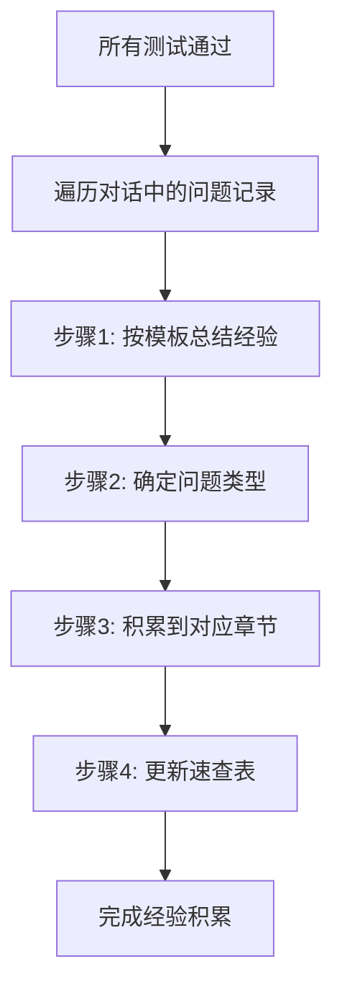

# Java单元测试经验积累工作流程

 **文档用途**：规范化skill执行过程中的经验积累流程，确保问题修复经验按统一格式记录并分类归档
> 
> **适用场景**：所有测试通过后，批量整理并写入问题修复经验时
>
> **执行策略**：采用"轻量化立即积累策略" - 问题修复后快速标记，测试通过后批量写入

---

## 流程总览

本文档定义了**批量写入阶段**的详细流程，配合SKILL.md中的轻量化立即积累策略使用：

**整体策略**：
- **阶段1（SKILL.md定义）**：问题修复后快速标记（10秒内，对话中记录）
- **阶段2（本文档定义）**：测试通过后批量写入文档



---

## 步骤1：按模板总结经验

### 1.1 使用模板
必须严格按照 [issue-fix-experience-template.md](issue-fix-experience-template.md) 模板的7要素结构进行经验总结。

### 1.2 必填字段（7要素）

#### ① 问题标识（Issue-ID）
- **格式**：`[类型]-[日期]-[序号]`
- **示例**：`MOCK-20260201-001`
- **生成规则**：
  - 类型：根据问题类型选择（MOCK/NPE/EXCEPTION/COVERAGE/FRAMEWORK/DEPENDENCY/ASSERTION/REPORT）
  - 日期：当前日期YYYYMMDD
  - 序号：当天该类型问题的序号（001, 002...）

#### ② 问题类型（Issue-Type）
从以下8种类型中选择一种：
- `MOCK` - Mock相关问题
- `NPE` - 空指针异常
- `EXCEPTION` - 其他异常
- `COVERAGE` - 覆盖率问题
- `FRAMEWORK` - 测试框架问题
- `DEPENDENCY` - 依赖配置问题
- `ASSERTION` - 断言失败问题
- `REPORT` - 单元测试报告生成问题

#### ③ 错误特征（Error-Pattern）
必须包含3个子项：
- **错误信息**：完整的异常类名和错误消息
- **触发场景**：描述导致错误的操作或代码模式
- **相关技术**：涉及的框架/类/API

#### ④ 根本原因（Root-Cause）
- **一句话概述**：用一句话说明问题本质（必填）
- **详细分析**：深层次原因分析（选填）

#### ⑤ 解决方案（Solution）
必须包含4个部分：
- **前置条件**：需要满足的条件（如依赖版本）
- **操作步骤**：清晰的步骤列表（1, 2, 3...）
- **代码示例**：包含❌错误示例和✅正确示例
- **关键要点**：需要特别注意的事项（列表形式）

#### ⑥ 适用场景（Applicable-Scenarios）
明确列出该解决方案适用的所有场景（列表形式）

#### ⑦ 经验标签（Tags）
生成3-5个关键词标签，格式：`#标签1 #标签2 #标签3`
参考 [经验标签库](issue-fix-experience-template.md#附录常用经验标签库)

### 1.3 模板示例
```markdown
### 【问题标识】MOCK-20260201-001

**问题类型**：MOCK

#### 错误特征
- **错误信息**：
  ```
  org.mockito.exceptions.base.MockitoException:
  The used MockMaker does not support static mocks
  ```
- **触发场景**：尝试使用Mockito Mock静态方法时
- **相关技术**：Mockito、静态方法Mock、MockedStatic

#### 根本原因
项目缺少`mockito-inline`依赖，默认的MockMaker不支持静态方法Mock

#### 解决方案

**前置条件**：
- Mockito版本 ≥ 3.4.0

**操作步骤**：
1. 在pom.xml中添加`mockito-inline`依赖
2. 使用`MockedStatic`包装静态方法调用
3. 确保测试逻辑在try-with-resources块内执行

**代码示例**：
```java
// ❌ 错误方式 - 缺少依赖会报错
@Test
void testStaticMethod() {
    mockStatic(UtilClass.class); // 报错
}

// ✅ 正确方式
<!-- 先添加依赖到pom.xml -->
<dependency>
    <groupId>org.mockito</groupId>
    <artifactId>mockito-inline</artifactId>
    <scope>test</scope>
</dependency>

// 测试代码
@Test
void testStaticMethod() {
    try (MockedStatic<UtilClass> mockedStatic = mockStatic(UtilClass.class)) {
        mockedStatic.when(() -> UtilClass.staticMethod(anyString()))
            .thenReturn("mocked result");
        
        String result = service.methodThatCallsStaticMethod();
        assertEquals("expected", result);
    }
}
```

**关键要点**：
- 必须使用try-with-resources确保Mock作用域正确
- 静态Mock在try块结束后自动清理
- 测试逻辑必须在try块内执行

#### 适用场景
- Mock静态工具类方法（如日期格式化、字符串处理等）
- Mock静态枚举方法（如`findByCode()`）
- Mock第三方库的静态API

#### 经验标签
`#Mockito #静态方法Mock #mockito-inline #MockedStatic #依赖配置`

---
```

---

## 步骤2：确定问题类型与目标章节

### 2.1 问题类型与章节映射关系

| 问题类型 | 目标章节 | 章节位置 |
|---------|---------|---------|
| `MOCK` | [Mockito异常处理经验](#mockito异常处理经验) | troubleshooting-guide.md 第40行 |
| `NPE` | [Mockito异常处理经验](#mockito异常处理经验) | troubleshooting-guide.md 第40行 |
| `EXCEPTION` | [Mockito异常处理经验](#mockito异常处理经验) | troubleshooting-guide.md 第40行 |
| `COVERAGE` | [覆盖率提升策略](#覆盖率提升策略) | troubleshooting-guide.md 第362行 |
| `FRAMEWORK` | [测试执行失败排查流程](#测试执行失败排查流程) | troubleshooting-guide.md 第337行 |
| `DEPENDENCY` | [报告生成常见问题](#报告生成常见问题) | troubleshooting-guide.md 第405行 |
| `ASSERTION` | [测试执行失败排查流程](#测试执行失败排查流程) | troubleshooting-guide.md 第337行 |
| `REPORT` | [报告生成常见问题](#报告生成常见问题) | troubleshooting-guide.md 第405行 |

### 2.2 特殊情况处理

#### 情况1：新问题无现有案例
- 在对应章节末尾添加新的二级标题
- 编号继续递增（如已有7个问题，新增为"## 8. xxx"）

#### 情况2：与现有问题相似但有差异
- 在现有问题下添加子场景
- 使用三级标题"### 变体场景X"

#### 情况3：高频问题
- 同时更新"常见问题速查表"
- 在速查表中添加该问题的简要信息

---

## 步骤3：积累到对应章节

### 3.1 定位目标位置
根据步骤2确定的章节，找到对应章节在 [troubleshooting-guide.md](troubleshooting-guide.md) 中的位置。

### 3.2 添加经验内容

#### 添加规则
1. **新问题**：在该章节的最后一个问题之后添加
2. **编号规则**：按章节内部顺序递增（## 1, ## 2, ## 3...）
3. **格式要求**：严格遵循模板的Markdown格式
4. **分隔符**：每个问题之间使用`---`分隔

#### 添加位置示例

**示例1：添加Mock相关问题**
```markdown
# Mockito异常处理经验

## 1. UnnecessaryStubbingException
[现有内容...]

---

## 2. NullPointerException - 依赖链未完整Mock
[现有内容...]

---

## 3. Spring容器依赖问题
[现有内容...]

---

## 新增问题编号. 新问题标题
[按模板格式添加新问题内容]

---
```

**示例2：添加报告生成问题**
```markdown
# 报告生成常见问题

## 1. JaCoCo报告未生成
[现有内容...]

---

## 2. Maven Surefire版本不支持JUnit 5
[现有内容...]

---

## 新增问题编号. 新问题标题
[按模板格式添加新问题内容]

---
```

### 3.3 格式检查清单

添加内容后，必须检查以下项目：
- [ ] 章节标题级别正确（# 一级标题，## 二级标题，### 三级标题）
- [ ] 问题编号连续递增
- [ ] 代码块使用正确的语言标识（```java, ```xml, ```bash等）
- [ ] 错误示例标记为❌，正确示例标记为✅
- [ ] 列表格式统一（使用`-`或`1.`）
- [ ] 分隔符`---`添加正确
- [ ] 没有破坏现有内容的格式

---

## 步骤4：更新常见问题速查表

### 4.1 判断是否需要更新速查表

满足以下条件之一，必须更新速查表：
1. **高频问题**：该问题在3次以上的测试中出现
2. **严重问题**：导致测试完全无法执行
3. **通用问题**：适用于大多数Java单元测试场景
4. **新类型问题**：首次出现的新类型问题

### 4.2 速查表更新格式

在 [troubleshooting-guide.md](troubleshooting-guide.md) 的"常见问题速查表"章节添加一行：

```markdown
| **问题简称** | `核心错误信息` | 根本原因简述 | 解决方案简述 |
```

#### 速查表字段说明

| 字段 | 说明 | 示例 |
|-----|------|------|
| 问题简称 | 3-5个字简要描述，加粗 | `**静态Mock不支持**` |
| 核心错误信息 | 最关键的错误消息，代码格式 | `` `MockMaker does not support static mocks` `` |
| 根本原因简述 | 一句话说明原因 | `缺少 mockito-inline 依赖` |
| 解决方案简述 | 最关键的解决步骤 | `在 pom.xml 添加 mockito-inline` |

#### 速查表添加位置
在表格的最后一行之前添加新行（保持表格完整性）

---

## 步骤5：同步到"最新经验积累"章节（可选）

### 5.1 何时添加到"最新经验积累"

当满足以下条件时，应在"最新经验积累"章节添加案例：
- **里程碑式测试**：为重要类生成测试并全部通过
- **多问题修复**：一次测试中修复了3个以上的问题
- **复杂场景**：涉及复杂的业务逻辑或技术栈

### 5.2 "最新经验积累"格式

```markdown
## 案例X：[被测类名]测试（YYYY-MM-DD）

### 基本信息
- **测试类**：`[测试类名]`
- **测试用例数**：[数量]个
- **通过率**：[百分比]%

### 修复的关键问题

#### 问题1：[问题标题]

**错误信息**：
```
[完整错误信息]
```

**根本原因**：[原因说明]

**解决方案**：
```java
[解决方案代码]
```

**适用场景**：
- [场景1]
- [场景2]

---

[其他问题...]

### 核心经验总结（通用经验）

1. **经验1标题**
   - 详细说明
   - 关键要点

2. **经验2标题**
   - 详细说明
   - 关键要点

---
```

---

## 执行检查清单

每次经验积累完成后，必须检查以下项目：

### ✅ 内容完整性
- [ ] 7要素全部填写完整
- [ ] 错误信息完整准确
- [ ] 代码示例包含错误和正确方式
- [ ] 适用场景明确列出
- [ ] 经验标签已添加

### ✅ 格式规范性
- [ ] 问题标识格式正确
- [ ] Markdown标题级别正确
- [ ] 代码块语言标识正确
- [ ] 列表格式统一
- [ ] 分隔符添加正确

### ✅ 分类准确性
- [ ] 问题类型选择正确
- [ ] 添加到正确的章节
- [ ] 章节内编号正确
- [ ] 速查表更新正确（如需要）

### ✅ 文档关联性
- [ ] troubleshooting-guide.md 已更新
- [ ] 目录链接正常工作
- [ ] 引用路径正确
- [ ] 没有破坏现有内容

---

## 常见错误与避免方法

### ❌ 错误1：直接复制粘贴，不按模板格式
**正确做法**：严格按照7要素结构填写，不省略任何必填项

### ❌ 错误2：问题类型分类错误
**正确做法**：仔细对照8种问题类型的定义，选择最匹配的类型

### ❌ 错误3：添加到错误的章节
**正确做法**：参考"步骤2：确定问题类型与目标章节"中的映射关系表

### ❌ 错误4：破坏现有文档格式
**正确做法**：
- 使用文本编辑工具的"插入"模式，而非"覆盖"模式
- 保持现有的缩进和空行
- 添加后检查整个章节的格式一致性

### ❌ 错误5：经验描述过于具体，缺乏通用性
**正确做法**：
- 提炼问题的本质特征，而非具体业务场景
- 解决方案应该适用于类似问题
- 避免包含特定的类名、方法名（除非是框架API）

### ❌ 错误6：忘记更新速查表
**正确做法**：对于高频、严重、通用问题，必须同步更新速查表

---

## 经验积累质量标准

### 优秀经验记录的特征

#### 1. 可识别性（AI能快速匹配）
- ✅ 错误信息完整且准确
- ✅ 问题类型明确
- ✅ 经验标签丰富且精准

#### 2. 可理解性（开发者能快速理解）
- ✅ 根本原因表述清晰
- ✅ 解决步骤逻辑清晰
- ✅ 代码示例简洁明了

#### 3. 可操作性（能直接应用）
- ✅ 操作步骤详细具体
- ✅ 代码示例可直接使用
- ✅ 关键要点突出重点

#### 4. 可复用性（适用多个场景）
- ✅ 适用场景明确列出
- ✅ 问题特征具有通用性
- ✅ 解决方案可举一反三

### 质量评分标准（自查）

| 评分项 | 权重 | 评分标准 |
|--------|------|---------|
| 内容完整性 | 30% | 7要素全部填写且准确 |
| 格式规范性 | 20% | Markdown格式正确无误 |
| 问题分类准确性 | 20% | 问题类型和章节选择正确 |
| 解决方案可操作性 | 20% | 步骤清晰、代码可用 |
| 适用场景通用性 | 10% | 能适用于类似场景 |

**合格标准**：总分 ≥ 80分

---

## 工作流程快速参考卡

### 🚀 5分钟快速流程

```
1️⃣ 问题修复成功
   ↓
2️⃣ 打开 issue-fix-experience-template.md
   ↓
3️⃣ 按7要素填写经验（5分钟）
   - 问题标识：[类型]-[日期]-[序号]
   - 问题类型：8选1
   - 错误特征：错误信息+场景+技术
   - 根本原因：一句话概述
   - 解决方案：前置+步骤+代码+要点
   - 适用场景：列出场景
   - 经验标签：3-5个标签
   ↓
4️⃣ 确定目标章节（参考映射表）
   ↓
5️⃣ 添加到 troubleshooting-guide.md 对应章节
   ↓
6️⃣ 高频问题更新速查表
   ↓
7️⃣ 执行检查清单
   ↓
✅ 完成
```

---

## 附录：问题类型判断决策树

```
遇到问题
    │
    ├─ 与Mock相关？
    │   └─ YES → MOCK类型 → Mockito异常处理经验章节
    │
    ├─ NullPointerException？
    │   └─ YES → NPE类型 → Mockito异常处理经验章节
    │
    ├─ 其他异常（Spring、Framework等）？
    │   └─ YES → EXCEPTION类型 → Mockito异常处理经验章节
    │
    ├─ 覆盖率不足？
    │   └─ YES → COVERAGE类型 → 覆盖率提升策略章节
    │
    ├─ 测试框架问题（JUnit、Surefire等）？
    │   └─ YES → FRAMEWORK类型 → 测试执行失败排查流程章节
    │
    ├─ 依赖配置问题（pom.xml等）？
    │   └─ YES → DEPENDENCY类型 → 报告生成常见问题章节
    │
    ├─ 断言失败？
    │   └─ YES → ASSERTION类型 → 测试执行失败排查流程章节
    │
    └─ 报告生成问题？
        └─ YES → REPORT类型 → 报告生成常见问题章节
```

---

## 更新记录

| 日期 | 版本 | 更新内容 | 更新人 |
|------|------|---------|--------|
| 2026-02-01 | v1.0 | 初始版本，建立经验积累工作流程 | AI Assistant |

---

## 相关文档

- [issue-fix-experience-template.md](issue-fix-experience-template.md) - 经验记录模板
- [troubleshooting-guide.md](troubleshooting-guide.md) - 经验积累目标文档
- [test-report-generation.md](test-report-generation.md) - 测试报告生成说明
- [testing-standards.md](testing-standards.md) - 测试标准规范
