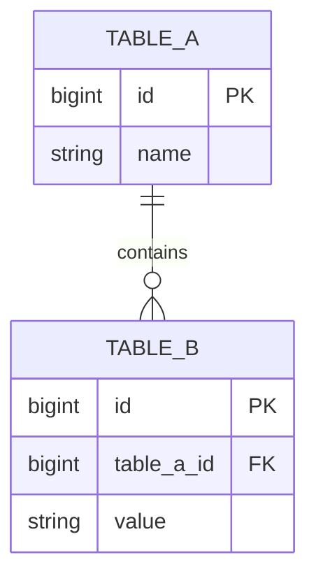

# 数据库设计模板

---

## 文档信息

| 字段 | 内容 |
|------|------|
| 表名称 | {表名} |
| 所属模块 | {模块名称} |
| 版本 | 1.0 |
| 创建日期 | {日期} |
| 作者 | {作者} |

---

## 表概述

简要描述表的业务用途。

---

## 表结构

### {表名}

| 字段名 | 类型 | 长度 | 允许空 | 默认值 | 主键 | 说明 |
|-------|------|------|-------|-------|------|------|
| id | BIGINT | - | 否 | - | 是 | 主键ID |
| create_time | DATETIME | - | 否 | CURRENT_TIMESTAMP | 否 | 创建时间 |
| update_time | DATETIME | - | 否 | CURRENT_TIMESTAMP | 否 | 更新时间 |
| create_by | VARCHAR | 64 | 是 | NULL | 否 | 创建人 |
| update_by | VARCHAR | 64 | 是 | NULL | 否 | 更新人 |
| del_flag | TINYINT | - | 否 | 0 | 否 | 删除标识 0-未删除 1-已删除 |

---

## DDL 语句

```sql
CREATE TABLE `{表名}` (
    `id` BIGINT NOT NULL COMMENT '主键ID',
    `create_time` DATETIME NOT NULL DEFAULT CURRENT_TIMESTAMP COMMENT '创建时间',
    `update_time` DATETIME NOT NULL DEFAULT CURRENT_TIMESTAMP ON UPDATE CURRENT_TIMESTAMP COMMENT '更新时间',
    `create_by` VARCHAR(64) DEFAULT NULL COMMENT '创建人',
    `update_by` VARCHAR(64) DEFAULT NULL COMMENT '更新人',
    `del_flag` TINYINT NOT NULL DEFAULT 0 COMMENT '删除标识 0-未删除 1-已删除',
    PRIMARY KEY (`id`)
) ENGINE=InnoDB DEFAULT CHARSET=utf8mb4 COMMENT='{表注释}';
```

---

## 索引设计

| 索引名 | 索引类型 | 字段 | 说明 |
|-------|---------|------|------|
| idx_{字段} | 普通 | {字段} | {说明} |
| uk_{字段} | 唯一 | {字段} | {说明} |

```sql
CREATE INDEX idx_{字段} ON `{表名}` (`{字段}`);
CREATE UNIQUE INDEX uk_{字段} ON `{表名}` (`{字段}`);
```

---

## 关联关系

| 关联表 | 关联字段 | 关系类型 | 说明 |
|-------|---------|---------|------|
| {表名} | {字段} | 一对多 | {说明} |

---

## ER 图



---

## 数据字典

### {字段名} 枚举值

| 值 | 说明 |
|---|------|
| 0 | 状态1 |
| 1 | 状态2 |

---

## 变更记录

| 版本 | 日期 | 变更内容 | 作者 |
|-----|------|---------|------|
| 1.0 | {日期} | 初始版本 | {作者} |
