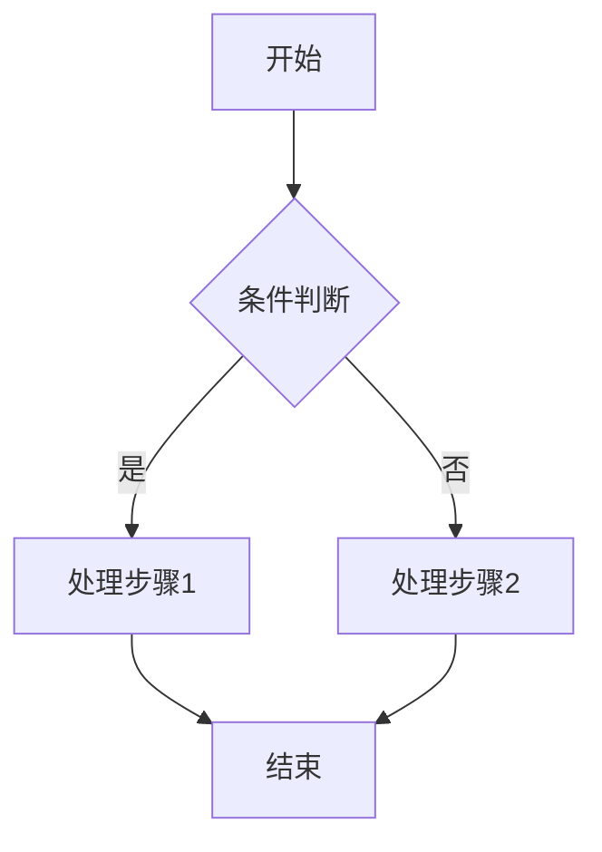
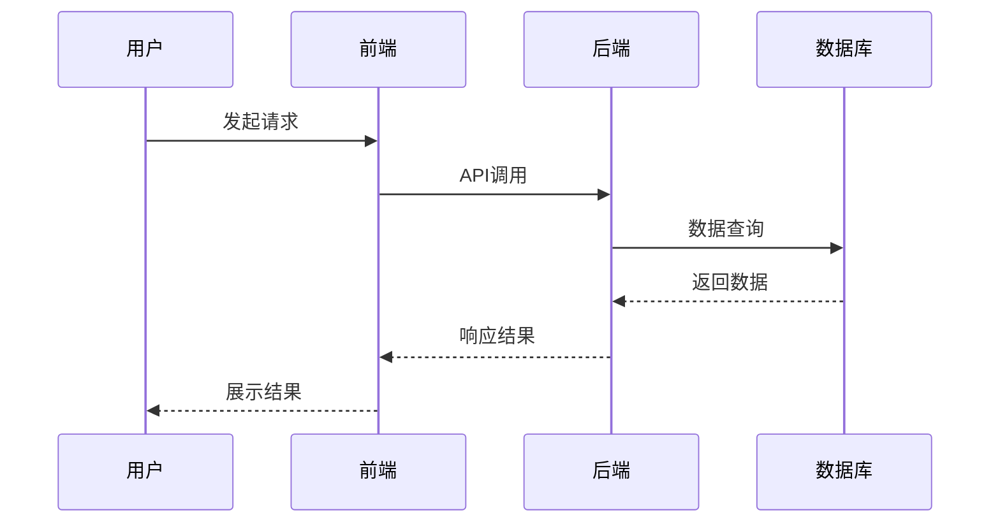
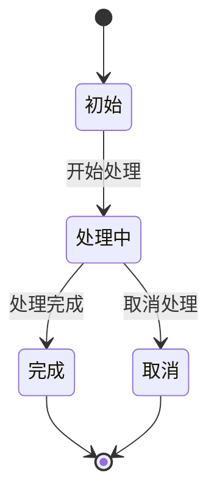

# 流程设计模板

---

## 文档信息

| 字段 | 内容 |
|------|------|
| 流程名称 | {流程名称} |
| 所属模块 | {模块名称} |
| 版本 | 1.0 |
| 创建日期 | {日期} |
| 作者 | {作者} |

---

## 流程概述

简要描述流程的业务背景和目的。

---

## 流程图

### 业务流程图



### 时序图



---

## 状态流转

### 状态定义

| 状态码 | 状态名 | 说明 |
|-------|-------|------|
| 0 | 初始 | 初始状态 |
| 1 | 处理中 | 处理中状态 |
| 2 | 完成 | 完成状态 |
| -1 | 取消 | 取消状态 |

### 状态流转图



### 状态流转规则

| 当前状态 | 目标状态 | 触发条件 | 操作说明 |
|---------|---------|---------|---------|
| 初始 | 处理中 | 用户触发 | 开始处理 |
| 处理中 | 完成 | 处理完成 | 完成处理 |
| 处理中 | 取消 | 用户取消 | 取消处理 |

---

## 异常处理

| 异常场景 | 处理方式 | 说明 |
|---------|---------|------|
| 场景1 | 重试 | 重试3次 |
| 场景2 | 回滚 | 事务回滚 |
| 场景3 | 告警 | 发送告警通知 |

---

## 关键逻辑

### 逻辑1：{逻辑名称}

```
1. 步骤1
2. 步骤2
3. 步骤3
```

### 逻辑2：{逻辑名称}

```java
// 伪代码示例
if (condition) {
    // 处理逻辑
}
```

---

## 注意事项

1. 注意事项1
2. 注意事项2

---

## 变更记录

| 版本 | 日期 | 变更内容 | 作者 |
|-----|------|---------|------|
| 1.0 | {日期} | 初始版本 | {作者} |
