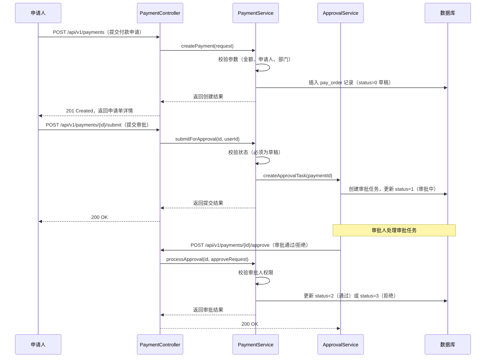
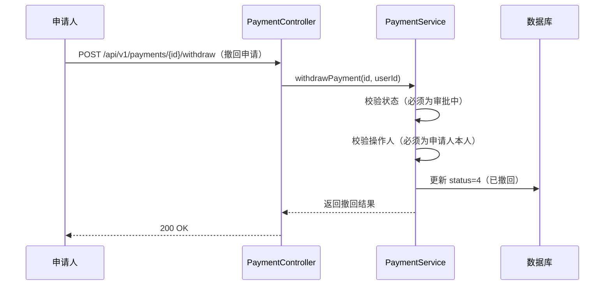
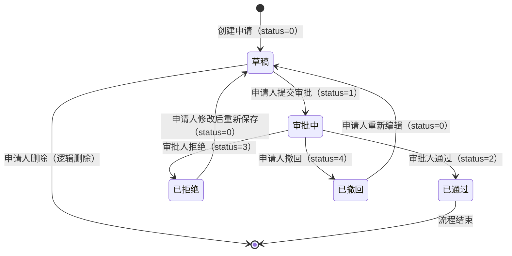

# design

| 字段     | 内容                              |
|----------|-----------------------------------|
| 文档标题 | _[需求名称]_ 技术设计文档         |
| CR 编号  | _[CRxx]_                          |
| 版本     | v1.0                              |
| 作者     | _[技术负责人/AI 协作]_            |
| 创建日期 | _[YYYY-MM-DD]_                    |
| 最后更新 | _[YYYY-MM-DD]_                    |
| 关联需求 | requirements/requirements.md      |
| 状态     | 草稿 / 评审中 / 已批准            |

---

## 设计概述

_[简要描述本次 CR 的技术实现方案，2-4 句话说明整体架构思路、主要技术手段以及与现有系统的集成方式。]_

例如：本次 CR 采用标准的 MVC 三层架构实现 _[功能模块名称]_ 功能。后端新增 _[X]_ 张数据库表，提供 _[X]_ 个 RESTful 接口，通过 Spring Security 进行权限控制。审批流程基于状态机模式实现，确保状态流转的一致性和可追溯性。整体方案对现有模块无侵入性改动，通过新增代码实现功能扩展。

---

## 数据库设计引用

本次 CR 涉及以下数据库变更，详细 DDL/DML 脚本见 `sql/` 目录：

| 文档文件 | 变更类型 | 表名 | 说明 |
|----------|----------|------|------|
| [sql-001-示例表名-ddl.md](../sql/sql-001-示例表名-ddl.md) | 新增表 | `pay_order` | 付款申请主表，存储申请单基本信息 |
| [sql-001-示例表名-dml.md](../sql/sql-001-示例表名-dml.md) | 初始化数据 | `sys_dict_data` | 初始化付款类型、状态等字典数据 |
| _[sql-002-示例表名-ddl.md]_ | _[新增表/修改表/新增字段]_ | _[表名]_ | _[变更说明]_ |

> **说明**：DDL 脚本需在服务部署前执行，DML 脚本在服务启动后执行。执行顺序和环境要求详见各 SQL 文档。

---

## 接口设计引用

本次 CR 涉及以下接口变更，详细接口规范见 `api/` 目录：

| 文档文件 | 变更类型 | 接口路径 | 说明 |
|----------|----------|----------|------|
| [api-001-示例模块名.md](../api/api-001-示例模块名.md) | 新增接口 | `POST /api/v1/payments` | 创建付款申请 |
| [api-001-示例模块名.md](../api/api-001-示例模块名.md) | 新增接口 | `GET /api/v1/payments` | 分页查询付款申请列表 |
| [api-001-示例模块名.md](../api/api-001-示例模块名.md) | 新增接口 | `GET /api/v1/payments/{id}` | 查询付款申请详情 |
| _[api-002-示例模块名.md]_ | _[新增接口/修改接口]_ | _[接口路径]_ | _[接口说明]_ |

> **说明**：所有接口均需携带 JWT Token 进行身份认证，权限控制基于角色（RBAC）实现。

---

## 核心业务逻辑

### 业务流程

#### 付款申请提交与审批流程



_[根据实际业务流程替换上述时序图，确保覆盖主流程和关键异常分支。]_

#### _[其他子流程名称，如：撤回流程、重新提交流程]_



---

### 关键算法/规则

#### 付款申请编号生成规则

付款申请编号格式：`PAY` + `yyyyMMdd`（8位日期）+ `6位序号`（当日自增，不足6位补零）

```
示例：PAY20240115000001
```

实现方式：使用 Redis 原子自增（`INCR pay:seq:yyyyMMdd`）生成当日序号，设置 key 过期时间为 2 天，避免内存泄漏。

#### 金额校验规则

| 规则 | 说明 |
|------|------|
| 金额必须大于 0 | 付款金额不允许为负数或零 |
| 金额精度 | 最多保留 2 位小数，超出部分四舍五入 |
| 金额上限 | 单笔付款金额不超过 _[X]_ 万元，超出需走特殊审批流程 |
| 币种一致性 | 同一申请单内金额与币种必须匹配 |

#### 权限控制规则

| 操作 | 所需权限 | 说明 |
|------|----------|------|
| 创建付款申请 | `payment:create` | 所有登录用户均可申请 |
| 查看申请列表 | `payment:list` | 普通用户只能查看本人申请，管理员可查看全部 |
| 查看申请详情 | `payment:detail` | 申请人、审批人及管理员可查看 |
| 提交审批 | `payment:submit` | 仅申请人本人可操作，且状态必须为草稿 |
| 审批通过/拒绝 | `payment:approve` | 仅具有审批权限的用户可操作 |
| 撤回申请 | `payment:withdraw` | 仅申请人本人可操作，且状态必须为审批中 |

---

### 状态机设计

付款申请状态流转图：



状态枚举定义：

| 状态值 | 枚举名 | 说明 | 允许的下一状态 |
|--------|--------|------|----------------|
| 0 | `DRAFT` | 草稿 | 审批中、已删除 |
| 1 | `PENDING` | 审批中 | 已通过、已拒绝、已撤回 |
| 2 | `APPROVED` | 已通过 | 无（终态） |
| 3 | `REJECTED` | 已拒绝 | 草稿 |
| 4 | `WITHDRAWN` | 已撤回 | 草稿 |

> **状态流转校验**：Service 层必须在每次状态变更前校验当前状态是否允许流转到目标状态，非法流转抛出 `BusinessException`（错误码 `10010`）。

---

## 技术选型说明

| 技术点 | 选型方案 | 选型理由 |
|--------|----------|----------|
| 持久层框架 | MyBatis-Plus 3.x | 项目现有技术栈，提供通用 CRUD、分页插件，减少样板代码 |
| 缓存 | Redis（Spring Data Redis） | 用于序号生成的原子自增操作，以及热点数据缓存 |
| 参数校验 | Jakarta Validation（Hibernate Validator） | Spring Boot 内置支持，通过注解声明式校验，减少手动判断 |
| 权限控制 | Spring Security + RBAC | 项目现有安全框架，基于角色的权限控制，与现有用户体系集成 |
| 状态机 | 自实现枚举状态机 | 业务状态简单（5个状态），无需引入 Spring Statemachine 等重量级框架 |
| 分页 | MyBatis-Plus 分页插件 | 与持久层框架统一，自动处理 count 查询和分页参数 |
| 日志 | SLF4J + Logback | 项目现有日志框架，结合 MDC 实现 traceId 链路追踪 |

_[根据实际技术选型调整上表，说明引入新技术的必要性和对现有架构的影响。]_

---

## 风险与约束

### 技术风险

| 风险编号 | 风险描述 | 风险等级 | 应对措施 |
|----------|----------|----------|----------|
| R-001 | Redis 不可用时，申请编号生成失败，导致创建接口不可用 | 高 | 降级方案：Redis 不可用时切换为数据库序列表生成编号，并触发告警 |
| R-002 | 并发提交时，状态校验存在竞态条件，可能导致重复提交 | 中 | 使用数据库乐观锁（`version` 字段）或 Redis 分布式锁防止并发问题 |
| R-003 | 大数据量下分页查询性能下降（深分页问题） | 中 | 禁止深分页（`current * size` 不超过 10000），提供游标分页替代方案 |
| _[R-004]_ | _[风险描述]_ | _[高/中/低]_ | _[应对措施]_ |

### 性能风险

| 风险编号 | 风险描述 | 预期影响 | 优化方案 |
|----------|----------|----------|----------|
| P-001 | 列表查询涉及多表 JOIN（关联用户表、部门表），数据量大时查询慢 | 查询响应时间超过 500ms | 对高频查询字段建立联合索引；考虑冗余存储申请人姓名、部门名称，避免 JOIN |
| P-002 | 审批流程中频繁更新 `pay_order` 状态，高并发下产生行锁竞争 | 写入吞吐量下降 | 合理设计事务粒度，减少锁持有时间；审批操作异步化处理 |
| _[P-003]_ | _[风险描述]_ | _[预期影响]_ | _[优化方案]_ |

### 依赖风险

| 依赖项 | 依赖类型 | 风险说明 | 协调措施 |
|--------|----------|----------|----------|
| 用户中心服务 | 接口依赖 | 查询用户信息（姓名、部门）依赖用户中心接口，若接口不稳定影响本模块 | 增加本地缓存（TTL 5分钟）；接口超时时返回 ID，不阻断主流程 |
| 消息通知服务 | 接口依赖 | 审批结果通知依赖消息服务，若消息服务不可用，通知发送失败 | 通知发送异步化，失败后重试（最多 3 次），不影响主流程 |
| _[外部系统名称]_ | _[接口依赖/数据依赖]_ | _[风险说明]_ | _[协调措施]_ |
