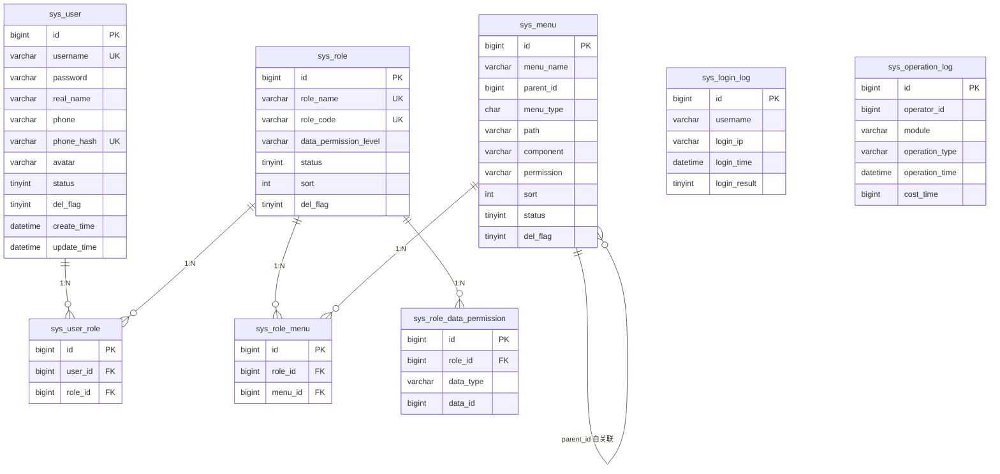

# SPMP user-center 数据库设计

> 表前缀：`sys_`  
> 引擎：InnoDB  
> 字符集：utf8mb4_general_ci  
> 逻辑删除：`del_flag`（0-正常 1-删除）

---

## 一、ER 图

---

## 二、表结构

### 1. sys_user — 用户表

| 字段 | 类型 | 说明 |
|------|------|------|
| id | BIGINT PK AUTO_INCREMENT | 主键 |
| username | VARCHAR(64) NOT NULL UK | 用户名 |
| password | VARCHAR(128) NOT NULL | 密码（BCrypt） |
| real_name | VARCHAR(64) NOT NULL | 姓名 |
| phone | VARCHAR(256) NOT NULL | 手机号（AES 加密） |
| phone_hash | VARCHAR(64) NOT NULL UK | 手机号 SHA-256 哈希 |
| avatar | VARCHAR(256) | 头像 URL（预留） |
| status | TINYINT DEFAULT 0 | 状态（0-启用 1-禁用） |
| del_flag | TINYINT DEFAULT 0 | 删除标记 |
| create_time | DATETIME | 创建时间 |
| update_time | DATETIME | 更新时间 |
| create_by | VARCHAR(64) | 创建人 |
| update_by | VARCHAR(64) | 更新人 |

### 2. sys_role — 角色表

| 字段 | 类型 | 说明 |
|------|------|------|
| id | BIGINT PK AUTO_INCREMENT | 主键 |
| role_name | VARCHAR(64) NOT NULL UK | 角色名称 |
| role_code | VARCHAR(64) NOT NULL UK | 角色编码 |
| data_permission_level | VARCHAR(20) DEFAULT 'SELF' | 数据权限级别（ALL/AREA/COMMUNITY/BUILDING/SELF） |
| status | TINYINT DEFAULT 0 | 状态 |
| sort | INT DEFAULT 0 | 排序 |
| remark | VARCHAR(256) | 备注 |
| del_flag | TINYINT DEFAULT 0 | 删除标记 |
| create_time | DATETIME | 创建时间 |
| update_time | DATETIME | 更新时间 |
| create_by | VARCHAR(64) | 创建人 |
| update_by | VARCHAR(64) | 更新人 |

### 3. sys_menu — 菜单表

| 字段 | 类型 | 说明 |
|------|------|------|
| id | BIGINT PK AUTO_INCREMENT | 主键 |
| menu_name | VARCHAR(64) NOT NULL | 菜单名称 |
| parent_id | BIGINT DEFAULT 0 | 父级 ID（0 为顶级） |
| menu_type | CHAR(1) NOT NULL | 类型（D-目录 M-菜单 B-按钮） |
| path | VARCHAR(256) | 路由路径 |
| component | VARCHAR(256) | 组件路径 |
| permission | VARCHAR(128) | 权限标识 |
| icon | VARCHAR(64) | 图标 |
| sort | INT DEFAULT 0 | 排序 |
| status | TINYINT DEFAULT 0 | 状态 |
| del_flag | TINYINT DEFAULT 0 | 删除标记 |
| create_time | DATETIME | 创建时间 |
| update_time | DATETIME | 更新时间 |
| create_by | VARCHAR(64) | 创建人 |
| update_by | VARCHAR(64) | 更新人 |

### 4. sys_user_role — 用户角色关联表

| 字段 | 类型 | 说明 |
|------|------|------|
| id | BIGINT PK AUTO_INCREMENT | 主键 |
| user_id | BIGINT NOT NULL FK | 用户 ID |
| role_id | BIGINT NOT NULL FK | 角色 ID |

### 5. sys_role_menu — 角色菜单关联表

| 字段 | 类型 | 说明 |
|------|------|------|
| id | BIGINT PK AUTO_INCREMENT | 主键 |
| role_id | BIGINT NOT NULL FK | 角色 ID |
| menu_id | BIGINT NOT NULL FK | 菜单 ID |

### 6. sys_role_data_permission — 角色数据权限关联表

| 字段 | 类型 | 说明 |
|------|------|------|
| id | BIGINT PK AUTO_INCREMENT | 主键 |
| role_id | BIGINT NOT NULL FK | 角色 ID |
| data_type | VARCHAR(20) NOT NULL | 数据类型（AREA/COMMUNITY/BUILDING） |
| data_id | BIGINT NOT NULL | 关联数据 ID |

### 7. sys_login_log — 登录日志表

| 字段 | 类型 | 说明 |
|------|------|------|
| id | BIGINT PK AUTO_INCREMENT | 主键 |
| username | VARCHAR(64) NOT NULL | 用户名 |
| login_ip | VARCHAR(64) | 登录 IP |
| login_location | VARCHAR(128) | 登录地点 |
| browser | VARCHAR(128) | 浏览器 |
| os | VARCHAR(128) | 操作系统 |
| login_time | DATETIME | 登录时间 |
| login_result | TINYINT DEFAULT 0 | 结果（0-成功 1-失败） |
| fail_reason | VARCHAR(256) | 失败原因 |

### 8. sys_operation_log — 操作日志表

| 字段 | 类型 | 说明 |
|------|------|------|
| id | BIGINT PK AUTO_INCREMENT | 主键 |
| operator_id | BIGINT | 操作人 ID |
| operator_name | VARCHAR(64) | 操作人用户名 |
| module | VARCHAR(64) NOT NULL | 模块名称 |
| operation_type | VARCHAR(32) NOT NULL | 操作类型（CREATE/UPDATE/DELETE/EXPORT/OTHER） |
| description | VARCHAR(256) | 操作描述 |
| request_method | VARCHAR(10) | 请求方法 |
| request_url | VARCHAR(256) | 请求 URL |
| request_params | TEXT | 请求参数（JSON，password 脱敏） |
| response_result | TEXT | 响应结果（JSON，超 2000 字符截断） |
| operation_ip | VARCHAR(64) | 操作 IP |
| operation_time | DATETIME | 操作时间 |
| cost_time | BIGINT | 耗时（ms） |

---

## 三、索引设计

| 表 | 索引名 | 字段 | 类型 |
|---|--------|------|------|
| sys_user | uk_username | username | UNIQUE |
| sys_user | uk_phone_hash | phone_hash | UNIQUE |
| sys_user | idx_status_del_flag | status, del_flag | NORMAL |
| sys_role | uk_role_code | role_code | UNIQUE |
| sys_role | uk_role_name | role_name | UNIQUE |
| sys_menu | idx_parent_id | parent_id | NORMAL |
| sys_menu | idx_permission | permission | NORMAL |
| sys_user_role | uk_user_role | user_id, role_id | UNIQUE |
| sys_user_role | idx_user_id | user_id | NORMAL |
| sys_user_role | idx_role_id | role_id | NORMAL |
| sys_role_menu | uk_role_menu | role_id, menu_id | UNIQUE |
| sys_role_menu | idx_role_id | role_id | NORMAL |
| sys_role_data_permission | uk_role_type_data | role_id, data_type, data_id | UNIQUE |
| sys_role_data_permission | idx_role_id | role_id | NORMAL |
| sys_login_log | idx_username | username | NORMAL |
| sys_login_log | idx_login_time | login_time | NORMAL |
| sys_operation_log | idx_operator_id | operator_id | NORMAL |
| sys_operation_log | idx_operation_time | operation_time | NORMAL |
| sys_operation_log | idx_module | module | NORMAL |
