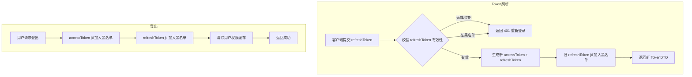
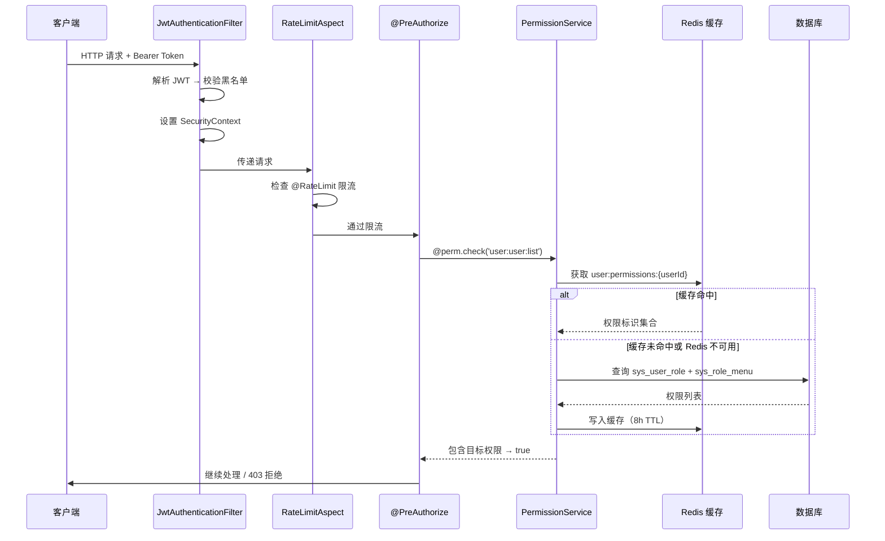
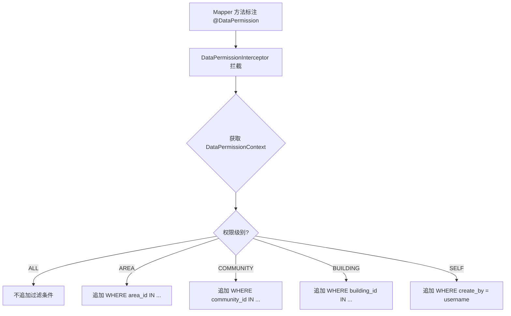

# SPMP user-center 核心业务流程

---

## 一、用户名密码登录流程

```mermaid
flowchart TD
    A[用户提交登录请求] --> B{校验图形验证码}
    B -->|失败| C[返回验证码错误]
    B -->|成功| D{检查账号锁定}
    D -->|已锁定| E[返回"账号已锁定，请N分钟后重试"]
    D -->|未锁定| F{查询用户}
    F -->|不存在| G[记录失败 + 返回"用户名或密码错误"]
    F -->|存在| H{校验密码 BCrypt}
    H -->|错误| I{错误次数 >= 5?}
    I -->|是| J[锁定账号30分钟]
    I -->|否| K[递增错误计数]
    J --> G
    K --> G
    H -->|正确| L{检查用户状态}
    L -->|禁用| M[返回"账号已被禁用"]
    L -->|正常| N[清除错误计数]
    N --> O[生成 AccessToken + RefreshToken]
    O --> P[缓存用户权限到 Redis]
    P --> Q[异步记录登录日志]
    Q --> R[返回 TokenDTO]
```

关键规则：
- 图形验证码 4 位字母数字混合，Redis 存储 2 分钟有效，一次性使用
- 密码错误计数 Redis key：`login:fail:{username}`，TTL 30 分钟
- 锁定标记 Redis key：`login:lock:{username}`，TTL 30 分钟
- Token 有效期：admin 端 access 8h / refresh 16h；owner 端 access 7d / refresh 14d

---

## 二、手机号验证码登录流程

```mermaid
flowchart TD
    A[用户请求发送验证码] --> B{60秒内是否已发送?}
    B -->|是| C[返回"请N秒后重试"]
    B -->|否| D{今日发送次数 >= 10?}
    D -->|是| E[返回"今日发送次数已达上限"]
    D -->|否| F[生成6位数字验证码]
    F --> G[存入 Redis 5分钟有效]
    G --> H[调用 SmsService 发送]
    H --> I[设置60秒发送间隔标记]

    J[用户提交验证码登录] --> K{校验验证码}
    K -->|错误/过期| L[返回"验证码错误或已过期"]
    K -->|正确| M{查询手机号对应用户}
    M -->|不存在| N[返回"该手机号未注册"]
    M -->|存在| O[删除 Redis 验证码]
    O --> P[生成 Token + 缓存权限]
    P --> Q[返回 TokenDTO]
```

关键规则：
- 验证码 Redis key：`sms:code:{phone_hash}`，TTL 5 分钟
- 发送间隔 Redis key：`sms:interval:{phone_hash}`，TTL 60 秒
- 日发送次数 Redis key：`sms:daily:{phone_hash}`，TTL 当日剩余秒数
- 手机号通过 phone_hash（SHA-256）查询用户
- 当前短信服务为模拟实现（日志输出），预留 SmsService 接口

---

## 三、Token 刷新和登出流程



黑名单规则：
- Redis key：`token:blacklist:{jti}`
- TTL = Token 剩余有效期（避免无限增长）
- JwtAuthenticationFilter 每次请求校验 jti 是否在黑名单中

---

## 四、RBAC 权限校验流程



权限校验规则：
- 超级管理员（super_admin）拥有所有权限，直接放行
- 权限标识格式：`模块:资源:操作`（如 `user:user:list`）
- 权限缓存 Redis key：`user:permissions:{userId}`，TTL 8 小时
- Redis 不可用时降级查数据库

---

## 五、数据权限过滤流程（五级模型）



五级数据权限模型：

| 级别 | 枚举值 | SQL 过滤方式 |
|------|--------|-------------|
| 全部 | ALL | 不追加过滤条件 |
| 片区 | AREA | `WHERE area_id IN (...)` |
| 小区 | COMMUNITY | `WHERE community_id IN (...)` |
| 楼栋 | BUILDING | `WHERE building_id IN (...)` |
| 仅本人 | SELF | `WHERE {selfField} = '{username}'` |

多角色合并规则：
- 多角色数据权限取并集
- 优先级：ALL > 具体范围（AREA/COMMUNITY/BUILDING）> SELF
- 任一角色为 ALL 则不追加过滤
- 使用通用化 `DataPermissionContext.scopeMap` 动态拼接条件
- 数据权限缓存 Redis key：`user:data-permission:{userId}`，TTL 8 小时
