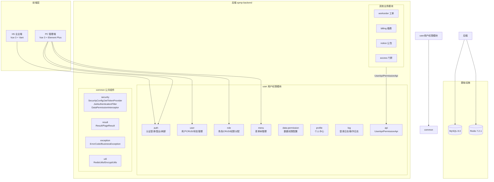
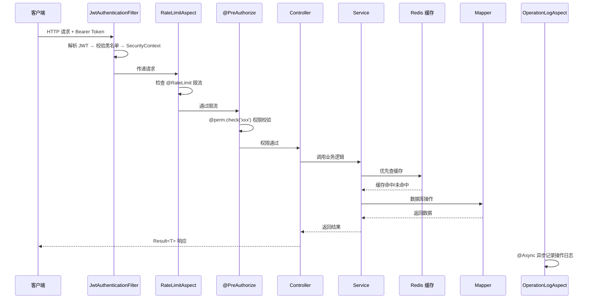
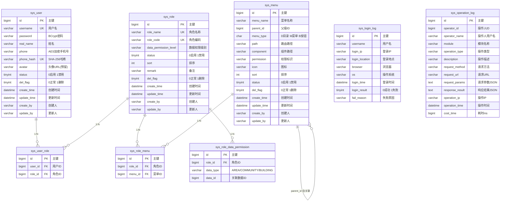
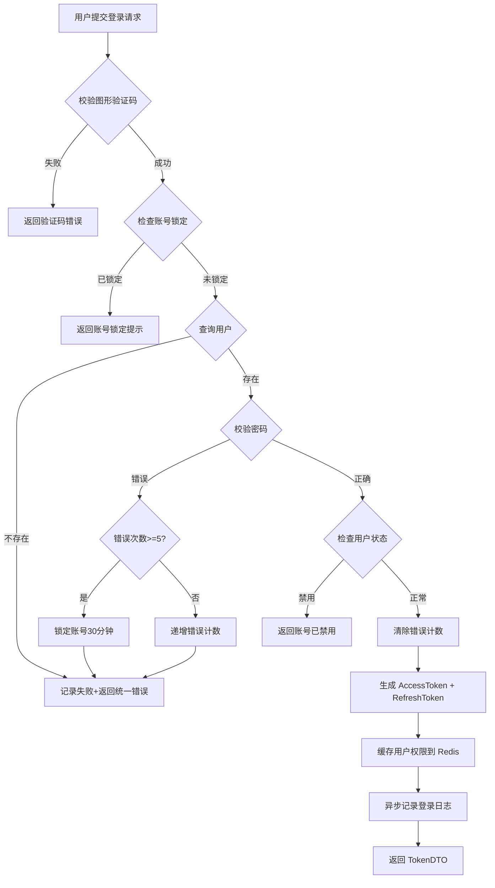

# 技术设计文档：用户权限管理模块（user）

| 字段 | 内容 |
|------|------|
| 文档名称 | 用户权限管理模块技术设计文档 |
| CR 编号 | CR02 |
| 版本 | 1.0 |
| 创建日期 | 2026-04-18 |
| 负责人 | 技术团队 |
| 状态 | 草稿 |
| 需求文档 | requirements.md |
| 依赖 | common 模块（CR01 已完成） |

---

## 概述

本设计文档定义 SPMP 智慧物业管理平台用户权限管理模块（`com.spmp.user`）的技术实现方案。该模块是所有业务模块的基础依赖，负责系统的身份认证、权限控制、用户管理、角色管理、菜单管理、数据权限、操作日志等核心能力。

技术栈：Spring Boot 2.4.4 + Java 1.8 + MyBatis Plus 3.4.x + MySQL 8.0 + Redis 7.2.1

设计目标：
- 完整的 RBAC 权限模型，支持功能权限 + 五级数据权限
- JWT 无状态认证，支持 admin/owner 双端差异化过期策略
- 多角色数据权限并集合并，通用化 DataPermissionContext 设计
- 高性能：权限信息 Redis 缓存，异步操作日志，接口限流
- 安全：密码 BCrypt 加密、手机号 AES 加密 + SHA-256 哈希、Token 黑名单、图形验证码
- 可扩展：SmsService 接口预留、数据权限通用化、对外 API 接口

---

## 架构

### 模块定位



### 内部分层架构

user 模块采用简化的 Service + Mapper 模式（非 DDD 聚合根模式），内部分层如下：

| 层 | 包 | 职责 |
|---|---|---|
| Controller | `controller` | HTTP 接口，参数校验，调用 Service |
| Service | `service` / `service/impl` | 业务逻辑编排，缓存管理，权限校验 |
| Repository | `repository` | MyBatis Mapper 接口，数据访问 |
| Domain | `domain/entity` | DO 数据库实体（XxxDO） |
| Domain | `domain/dto` | 数据传输对象（入参/出参 DTO） |
| Domain | `domain/vo` | 值对象（VO） |
| API | `api` / `api/dto` | 对外接口定义 + 跨模块 DTO |
| Config | `config` | 模块级配置（线程池、限流等） |
| Constant | `constant` | 枚举、常量 |
| Annotation | `annotation` | 自定义注解（@OperationLog、@RateLimit） |
| Aspect | `aspect` | AOP 切面（操作日志、限流） |

### 请求处理流程



---

## 数据库设计

### ER 图



### DDL

#### 1. sys_user — 用户表

```sql
CREATE TABLE `sys_user` (
    `id` BIGINT NOT NULL AUTO_INCREMENT COMMENT '主键',
    `username` VARCHAR(64) NOT NULL COMMENT '用户名',
    `password` VARCHAR(128) NOT NULL COMMENT '密码(BCrypt加密)',
    `real_name` VARCHAR(64) NOT NULL COMMENT '姓名',
    `phone` VARCHAR(256) NOT NULL COMMENT '手机号(AES加密)',
    `phone_hash` VARCHAR(64) NOT NULL COMMENT '手机号SHA-256哈希(用于查询和唯一索引)',
    `avatar` VARCHAR(256) DEFAULT NULL COMMENT '头像URL(预留)',
    `status` TINYINT NOT NULL DEFAULT 0 COMMENT '状态(0-启用 1-禁用)',
    `del_flag` TINYINT NOT NULL DEFAULT 0 COMMENT '删除标记(0-正常 1-删除)',
    `create_time` DATETIME NOT NULL DEFAULT CURRENT_TIMESTAMP COMMENT '创建时间',
    `update_time` DATETIME NOT NULL DEFAULT CURRENT_TIMESTAMP ON UPDATE CURRENT_TIMESTAMP COMMENT '更新时间',
    `create_by` VARCHAR(64) NOT NULL DEFAULT '' COMMENT '创建人',
    `update_by` VARCHAR(64) NOT NULL DEFAULT '' COMMENT '更新人',
    PRIMARY KEY (`id`),
    UNIQUE KEY `uk_username` (`username`),
    UNIQUE KEY `uk_phone_hash` (`phone_hash`),
    KEY `idx_status_del_flag` (`status`, `del_flag`)
) ENGINE=InnoDB DEFAULT CHARSET=utf8mb4 COLLATE=utf8mb4_general_ci COMMENT='用户表';
```

#### 2. sys_role — 角色表

```sql
CREATE TABLE `sys_role` (
    `id` BIGINT NOT NULL AUTO_INCREMENT COMMENT '主键',
    `role_name` VARCHAR(64) NOT NULL COMMENT '角色名称',
    `role_code` VARCHAR(64) NOT NULL COMMENT '角色编码',
    `data_permission_level` VARCHAR(20) NOT NULL DEFAULT 'SELF' COMMENT '数据权限级别(ALL/AREA/COMMUNITY/BUILDING/SELF)',
    `status` TINYINT NOT NULL DEFAULT 0 COMMENT '状态(0-启用 1-禁用)',
    `sort` INT NOT NULL DEFAULT 0 COMMENT '排序',
    `remark` VARCHAR(256) DEFAULT NULL COMMENT '备注',
    `del_flag` TINYINT NOT NULL DEFAULT 0 COMMENT '删除标记(0-正常 1-删除)',
    `create_time` DATETIME NOT NULL DEFAULT CURRENT_TIMESTAMP COMMENT '创建时间',
    `update_time` DATETIME NOT NULL DEFAULT CURRENT_TIMESTAMP ON UPDATE CURRENT_TIMESTAMP COMMENT '更新时间',
    `create_by` VARCHAR(64) NOT NULL DEFAULT '' COMMENT '创建人',
    `update_by` VARCHAR(64) NOT NULL DEFAULT '' COMMENT '更新人',
    PRIMARY KEY (`id`),
    UNIQUE KEY `uk_role_code` (`role_code`),
    UNIQUE KEY `uk_role_name` (`role_name`)
) ENGINE=InnoDB DEFAULT CHARSET=utf8mb4 COLLATE=utf8mb4_general_ci COMMENT='角色表';
```

#### 3. sys_menu — 菜单表

```sql
CREATE TABLE `sys_menu` (
    `id` BIGINT NOT NULL AUTO_INCREMENT COMMENT '主键',
    `menu_name` VARCHAR(64) NOT NULL COMMENT '菜单名称',
    `parent_id` BIGINT NOT NULL DEFAULT 0 COMMENT '父级ID(0为顶级)',
    `menu_type` CHAR(1) NOT NULL COMMENT '菜单类型(D-目录 M-菜单 B-按钮)',
    `path` VARCHAR(256) DEFAULT NULL COMMENT '路由路径',
    `component` VARCHAR(256) DEFAULT NULL COMMENT '组件路径',
    `permission` VARCHAR(128) DEFAULT NULL COMMENT '权限标识',
    `icon` VARCHAR(64) DEFAULT NULL COMMENT '图标',
    `sort` INT NOT NULL DEFAULT 0 COMMENT '排序',
    `status` TINYINT NOT NULL DEFAULT 0 COMMENT '状态(0-启用 1-禁用)',
    `del_flag` TINYINT NOT NULL DEFAULT 0 COMMENT '删除标记(0-正常 1-删除)',
    `create_time` DATETIME NOT NULL DEFAULT CURRENT_TIMESTAMP COMMENT '创建时间',
    `update_time` DATETIME NOT NULL DEFAULT CURRENT_TIMESTAMP ON UPDATE CURRENT_TIMESTAMP COMMENT '更新时间',
    `create_by` VARCHAR(64) NOT NULL DEFAULT '' COMMENT '创建人',
    `update_by` VARCHAR(64) NOT NULL DEFAULT '' COMMENT '更新人',
    PRIMARY KEY (`id`),
    KEY `idx_parent_id` (`parent_id`),
    KEY `idx_permission` (`permission`)
) ENGINE=InnoDB DEFAULT CHARSET=utf8mb4 COLLATE=utf8mb4_general_ci COMMENT='菜单表';
```

#### 4. sys_user_role — 用户角色关联表

```sql
CREATE TABLE `sys_user_role` (
    `id` BIGINT NOT NULL AUTO_INCREMENT COMMENT '主键',
    `user_id` BIGINT NOT NULL COMMENT '用户ID',
    `role_id` BIGINT NOT NULL COMMENT '角色ID',
    PRIMARY KEY (`id`),
    UNIQUE KEY `uk_user_role` (`user_id`, `role_id`),
    KEY `idx_user_id` (`user_id`),
    KEY `idx_role_id` (`role_id`)
) ENGINE=InnoDB DEFAULT CHARSET=utf8mb4 COLLATE=utf8mb4_general_ci COMMENT='用户角色关联表';
```

#### 5. sys_role_menu — 角色菜单关联表

```sql
CREATE TABLE `sys_role_menu` (
    `id` BIGINT NOT NULL AUTO_INCREMENT COMMENT '主键',
    `role_id` BIGINT NOT NULL COMMENT '角色ID',
    `menu_id` BIGINT NOT NULL COMMENT '菜单ID',
    PRIMARY KEY (`id`),
    UNIQUE KEY `uk_role_menu` (`role_id`, `menu_id`),
    KEY `idx_role_id` (`role_id`)
) ENGINE=InnoDB DEFAULT CHARSET=utf8mb4 COLLATE=utf8mb4_general_ci COMMENT='角色菜单关联表';
```

#### 6. sys_role_data_permission — 角色数据权限关联表

```sql
CREATE TABLE `sys_role_data_permission` (
    `id` BIGINT NOT NULL AUTO_INCREMENT COMMENT '主键',
    `role_id` BIGINT NOT NULL COMMENT '角色ID',
    `data_type` VARCHAR(20) NOT NULL COMMENT '数据类型(AREA/COMMUNITY/BUILDING)',
    `data_id` BIGINT NOT NULL COMMENT '关联数据ID',
    PRIMARY KEY (`id`),
    UNIQUE KEY `uk_role_type_data` (`role_id`, `data_type`, `data_id`),
    KEY `idx_role_id` (`role_id`)
) ENGINE=InnoDB DEFAULT CHARSET=utf8mb4 COLLATE=utf8mb4_general_ci COMMENT='角色数据权限关联表';
```

#### 7. sys_login_log — 登录日志表

```sql
CREATE TABLE `sys_login_log` (
    `id` BIGINT NOT NULL AUTO_INCREMENT COMMENT '主键',
    `username` VARCHAR(64) NOT NULL COMMENT '用户名',
    `login_ip` VARCHAR(64) DEFAULT NULL COMMENT '登录IP',
    `login_location` VARCHAR(128) DEFAULT NULL COMMENT '登录地点',
    `browser` VARCHAR(128) DEFAULT NULL COMMENT '浏览器',
    `os` VARCHAR(128) DEFAULT NULL COMMENT '操作系统',
    `login_time` DATETIME NOT NULL DEFAULT CURRENT_TIMESTAMP COMMENT '登录时间',
    `login_result` TINYINT NOT NULL DEFAULT 0 COMMENT '登录结果(0-成功 1-失败)',
    `fail_reason` VARCHAR(256) DEFAULT NULL COMMENT '失败原因',
    PRIMARY KEY (`id`),
    KEY `idx_username` (`username`),
    KEY `idx_login_time` (`login_time`)
) ENGINE=InnoDB DEFAULT CHARSET=utf8mb4 COLLATE=utf8mb4_general_ci COMMENT='登录日志表';
```

#### 8. sys_operation_log — 操作日志表

```sql
CREATE TABLE `sys_operation_log` (
    `id` BIGINT NOT NULL AUTO_INCREMENT COMMENT '主键',
    `operator_id` BIGINT DEFAULT NULL COMMENT '操作人ID',
    `operator_name` VARCHAR(64) DEFAULT NULL COMMENT '操作人用户名',
    `module` VARCHAR(64) NOT NULL COMMENT '模块名称',
    `operation_type` VARCHAR(32) NOT NULL COMMENT '操作类型(CREATE/UPDATE/DELETE/EXPORT/OTHER)',
    `description` VARCHAR(256) DEFAULT NULL COMMENT '操作描述',
    `request_method` VARCHAR(10) DEFAULT NULL COMMENT '请求方法(GET/POST/PUT/DELETE)',
    `request_url` VARCHAR(256) DEFAULT NULL COMMENT '请求URL',
    `request_params` TEXT DEFAULT NULL COMMENT '请求参数(JSON,password脱敏)',
    `response_result` TEXT DEFAULT NULL COMMENT '响应结果(JSON,超2000字符截断)',
    `operation_ip` VARCHAR(64) DEFAULT NULL COMMENT '操作IP',
    `operation_time` DATETIME NOT NULL DEFAULT CURRENT_TIMESTAMP COMMENT '操作时间',
    `cost_time` BIGINT DEFAULT NULL COMMENT '耗时(ms)',
    PRIMARY KEY (`id`),
    KEY `idx_operator_id` (`operator_id`),
    KEY `idx_operation_time` (`operation_time`),
    KEY `idx_module` (`module`)
) ENGINE=InnoDB DEFAULT CHARSET=utf8mb4 COLLATE=utf8mb4_general_ci COMMENT='操作日志表';
```

### DML — 初始化数据

#### 1. 超级管理员账号

```sql
-- 密码为 Spmp@2026 的 BCrypt 加密值
INSERT INTO `sys_user` (`id`, `username`, `password`, `real_name`, `phone`, `phone_hash`, `status`, `del_flag`, `create_by`, `update_by`)
VALUES (1, 'admin', '$2a$10$N.zmdr9k7uOCQb376NoUnuTJ8iAt6Z5EHsM8lE9lBOsl7iAt6Z5EH', '超级管理员',
        'AES_ENCRYPT(13800000000)', 'SHA256_HASH(13800000000)', 0, 0, 'system', 'system');
```

> 注：实际部署时需使用真实的 BCrypt 加密值、AES 加密值和 SHA-256 哈希值。

#### 2. 预置角色

```sql
INSERT INTO `sys_role` (`id`, `role_name`, `role_code`, `data_permission_level`, `status`, `sort`, `remark`, `create_by`, `update_by`) VALUES
(1, '超级管理员', 'super_admin', 'ALL', 0, 1, '系统全局管理', 'system', 'system'),
(2, '物业管理员', 'property_admin', 'COMMUNITY', 0, 2, '所管辖小区的日常管理', 'system', 'system'),
(3, '片区经理', 'area_manager', 'AREA', 0, 3, '所辖片区多个小区的监管', 'system', 'system'),
(4, '楼栋管家', 'building_steward', 'BUILDING', 0, 4, '具体楼栋的日常管理', 'system', 'system'),
(5, '维修人员', 'repairman', 'SELF', 0, 5, '处理分配的报修工单', 'system', 'system'),
(6, '业主', 'owner', 'SELF', 0, 6, '移动端物业交互', 'system', 'system');
```

#### 3. 管理员-角色关联

```sql
INSERT INTO `sys_user_role` (`user_id`, `role_id`) VALUES (1, 1);
```

#### 4. 预置菜单树

```sql
-- 一级目录
INSERT INTO `sys_menu` (`id`, `menu_name`, `parent_id`, `menu_type`, `path`, `component`, `permission`, `icon`, `sort`, `status`, `create_by`, `update_by`) VALUES
(1, '系统管理', 0, 'D', '/system', NULL, NULL, 'setting', 1, 0, 'system', 'system'),
(2, '日志管理', 0, 'D', '/log', NULL, NULL, 'document', 2, 0, 'system', 'system');

-- 二级菜单
INSERT INTO `sys_menu` (`id`, `menu_name`, `parent_id`, `menu_type`, `path`, `component`, `permission`, `icon`, `sort`, `status`, `create_by`, `update_by`) VALUES
(101, '用户管理', 1, 'M', '/system/users', 'system/user/index', 'user:user:list', 'user', 1, 0, 'system', 'system'),
(102, '角色管理', 1, 'M', '/system/roles', 'system/role/index', 'user:role:list', 'peoples', 2, 0, 'system', 'system'),
(103, '菜单管理', 1, 'M', '/system/menus', 'system/menu/index', 'user:menu:list', 'tree-table', 3, 0, 'system', 'system'),
(201, '登录日志', 2, 'M', '/log/login-logs', 'log/loginLog/index', 'user:log:list', 'logininfor', 1, 0, 'system', 'system'),
(202, '操作日志', 2, 'M', '/log/operation-logs', 'log/operationLog/index', 'user:log:list', 'form', 2, 0, 'system', 'system');

-- 三级按钮权限 — 用户管理
INSERT INTO `sys_menu` (`id`, `menu_name`, `parent_id`, `menu_type`, `path`, `component`, `permission`, `icon`, `sort`, `status`, `create_by`, `update_by`) VALUES
(1011, '用户查询', 101, 'B', NULL, NULL, 'user:user:list', NULL, 1, 0, 'system', 'system'),
(1012, '用户新增', 101, 'B', NULL, NULL, 'user:user:create', NULL, 2, 0, 'system', 'system'),
(1013, '用户编辑', 101, 'B', NULL, NULL, 'user:user:edit', NULL, 3, 0, 'system', 'system'),
(1014, '用户删除', 101, 'B', NULL, NULL, 'user:user:delete', NULL, 4, 0, 'system', 'system'),
(1015, '密码重置', 101, 'B', NULL, NULL, 'user:user:reset-pwd', NULL, 5, 0, 'system', 'system');

-- 三级按钮权限 — 角色管理
INSERT INTO `sys_menu` (`id`, `menu_name`, `parent_id`, `menu_type`, `path`, `component`, `permission`, `icon`, `sort`, `status`, `create_by`, `update_by`) VALUES
(1021, '角色查询', 102, 'B', NULL, NULL, 'user:role:list', NULL, 1, 0, 'system', 'system'),
(1022, '角色新增', 102, 'B', NULL, NULL, 'user:role:create', NULL, 2, 0, 'system', 'system'),
(1023, '角色编辑', 102, 'B', NULL, NULL, 'user:role:edit', NULL, 3, 0, 'system', 'system'),
(1024, '角色删除', 102, 'B', NULL, NULL, 'user:role:delete', NULL, 4, 0, 'system', 'system'),
(1025, '权限分配', 102, 'B', NULL, NULL, 'user:role:assign', NULL, 5, 0, 'system', 'system');

-- 三级按钮权限 — 菜单管理
INSERT INTO `sys_menu` (`id`, `menu_name`, `parent_id`, `menu_type`, `path`, `component`, `permission`, `icon`, `sort`, `status`, `create_by`, `update_by`) VALUES
(1031, '菜单查询', 103, 'B', NULL, NULL, 'user:menu:list', NULL, 1, 0, 'system', 'system'),
(1032, '菜单新增', 103, 'B', NULL, NULL, 'user:menu:create', NULL, 2, 0, 'system', 'system'),
(1033, '菜单编辑', 103, 'B', NULL, NULL, 'user:menu:edit', NULL, 3, 0, 'system', 'system'),
(1034, '菜单删除', 103, 'B', NULL, NULL, 'user:menu:delete', NULL, 4, 0, 'system', 'system');
```

#### 5. 超级管理员角色-菜单关联（全部菜单）

```sql
INSERT INTO `sys_role_menu` (`role_id`, `menu_id`)
SELECT 1, id FROM `sys_menu`;
```

#### 6. 测试用基础数据（片区/小区/楼栋）

```sql
-- 片区测试数据（模拟，实际由 base 模块管理）
-- 片区1: 东区 (area_id=1), 片区2: 西区 (area_id=2), 片区3: 南区 (area_id=3)
-- 小区: 东区-阳光花园(community_id=1), 东区-翠湖苑(community_id=2),
--       西区-碧水湾(community_id=3), 西区-金色家园(community_id=4),
--       南区-绿城小区(community_id=5)
-- 楼栋: 阳光花园-1栋(building_id=1), 阳光花园-2栋(building_id=2),
--        翠湖苑-1栋(building_id=3), 碧水湾-1栋(building_id=4),
--        碧水湾-2栋(building_id=5), 金色家园-1栋(building_id=6),
--        绿城小区-1栋(building_id=7), 绿城小区-2栋(building_id=8)

-- 片区经理角色数据权限示例（关联东区）
INSERT INTO `sys_role_data_permission` (`role_id`, `data_type`, `data_id`) VALUES
(3, 'AREA', 1);

-- 物业管理员角色数据权限示例（关联阳光花园小区）
INSERT INTO `sys_role_data_permission` (`role_id`, `data_type`, `data_id`) VALUES
(2, 'COMMUNITY', 1);

-- 楼栋管家角色数据权限示例（关联阳光花园1栋）
INSERT INTO `sys_role_data_permission` (`role_id`, `data_type`, `data_id`) VALUES
(4, 'BUILDING', 1);
```

---

## 包结构设计

```
com.spmp.user/
├── api/                                    # 对外 API 接口
│   ├── UserApi.java                        # 用户查询 API 接口
│   ├── PermissionApi.java                  # 权限查询 API 接口
│   └── dto/                                # 跨模块 DTO
│       ├── UserBriefDTO.java               # 用户简要信息
│       └── DataPermissionDTO.java          # 数据权限信息
├── controller/                             # HTTP 接口层
│   ├── AuthController.java                 # 认证（登录/登出/刷新/验证码）
│   ├── UserController.java                 # 用户管理 CRUD
│   ├── RoleController.java                 # 角色管理 CRUD
│   ├── MenuController.java                 # 菜单管理
│   ├── ProfileController.java             # 个人中心
│   ├── LoginLogController.java            # 登录日志查询
│   └── OperationLogController.java        # 操作日志查询
├── service/                                # 业务逻辑层
│   ├── AuthService.java                    # 认证服务接口
│   ├── UserService.java                    # 用户服务接口
│   ├── RoleService.java                    # 角色服务接口
│   ├── MenuService.java                    # 菜单服务接口
│   ├── ProfileService.java                # 个人中心服务接口
│   ├── DataPermissionService.java         # 数据权限服务接口
│   ├── LoginLogService.java               # 登录日志服务接口
│   ├── OperationLogService.java           # 操作日志服务接口
│   ├── SmsService.java                    # 短信服务接口（预留）
│   ├── PermissionCacheService.java        # 权限缓存服务接口
│   └── impl/                               # 实现类
│       ├── AuthServiceImpl.java
│       ├── UserServiceImpl.java            # 同时实现 UserApi
│       ├── RoleServiceImpl.java
│       ├── MenuServiceImpl.java
│       ├── ProfileServiceImpl.java
│       ├── DataPermissionServiceImpl.java  # 同时实现 PermissionApi
│       ├── LoginLogServiceImpl.java
│       ├── OperationLogServiceImpl.java
│       ├── SmsServiceMockImpl.java         # 短信模拟实现（日志输出）
│       └── PermissionCacheServiceImpl.java
├── domain/                                 # 领域模型
│   ├── entity/                             # DO 数据库实体
│   │   ├── UserDO.java
│   │   ├── RoleDO.java
│   │   ├── MenuDO.java
│   │   ├── UserRoleDO.java
│   │   ├── RoleMenuDO.java
│   │   ├── RoleDataPermissionDO.java
│   │   ├── LoginLogDO.java
│   │   └── OperationLogDO.java
│   ├── dto/                                # 数据传输对象
│   │   ├── LoginDTO.java                   # 用户名密码登录入参
│   │   ├── SmsLoginDTO.java               # 手机号验证码登录入参
│   │   ├── TokenDTO.java                  # Token 响应
│   │   ├── UserCreateDTO.java             # 新增用户入参
│   │   ├── UserUpdateDTO.java            # 编辑用户入参
│   │   ├── UserQueryDTO.java             # 用户查询条件
│   │   ├── UserPageDTO.java              # 用户分页列表出参
│   │   ├── UserDetailDTO.java            # 用户详情出参
│   │   ├── RoleCreateDTO.java            # 新增角色入参
│   │   ├── RoleUpdateDTO.java            # 编辑角色入参
│   │   ├── RoleQueryDTO.java             # 角色查询条件
│   │   ├── RolePageDTO.java              # 角色分页列表出参
│   │   ├── MenuCreateDTO.java            # 新增菜单入参
│   │   ├── MenuUpdateDTO.java            # 编辑菜单入参
│   │   ├── MenuTreeDTO.java              # 菜单树节点出参
│   │   ├── DataPermissionConfigDTO.java  # 数据权限配置入参
│   │   ├── ProfileDTO.java               # 个人信息出参
│   │   ├── ProfileUpdateDTO.java         # 修改个人信息入参
│   │   ├── PasswordUpdateDTO.java        # 修改密码入参
│   │   ├── LoginLogQueryDTO.java         # 登录日志查询条件
│   │   ├── OperationLogQueryDTO.java     # 操作日志查询条件
│   │   └── CaptchaDTO.java              # 验证码响应
│   └── vo/                                # 值对象
│       ├── DataPermissionOptionVO.java    # 数据权限可选范围
│       └── RoleSimpleVO.java             # 角色下拉选项
├── repository/                             # 数据访问层
│   ├── UserMapper.java
│   ├── RoleMapper.java
│   ├── MenuMapper.java
│   ├── UserRoleMapper.java
│   ├── RoleMenuMapper.java
│   ├── RoleDataPermissionMapper.java
│   ├── LoginLogMapper.java
│   └── OperationLogMapper.java
├── config/                                 # 模块级配置
│   ├── AsyncConfig.java                   # 异步线程池配置
│   └── UserSecurityConfig.java            # user 模块安全扩展配置
├── constant/                               # 常量和枚举
│   ├── UserErrorCode.java                 # user 模块错误码（2000-2999）
│   ├── UserConstants.java                 # 常量定义
│   └── OperationType.java                 # 操作类型枚举
├── annotation/                             # 自定义注解
│   ├── OperationLog.java                  # 操作日志注解
│   └── RateLimit.java                     # 限流注解
├── aspect/                                 # AOP 切面
│   ├── OperationLogAspect.java            # 操作日志切面
│   └── RateLimitAspect.java              # 限流切面
└── security/                               # 安全相关
    └── PermissionService.java             # @perm.check() 权限校验 Bean
```

### 命名规范说明

| 类型 | 后缀 | 示例 | 说明 |
|------|------|------|------|
| 数据传输对象 | DTO | UserCreateDTO、LoginDTO | 入参/出参传输对象 |
| 领域实体 | 无后缀 | User、Role | 领域概念（本模块简化，不单独使用） |
| 值对象 | VO | DataPermissionOptionVO | 值对象 |
| 表对象 | DO | UserDO、RoleDO | 数据库表映射对象 |

---

## 组件与接口设计

### 1. 认证模块（AuthController + AuthService）

#### AuthController

```java
@RestController
@RequestMapping("/api/v1/user/auth")
public class AuthController {

    /**
     * 获取图形验证码
     * GET /api/v1/user/auth/captcha
     */
    @GetMapping("/captcha")
    public Result<CaptchaDTO> getCaptcha();

    /**
     * 用户名密码登录
     * POST /api/v1/user/auth/login
     */
    @PostMapping("/login")
    public Result<TokenDTO> login(@Valid @RequestBody LoginDTO loginDTO);

    /**
     * 手机号验证码登录
     * POST /api/v1/user/auth/login/sms
     */
    @PostMapping("/login/sms")
    public Result<TokenDTO> loginBySms(@Valid @RequestBody SmsLoginDTO smsLoginDTO);

    /**
     * 发送短信验证码
     * POST /api/v1/user/auth/sms-code
     */
    @PostMapping("/sms-code")
    public Result<Void> sendSmsCode(@RequestParam String phone);

    /**
     * 刷新 Token
     * POST /api/v1/user/auth/refresh
     */
    @PostMapping("/refresh")
    public Result<TokenDTO> refreshToken(@RequestParam String refreshToken);

    /**
     * 登出
     * POST /api/v1/user/auth/logout
     */
    @PostMapping("/logout")
    public Result<Void> logout(HttpServletRequest request);
}
```

#### AuthService 核心逻辑

```java
public interface AuthService {

    /** 用户名密码登录 */
    TokenDTO login(LoginDTO loginDTO);

    /** 手机号验证码登录 */
    TokenDTO loginBySms(SmsLoginDTO smsLoginDTO);

    /** 发送短信验证码 */
    void sendSmsCode(String phone);

    /** 刷新 Token */
    TokenDTO refreshToken(String refreshToken);

    /** 登出 */
    void logout(String accessToken);

    /** 获取图形验证码 */
    CaptchaDTO getCaptcha();
}
```

#### 登录流程设计



#### 关键 DTO 定义

```java
/** 用户名密码登录入参 */
@Data
public class LoginDTO {
    @NotBlank(message = "用户名不能为空")
    private String username;

    @NotBlank(message = "密码不能为空")
    private String password;

    @NotBlank(message = "验证码不能为空")
    private String captchaCode;

    @NotBlank(message = "验证码key不能为空")
    private String captchaKey;

    @NotBlank(message = "客户端类型不能为空")
    private String clientType;  // admin / owner
}

/** Token 响应 */
@Data
public class TokenDTO {
    private String accessToken;
    private String refreshToken;
    private Long userId;
    private String username;
    private String realName;
    private String avatar;
}

/** 验证码响应 */
@Data
public class CaptchaDTO {
    private String captchaKey;   // UUID
    private String captchaImage; // Base64 图片
}
```

### 2. 用户管理（UserController + UserService）

#### UserController

```java
@RestController
@RequestMapping("/api/v1/user/users")
public class UserController {

    @GetMapping
    @PreAuthorize("@perm.check('user:user:list')")
    public PageResult<UserPageDTO> listUsers(UserQueryDTO queryDTO);

    @PostMapping
    @PreAuthorize("@perm.check('user:user:create')")
    @OperationLog(module = "用户管理", type = "CREATE", description = "新增用户")
    public Result<Void> createUser(@Valid @RequestBody UserCreateDTO createDTO);

    @PutMapping("/{id}")
    @PreAuthorize("@perm.check('user:user:edit')")
    @OperationLog(module = "用户管理", type = "UPDATE", description = "编辑用户")
    public Result<Void> updateUser(@PathVariable Long id, @Valid @RequestBody UserUpdateDTO updateDTO);

    @DeleteMapping("/{id}")
    @PreAuthorize("@perm.check('user:user:delete')")
    @OperationLog(module = "用户管理", type = "DELETE", description = "删除用户")
    public Result<Void> deleteUser(@PathVariable Long id);

    @DeleteMapping("/batch")
    @PreAuthorize("@perm.check('user:user:delete')")
    @OperationLog(module = "用户管理", type = "DELETE", description = "批量删除用户")
    public Result<Void> batchDeleteUsers(@RequestBody List<Long> ids);

    @PutMapping("/{id}/status")
    @PreAuthorize("@perm.check('user:user:edit')")
    @OperationLog(module = "用户管理", type = "UPDATE", description = "用户状态切换")
    public Result<Void> updateStatus(@PathVariable Long id, @RequestParam Integer status);

    @PutMapping("/batch-status")
    @PreAuthorize("@perm.check('user:user:edit')")
    @OperationLog(module = "用户管理", type = "UPDATE", description = "批量启用/禁用用户")
    public Result<Void> batchUpdateStatus(@RequestBody List<Long> ids, @RequestParam Integer status);

    @PutMapping("/{id}/reset-password")
    @PreAuthorize("@perm.check('user:user:reset-pwd')")
    @OperationLog(module = "用户管理", type = "UPDATE", description = "重置密码")
    public Result<Void> resetPassword(@PathVariable Long id);
}
```

#### UserService 核心逻辑

```java
public interface UserService {

    /** 分页查询用户（应用数据权限过滤） */
    PageResult<UserPageDTO> listUsers(UserQueryDTO queryDTO);

    /** 新增用户 */
    void createUser(UserCreateDTO createDTO);

    /** 编辑用户 */
    void updateUser(Long id, UserUpdateDTO updateDTO);

    /** 删除用户（逻辑删除） */
    void deleteUser(Long id);

    /** 批量删除用户 */
    void batchDeleteUsers(List<Long> ids);

    /** 用户状态切换 */
    void updateStatus(Long id, Integer status);

    /** 批量启用/禁用 */
    void batchUpdateStatus(List<Long> ids, Integer status);

    /** 重置密码 */
    void resetPassword(Long id);
}
```

#### 用户查询 DTO

```java
@Data
public class UserQueryDTO {
    private String username;
    private String realName;
    private String phone;
    private Integer status;
    private Long roleId;
    @Min(1) private Integer pageNum = 1;
    @Min(1) @Max(100) private Integer pageSize = 10;
    private String sortField;    // 排序字段
    private String sortOrder;    // asc / desc
}
```

#### 数据权限过滤策略

用户列表的数据权限过滤在 Service 层手动实现（DQ12.1 方案 C）：

```java
// UserServiceImpl.listUsers() 伪代码
public PageResult<UserPageDTO> listUsers(UserQueryDTO queryDTO) {
    // 1. 获取当前用户的数据权限上下文
    DataPermissionContext ctx = permissionCacheService.getDataPermission(currentUserId);

    // 2. 如果是 ALL 级别，不过滤
    if (ctx.getLevel() == DataPermissionLevel.ALL) {
        return userMapper.selectPage(queryDTO);
    }

    // 3. 查询当前用户数据权限范围内的角色关联的用户 ID 集合
    Set<Long> visibleUserIds = getVisibleUserIds(ctx);

    // 4. 在查询条件中追加 user_id IN (visibleUserIds) 过滤
    return userMapper.selectPageWithFilter(queryDTO, visibleUserIds);
}
```

### 3. 角色管理（RoleController + RoleService）

#### RoleController

```java
@RestController
@RequestMapping("/api/v1/user/roles")
public class RoleController {

    @GetMapping
    @PreAuthorize("@perm.check('user:role:list')")
    public PageResult<RolePageDTO> listRoles(RoleQueryDTO queryDTO);

    @GetMapping("/list")
    @PreAuthorize("@perm.check('user:role:list')")
    public Result<List<RoleSimpleVO>> listAllRoles();
    // 按数据权限范围过滤角色下拉列表

    @PostMapping
    @PreAuthorize("@perm.check('user:role:create')")
    @OperationLog(module = "角色管理", type = "CREATE", description = "新增角色")
    public Result<Void> createRole(@Valid @RequestBody RoleCreateDTO createDTO);

    @PutMapping("/{id}")
    @PreAuthorize("@perm.check('user:role:edit')")
    @OperationLog(module = "角色管理", type = "UPDATE", description = "编辑角色")
    public Result<Void> updateRole(@PathVariable Long id, @Valid @RequestBody RoleUpdateDTO updateDTO);

    @DeleteMapping("/{id}")
    @PreAuthorize("@perm.check('user:role:delete')")
    @OperationLog(module = "角色管理", type = "DELETE", description = "删除角色")
    public Result<Void> deleteRole(@PathVariable Long id);

    @DeleteMapping("/batch")
    @PreAuthorize("@perm.check('user:role:delete')")
    @OperationLog(module = "角色管理", type = "DELETE", description = "批量删除角色")
    public Result<Void> batchDeleteRoles(@RequestBody List<Long> ids);

    @GetMapping("/{id}/menus")
    @PreAuthorize("@perm.check('user:role:list')")
    public Result<List<Long>> getRoleMenuIds(@PathVariable Long id);

    @PutMapping("/{id}/menus")
    @PreAuthorize("@perm.check('user:role:assign')")
    @OperationLog(module = "角色管理", type = "UPDATE", description = "分配菜单权限")
    public Result<Void> assignMenus(@PathVariable Long id, @RequestBody List<Long> menuIds);

    @PutMapping("/{id}/data-permission")
    @PreAuthorize("@perm.check('user:role:assign')")
    @OperationLog(module = "角色管理", type = "UPDATE", description = "配置数据权限")
    public Result<Void> configDataPermission(@PathVariable Long id,
                                              @Valid @RequestBody DataPermissionConfigDTO configDTO);
}
```

### 4. 菜单管理（MenuController + MenuService）

#### MenuController

```java
@RestController
@RequestMapping("/api/v1/user/menus")
public class MenuController {

    @GetMapping("/tree")
    @PreAuthorize("@perm.check('user:menu:list')")
    public Result<List<MenuTreeDTO>> getMenuTree(@RequestParam(required = false) String menuName,
                                                  @RequestParam(required = false) Integer status);

    @GetMapping("/user-tree")
    public Result<List<MenuTreeDTO>> getUserMenuTree();
    // 仅需认证，返回当前用户有权限的菜单树（从缓存获取）

    @PostMapping
    @PreAuthorize("@perm.check('user:menu:create')")
    @OperationLog(module = "菜单管理", type = "CREATE", description = "新增菜单")
    public Result<Void> createMenu(@Valid @RequestBody MenuCreateDTO createDTO);

    @PutMapping("/{id}")
    @PreAuthorize("@perm.check('user:menu:edit')")
    @OperationLog(module = "菜单管理", type = "UPDATE", description = "编辑菜单")
    public Result<Void> updateMenu(@PathVariable Long id, @Valid @RequestBody MenuUpdateDTO updateDTO);

    @DeleteMapping("/{id}")
    @PreAuthorize("@perm.check('user:menu:delete')")
    @OperationLog(module = "菜单管理", type = "DELETE", description = "删除菜单")
    public Result<Void> deleteMenu(@PathVariable Long id);
}
```

### 5. 数据权限（DataPermissionService）

```java
public interface DataPermissionService {

    /**
     * 获取数据权限可选范围（片区/小区/楼栋列表）
     * 本期使用硬编码数据，后续对接 base 模块
     */
    DataPermissionOptionVO getOptions();

    /**
     * 加载用户的数据权限上下文（多角色并集合并）
     */
    DataPermissionContext loadUserDataPermission(Long userId);

    /**
     * 配置角色数据权限
     */
    void configRoleDataPermission(Long roleId, DataPermissionConfigDTO configDTO);
}
```

### 6. 个人中心（ProfileController + ProfileService）

```java
@RestController
@RequestMapping("/api/v1/user/profile")
public class ProfileController {

    @GetMapping
    public Result<ProfileDTO> getProfile();

    @PutMapping
    @OperationLog(module = "个人中心", type = "UPDATE", description = "修改个人信息")
    public Result<Void> updateProfile(@Valid @RequestBody ProfileUpdateDTO updateDTO);

    @PutMapping("/password")
    @OperationLog(module = "个人中心", type = "UPDATE", description = "修改密码")
    public Result<Void> updatePassword(@Valid @RequestBody PasswordUpdateDTO passwordDTO);
}
```

#### ProfileDTO 定义

```java
@Data
public class ProfileDTO {
    private Long userId;
    private String username;
    private String realName;
    private String phone;          // 脱敏展示 138****1234
    private String avatar;
    private List<String> roles;    // 角色编码列表
    private List<String> permissions; // 按钮权限标识列表
    private String dataPermissionLevel;
}
```

### 7. 日志模块

#### LoginLogController

```java
@RestController
@RequestMapping("/api/v1/user/login-logs")
public class LoginLogController {

    @GetMapping
    @PreAuthorize("@perm.check('user:log:list')")
    public PageResult<LoginLogDO> listLoginLogs(LoginLogQueryDTO queryDTO);
}
```

#### OperationLogController

```java
@RestController
@RequestMapping("/api/v1/user/operation-logs")
public class OperationLogController {

    @GetMapping
    @PreAuthorize("@perm.check('user:log:list')")
    public PageResult<OperationLogDO> listOperationLogs(OperationLogQueryDTO queryDTO);
}
```

### 8. 操作日志 AOP 设计

#### @OperationLog 注解

```java
package com.spmp.user.annotation;

@Target(ElementType.METHOD)
@Retention(RetentionPolicy.RUNTIME)
@Documented
public @interface OperationLog {
    /** 模块名称 */
    String module();
    /** 操作类型: CREATE/UPDATE/DELETE/EXPORT/OTHER */
    String type();
    /** 操作描述 */
    String description() default "";
}
```

#### OperationLogAspect 切面

```java
@Slf4j
@Aspect
@Component
public class OperationLogAspect {

    private final OperationLogService operationLogService;

    @Around("@annotation(operationLog)")
    public Object around(ProceedingJoinPoint joinPoint, OperationLog operationLog) throws Throwable {
        long startTime = System.currentTimeMillis();
        Object result = null;
        Throwable exception = null;

        try {
            result = joinPoint.proceed();
            return result;
        } catch (Throwable e) {
            exception = e;
            throw e;
        } finally {
            long costTime = System.currentTimeMillis() - startTime;
            // 异步记录操作日志
            saveOperationLog(joinPoint, operationLog, result, exception, costTime);
        }
    }

    @Async("operationLogExecutor")
    protected void saveOperationLog(...) {
        // 1. 构建 OperationLogDO
        // 2. 请求参数 JSON 序列化，password 字段脱敏为 "******"
        // 3. 响应结果 JSON 序列化，超 2000 字符截断
        // 4. 异常时记录异常类名 + 异常消息
        // 5. 调用 operationLogMapper.insert()
    }
}
```

### 9. 对外 API（UserApi + PermissionApi）

#### UserApi 接口

```java
package com.spmp.user.api;

public interface UserApi {

    /** 根据用户 ID 查询用户简要信息 */
    UserBriefDTO getUserById(Long userId);

    /** 根据角色编码查询用户列表 */
    List<UserBriefDTO> getUsersByRoleCode(String roleCode);

    /** 批量查询用户信息 */
    List<UserBriefDTO> getUsersByIds(List<Long> userIds);
}
```

#### PermissionApi 接口

```java
package com.spmp.user.api;

public interface PermissionApi {

    /** 获取用户数据权限 */
    DataPermissionDTO getDataPermission(Long userId);

    /** 校验用户是否拥有指定权限标识 */
    boolean checkPermission(Long userId, String permissionCode);

    /** 获取用户角色编码列表 */
    List<String> getUserRoles(Long userId);
}
```

#### UserBriefDTO

```java
package com.spmp.user.api.dto;

@Data
public class UserBriefDTO {
    private Long id;
    private String username;
    private String realName;
    private String phone;  // 脱敏
}
```

---

## 安全设计

### 1. CSRF 策略

保持 CSRF 禁用（DQ4.1 方案 A）。

理由：SPMP 使用 JWT + Authorization Header 方式认证，Token 存储在前端 localStorage 中，浏览器不会自动携带，天然免疫 CSRF 攻击。无需变更 common 模块 SecurityConfig 的 `csrf().disable()` 配置。

### 2. @PreAuthorize 权限校验

采用自定义权限校验方法（DQ4.2 方案 B）：

```java
package com.spmp.user.security;

@Slf4j
@Component("perm")
public class PermissionService {

    private final PermissionCacheService permissionCacheService;

    /**
     * 校验当前用户是否拥有指定权限标识
     * 使用方式: @PreAuthorize("@perm.check('user:user:list')")
     */
    public boolean check(String permissionCode) {
        // 1. 从 SecurityContext 获取当前用户 ID
        Long userId = SecurityUtils.getCurrentUserId();
        if (userId == null) return false;

        // 2. 超级管理员拥有所有权限
        if (isSuperAdmin(userId)) return true;

        // 3. 从 Redis 缓存获取用户权限列表
        Set<String> permissions = permissionCacheService.getUserPermissions(userId);

        // 4. 判断是否包含目标权限
        return permissions.contains(permissionCode);
    }
}
```

#### SecurityConfig 白名单扩展

user 模块需要在 SecurityConfig 白名单中追加以下路径：

```java
// 追加到 security.white-list 配置
/api/v1/user/auth/login
/api/v1/user/auth/login/sms
/api/v1/user/auth/sms-code
/api/v1/user/auth/captcha
/api/v1/user/auth/refresh
```

### 3. Token 黑名单（jti 方案）

采用 JWT jti（JWT ID）作为黑名单 key（DQ4.3 方案 B）：

#### JwtTokenProvider 扩展

```java
// 在 generateToken 中增加 jti
public String generateToken(Long userId, String username, List<String> roles, String clientType) {
    String jti = UUID.randomUUID().toString().replace("-", "");
    return Jwts.builder()
        .setId(jti)                    // 新增 jti
        .claim("userId", userId)
        .claim("roles", roles)
        .claim("clientType", clientType)
        .setSubject(username)
        .setIssuedAt(new Date())
        .setExpiration(new Date(System.currentTimeMillis() + getExpiration(clientType)))
        .signWith(getSigningKey(), SignatureAlgorithm.HS256)
        .compact();
}
```

#### 黑名单校验流程

```java
// JwtAuthenticationFilter 中增加黑名单校验
@Override
protected void doFilterInternal(...) {
    String token = extractToken(request);
    if (token != null && jwtTokenProvider.validateToken(token)) {
        Claims claims = jwtTokenProvider.parseToken(token);
        String jti = claims.getId();

        // 校验 Token 是否在黑名单中
        if (isTokenBlacklisted(jti)) {
            // Token 已失效，不设置认证信息
            filterChain.doFilter(request, response);
            return;
        }

        // 正常设置 SecurityContext...
    }
    filterChain.doFilter(request, response);
}

private boolean isTokenBlacklisted(String jti) {
    try {
        return redisUtils.hasKey("token:blacklist:" + jti);
    } catch (Exception e) {
        // Redis 不可用时降级放行 + 日志告警（DQ5.2 方案 C）
        log.warn("Redis 不可用，Token 黑名单校验降级放行, jti={}", jti);
        return false;
    }
}
```

#### 加入黑名单的场景

| 场景 | 操作 |
|------|------|
| 用户登出 | access_token 和 refresh_token 的 jti 加入黑名单 |
| 禁用用户 | 该用户当前 token 的 jti 加入黑名单 |
| 修改密码 | 该用户当前 token 的 jti 加入黑名单 |
| Token 刷新 | 旧 refresh_token 的 jti 加入黑名单 |

黑名单 TTL = Token 剩余有效期（避免无限增长）。

### 4. 密码策略

| 策略项 | 规则 |
|--------|------|
| 加密算法 | BCrypt，默认 10 轮 |
| 密码强度 | 至少 8 位，必须包含字母和数字 |
| 默认密码 | `Spmp@2026` |
| 错误锁定 | 连续 5 次错误锁定 30 分钟 |
| 错误提示 | 统一返回"用户名或密码错误"，不区分用户名不存在和密码错误 |

密码强度校验正则：`^(?=.*[a-zA-Z])(?=.*\d).{8,}$`

---

## 缓存设计

### Redis Key 规范

| 用途 | Key 格式 | TTL | 数据类型 | 说明 |
|------|---------|-----|---------|------|
| 登录失败计数 | `login:fail:{username}` | 30 分钟 | String(int) | 密码错误计数 |
| 账号锁定 | `login:lock:{username}` | 30 分钟 | String(1) | 账号锁定标记 |
| 图形验证码 | `captcha:{uuid}` | 2 分钟 | String | 验证码文本 |
| 短信验证码 | `sms:code:{phone_hash}` | 5 分钟 | String | 6 位数字验证码 |
| 短信发送间隔 | `sms:interval:{phone_hash}` | 60 秒 | String(1) | 防止频繁发送 |
| 短信日发送次数 | `sms:daily:{phone_hash}` | 当日剩余秒数 | String(int) | 每日限制 10 次 |
| Token 黑名单 | `token:blacklist:{jti}` | Token 剩余有效期 | String(1) | 已失效的 Token |
| 用户权限缓存 | `user:permissions:{userId}` | 8 小时 | Set\<String\> | 权限标识列表 |
| 用户数据权限缓存 | `user:data-permission:{userId}` | 8 小时 | Hash/JSON | 数据权限信息 |
| 用户菜单缓存 | `user:menus:{userId}` | 8 小时 | String(JSON) | 用户菜单树 |
| 限流计数 | `rate-limit:{key}` | 窗口时间 | String(int) | 限流计数器 |

### 缓存策略

#### 权限缓存（user:permissions）

- 写入时机：用户登录成功时
- 读取时机：每次 `@perm.check()` 权限校验时
- 清除时机：
  - 用户角色变更时
  - 角色菜单权限变更时
  - 用户登出时
  - 用户被删除时

#### 数据权限缓存（user:data-permission）

- 写入时机：用户登录成功时 / 首次查询时（懒加载）
- 读取时机：DataPermissionInterceptor 拦截 SQL 时
- 清除时机：
  - 角色数据权限配置变更时（清除该角色下所有用户的缓存）
  - 用户角色变更时

#### 菜单树缓存（user:menus）

- 写入时机：用户首次请求菜单树时
- 读取时机：`GET /api/v1/user/menus/user-tree`
- 清除时机：
  - 菜单新增/编辑/删除时（清除所有用户的菜单缓存）
  - 角色菜单权限变更时（清除该角色下所有用户的菜单缓存）
  - 用户角色变更时

### 降级方案

| 缓存类型 | Redis 不可用时的降级策略 |
|---------|----------------------|
| 权限缓存 | 降级为查数据库（查 sys_role_menu + sys_user_role） |
| 数据权限缓存 | 降级为查数据库（查 sys_role_data_permission + sys_user_role） |
| Token 黑名单 | 降级放行 + 日志告警（DQ5.2 方案 C） |
| 菜单树缓存 | 降级为查数据库构建菜单树 |
| 验证码/限流 | 降级跳过校验 + 日志告警 |

#### PermissionCacheService 降级实现

```java
@Slf4j
@Service
public class PermissionCacheServiceImpl implements PermissionCacheService {

    public Set<String> getUserPermissions(Long userId) {
        try {
            // 1. 尝试从 Redis 获取
            Set<String> cached = redisUtils.get("user:permissions:" + userId, Set.class);
            if (cached != null) return cached;
        } catch (Exception e) {
            log.warn("Redis 不可用，权限缓存降级查数据库, userId={}", userId);
        }

        // 2. 缓存未命中或 Redis 不可用，从数据库加载
        Set<String> permissions = loadPermissionsFromDB(userId);

        // 3. 尝试写入缓存（Redis 可用时）
        try {
            redisUtils.set("user:permissions:" + userId, permissions, 8, TimeUnit.HOURS);
        } catch (Exception e) {
            log.warn("Redis 写入权限缓存失败, userId={}", userId);
        }

        return permissions;
    }
}
```

---

## 限流设计

### @RateLimit 注解

```java
package com.spmp.user.annotation;

@Target(ElementType.METHOD)
@Retention(RetentionPolicy.RUNTIME)
@Documented
public @interface RateLimit {
    /** 限流 key 前缀 */
    String key() default "";

    /** 时间窗口（秒） */
    int window() default 60;

    /** 窗口内最大请求次数 */
    int maxCount() default 10;

    /** 限流维度: IP / USER / PHONE / CUSTOM */
    String dimension() default "IP";

    /** 限流提示消息 */
    String message() default "请求过于频繁，请稍后重试";
}
```

### RateLimitAspect 切面

```java
@Slf4j
@Aspect
@Component
public class RateLimitAspect {

    private final RedisUtils redisUtils;

    @Before("@annotation(rateLimit)")
    public void checkRateLimit(JoinPoint joinPoint, RateLimit rateLimit) {
        String key = buildKey(rateLimit, joinPoint);
        String redisKey = "rate-limit:" + key;

        try {
            Long count = redisUtils.increment(redisKey, 1);
            if (count == 1) {
                // 首次请求，设置过期时间
                redisUtils.expire(redisKey, rateLimit.window(), TimeUnit.SECONDS);
            }
            if (count > rateLimit.maxCount()) {
                throw new BusinessException(UserErrorCode.RATE_LIMIT_EXCEEDED, rateLimit.message());
            }
        } catch (BusinessException e) {
            throw e;
        } catch (Exception e) {
            // Redis 不可用时降级放行
            log.warn("限流 Redis 不可用，降级放行, key={}", redisKey);
        }
    }

    private String buildKey(RateLimit rateLimit, JoinPoint joinPoint) {
        String dimension = rateLimit.dimension();
        switch (dimension) {
            case "IP":
                return rateLimit.key() + ":" + getClientIp();
            case "PHONE":
                return rateLimit.key() + ":" + extractPhone(joinPoint);
            case "USER":
                return rateLimit.key() + ":" + SecurityUtils.getCurrentUserId();
            default:
                return rateLimit.key() + ":" + getClientIp();
        }
    }
}
```

### 限流配置

| 接口 | 维度 | 窗口 | 最大次数 | 说明 |
|------|------|------|---------|------|
| `POST /auth/login` | IP | 60s | 10 | 防暴力破解 |
| `POST /auth/sms-code` | PHONE | 60s | 1 | 短信发送间隔 |
| `POST /auth/sms-code` | IP | 60s | 10 | 防同 IP 刷短信 |
| `POST /auth/refresh` | IP | 60s | 20 | Token 刷新限流 |

#### 使用示例

```java
@PostMapping("/login")
@RateLimit(key = "login", window = 60, maxCount = 10, dimension = "IP",
           message = "登录请求过于频繁，请1分钟后重试")
public Result<TokenDTO> login(@Valid @RequestBody LoginDTO loginDTO) { ... }

@PostMapping("/sms-code")
@RateLimit(key = "sms", window = 60, maxCount = 1, dimension = "PHONE",
           message = "请60秒后再次发送验证码")
public Result<Void> sendSmsCode(@RequestParam String phone) { ... }
```

---

## 数据权限扩展设计

### DataPermissionContext 通用化设计（DQ9.3）

```java
package com.spmp.common.security;

/**
 * 数据权限上下文 — 通用化设计
 * 使用 Map<String, Set<Long>> scopeMap 动态传入字段名和 ID 集合，
 * 不写死 areaIds 等属性，支持任意业务场景的数据权限过滤。
 */
@Data
public class DataPermissionContext {
    /** 最终合并后的数据权限级别 */
    private DataPermissionLevel level;

    /**
     * 数据范围映射
     * key = 数据库字段名（如 "area_id", "community_id", "building_id"）
     * value = 该字段允许的 ID 集合
     * 示例: {"area_id": [1,2], "community_id": [3,4,5]}
     */
    private Map<String, Set<Long>> scopeMap;

    /** 当前用户 ID（SELF 级别使用） */
    private Long userId;

    /** 当前用户名（SELF 级别 create_by 过滤使用） */
    private String username;
}
```

### DataPermissionLevel 枚举扩展

```java
package com.spmp.common.security;

public enum DataPermissionLevel {
    ALL,        // 全部数据 — 不追加过滤条件
    AREA,       // 片区级
    COMMUNITY,  // 小区级
    BUILDING,   // 楼栋级
    SELF        // 仅本人 — 新增
}
```

### @DataPermission 注解扩展

```java
package com.spmp.common.security;

@Target(ElementType.METHOD)
@Retention(RetentionPolicy.RUNTIME)
public @interface DataPermission {
    /** 片区字段名 */
    String areaField() default "area_id";
    /** 小区字段名 */
    String communityField() default "community_id";
    /** 楼栋字段名 */
    String buildingField() default "building_id";
    /** 仅本人级别的过滤字段（默认 create_by） */
    String selfField() default "create_by";
}
```

### DataPermissionInterceptor 扩展逻辑

```java
@Override
public void beforeQuery(Executor executor, MappedStatement ms,
                        Object parameter, RowBounds rowBounds,
                        ResultHandler resultHandler, BoundSql boundSql) {
    // 1. 检查 Mapper 方法是否标注 @DataPermission
    DataPermission annotation = getAnnotation(ms);
    if (annotation == null) return;

    // 2. 获取当前用户的 DataPermissionContext
    DataPermissionContext ctx = DataPermissionContextHolder.get();
    if (ctx == null || ctx.getLevel() == DataPermissionLevel.ALL) return;

    // 3. SELF 级别处理
    if (ctx.getLevel() == DataPermissionLevel.SELF) {
        String selfField = annotation.selfField();
        String condition = selfField + " = '" + ctx.getUsername() + "'";
        appendWhereCondition(boundSql, condition);
        return;
    }

    // 4. 通用化处理：遍历 scopeMap 动态拼接 SQL 条件
    Map<String, Set<Long>> scopeMap = ctx.getScopeMap();
    if (scopeMap == null || scopeMap.isEmpty()) return;

    List<String> conditions = new ArrayList<>();
    for (Map.Entry<String, Set<Long>> entry : scopeMap.entrySet()) {
        String field = entry.getKey();
        Set<Long> ids = entry.getValue();
        if (ids != null && !ids.isEmpty()) {
            String inClause = ids.stream()
                .map(String::valueOf)
                .collect(Collectors.joining(","));
            conditions.add(field + " IN (" + inClause + ")");
        }
    }

    if (!conditions.isEmpty()) {
        String finalCondition = String.join(" OR ", conditions);
        appendWhereCondition(boundSql, "(" + finalCondition + ")");
    }
}
```

### 多角色数据权限合并算法（DQ9.2 方案 B）

```java
/**
 * 合并用户所有角色的数据权限，取并集
 */
public DataPermissionContext mergeRolePermissions(Long userId, List<RoleDO> roles) {
    DataPermissionContext ctx = new DataPermissionContext();
    ctx.setUserId(userId);
    ctx.setUsername(SecurityUtils.getCurrentUsername());

    Map<String, Set<Long>> scopeMap = new HashMap<>();
    boolean hasAll = false;
    boolean hasSelf = false;

    for (RoleDO role : roles) {
        DataPermissionLevel level = DataPermissionLevel.valueOf(role.getDataPermissionLevel());

        if (level == DataPermissionLevel.ALL) {
            hasAll = true;
            break;
        }

        if (level == DataPermissionLevel.SELF) {
            hasSelf = true;
            continue;
        }

        // 查询该角色关联的数据 ID
        List<RoleDataPermissionDO> permissions =
            roleDataPermissionMapper.selectByRoleId(role.getId());

        for (RoleDataPermissionDO perm : permissions) {
            String fieldName = getFieldName(perm.getDataType()); // AREA -> "area_id"
            scopeMap.computeIfAbsent(fieldName, k -> new HashSet<>())
                    .add(perm.getDataId());
        }
    }

    // 优先级: ALL > 具体范围 > SELF
    if (hasAll) {
        ctx.setLevel(DataPermissionLevel.ALL);
    } else if (!scopeMap.isEmpty()) {
        // 取最高级别作为 level 标识
        ctx.setLevel(determineHighestLevel(scopeMap));
        ctx.setScopeMap(scopeMap);
    } else if (hasSelf) {
        ctx.setLevel(DataPermissionLevel.SELF);
    } else {
        ctx.setLevel(DataPermissionLevel.SELF); // 默认仅本人
    }

    return ctx;
}
```

---

## 短信验证码设计

### SmsService 接口预留

```java
package com.spmp.user.service;

public interface SmsService {
    /**
     * 发送短信验证码
     * @param phone 手机号明文
     * @param code 验证码
     * @return 是否发送成功
     */
    boolean sendVerificationCode(String phone, String code);
}
```

### SmsServiceMockImpl 模拟实现

```java
@Slf4j
@Service
public class SmsServiceMockImpl implements SmsService {

    @Override
    public boolean sendVerificationCode(String phone, String code) {
        // 本期仅日志输出，不实际发送短信
        log.info("【短信模拟】向手机号 {} 发送验证码: {}", EncryptUtils.mask(phone, 3, 4), code);
        return true;
    }
}
```

### 图形验证码（Hutool CaptchaUtil）

```java
public CaptchaDTO getCaptcha() {
    // 1. 生成 4 位字母数字混合验证码
    LineCaptcha captcha = CaptchaUtil.createLineCaptcha(120, 40, 4, 50);
    String code = captcha.getCode();
    String uuid = UUID.randomUUID().toString().replace("-", "");

    // 2. 存入 Redis，2 分钟有效
    redisUtils.set("captcha:" + uuid, code, 2, TimeUnit.MINUTES);

    // 3. 返回 Base64 图片 + key
    CaptchaDTO dto = new CaptchaDTO();
    dto.setCaptchaKey(uuid);
    dto.setCaptchaImage("data:image/png;base64," + captcha.getImageBase64());
    return dto;
}
```

---

## 异步线程池配置

```java
package com.spmp.user.config;

@Configuration
@EnableAsync
public class AsyncConfig {

    @Bean("operationLogExecutor")
    public Executor operationLogExecutor() {
        ThreadPoolTaskExecutor executor = new ThreadPoolTaskExecutor();
        executor.setCorePoolSize(2);
        executor.setMaxPoolSize(5);
        executor.setQueueCapacity(200);
        executor.setThreadNamePrefix("op-log-");
        executor.setRejectedExecutionHandler(new ThreadPoolExecutor.CallerRunsPolicy());
        executor.initialize();
        return executor;
    }
}
```

---

## common 模块变更清单

| 序号 | 变更项 | 变更内容 | 影响范围 | 兼容性 |
|------|--------|---------|---------|--------|
| 1 | DataPermissionLevel | 增加 `SELF` 枚举值 | 所有使用该枚举的模块 | 向后兼容（新增值） |
| 2 | DataPermissionContext | 重构为通用化设计：`Map<String, Set<Long>> scopeMap` + userId + username | DataPermissionInterceptor、所有设置上下文的代码 | Breaking Change（直接替换，当前无其他模块依赖） |
| 3 | @DataPermission 注解 | 增加 `selfField` 参数（默认 "create_by"） | 无影响（新增参数有默认值） | 向后兼容 |
| 4 | DataPermissionInterceptor | 支持 SELF 级别、IN 查询、OR 条件、scopeMap 遍历 | 所有标注 @DataPermission 的 Mapper 方法 | 行为变更（= 改为 IN） |
| 5 | JwtTokenProvider | generateToken 增加 jti（UUID）、generateRefreshToken 增加 jti | Token 结构变更 | 向后兼容（新增 Claim） |
| 6 | JwtAuthenticationFilter | 增加 Token 黑名单校验逻辑 | 所有认证请求 | 行为增强 |
| 7 | SecurityConfig | 白名单追加 user 模块认证接口路径 | 无影响 | 向后兼容 |
| 8 | ErrorCode | 增加 user 模块错误码段（2000-2999） | 无影响（新增枚举值） | 向后兼容 |

### UserErrorCode 定义（2000-2999）

```java
package com.spmp.user.constant;

@Getter
@AllArgsConstructor
public enum UserErrorCode {
    // 认证相关 2000-2099
    USER_NOT_FOUND(2001, "用户名或密码错误"),
    PASSWORD_ERROR(2002, "用户名或密码错误"),
    ACCOUNT_LOCKED(2003, "账号已锁定，请{0}分钟后重试"),
    ACCOUNT_DISABLED(2004, "账号已被禁用"),
    CAPTCHA_ERROR(2005, "验证码错误"),
    CAPTCHA_EXPIRED(2006, "验证码已过期"),
    SMS_CODE_ERROR(2007, "验证码错误或已过期"),
    PHONE_NOT_REGISTERED(2008, "该手机号未注册"),
    SMS_SEND_TOO_FREQUENT(2009, "请{0}秒后重试"),
    SMS_DAILY_LIMIT(2010, "今日短信发送次数已达上限"),
    TOKEN_INVALID(2011, "令牌无效，请重新登录"),
    TOKEN_EXPIRED(2012, "令牌已过期，请重新登录"),

    // 用户管理 2100-2199
    USERNAME_EXISTS(2101, "用户名已存在"),
    PHONE_EXISTS(2102, "手机号已存在"),
    CANNOT_DELETE_ADMIN(2103, "不能删除超级管理员"),
    CANNOT_DISABLE_SELF(2104, "不能禁用自己的账号"),
    CANNOT_DELETE_SELF(2105, "不能删除自己的账号"),
    CANNOT_DISABLE_ADMIN(2106, "不能禁用超级管理员"),

    // 角色管理 2200-2299
    ROLE_CODE_EXISTS(2201, "角色编码已存在"),
    ROLE_NAME_EXISTS(2202, "角色名称已存在"),
    ROLE_HAS_USERS(2203, "该角色下存在用户，无法删除"),
    CANNOT_MODIFY_ADMIN_ROLE(2204, "不能修改超级管理员角色"),
    CANNOT_DELETE_ADMIN_ROLE(2205, "不能删除超级管理员角色"),

    // 菜单管理 2300-2399
    MENU_HAS_CHILDREN(2301, "存在子菜单，无法删除"),
    MENU_USED_BY_ROLE(2302, "该菜单已被角色使用，无法删除"),
    MENU_PARENT_INVALID(2303, "父级菜单不能设置为自身或其子级"),
    MENU_NAME_DUPLICATE(2304, "同一父级下菜单名称不能重复"),

    // 个人中心 2400-2499
    OLD_PASSWORD_ERROR(2401, "旧密码错误"),
    NEW_PASSWORD_SAME(2402, "新密码不能与旧密码相同"),
    PASSWORD_TOO_WEAK(2403, "密码强度不足，至少8位且包含字母和数字"),

    // 限流 2900-2999
    RATE_LIMIT_EXCEEDED(2901, "请求过于频繁，请稍后重试"),
    ;

    private final int code;
    private final String message;
}
```

---

## 正确性属性（Correctness Properties）

*正确性属性是指在系统所有有效执行中都应成立的特征或行为——本质上是对系统应做什么的形式化陈述。*

### Property 1: 登录成功返回有效 Token

*对于任意*正确的用户名、密码、验证码组合，且用户状态为启用、未锁定，调用登录接口应返回：accessToken 非空、refreshToken 非空、userId 等于该用户 ID、username 等于该用户名。

**Validates: R1.1 验收标准 2**

### Property 2: 密码错误计数递增且达到阈值锁定

*对于任意*存在的用户名，连续 N 次（1 ≤ N ≤ 5）提交错误密码后，Redis 中 `login:fail:{username}` 的值应等于 N。当 N = 5 时，`login:lock:{username}` 应存在且 TTL ≤ 30 分钟。

**Validates: R1.1 验收标准 4, 5**

### Property 3: 登录成功清除错误计数

*对于任意*用户，在密码错误计数 > 0 的情况下成功登录后，Redis 中 `login:fail:{username}` 应被删除。

**Validates: R1.1 验收标准 7**

### Property 4: 图形验证码一次性使用

*对于任意*有效的验证码 key 和正确的验证码文本，校验成功后 Redis 中 `captcha:{key}` 应被删除，再次使用同一验证码应校验失败。

**Validates: R1.3 验收标准 4**

### Property 5: 短信验证码一次性使用且有时效

*对于任意*手机号，发送验证码后 Redis 中 `sms:code:{phone_hash}` 应存在且 TTL ≤ 5 分钟。验证成功后该 key 应被删除。

**Validates: R1.2 验收标准 3, 8**

### Property 6: Token 刷新后旧 RefreshToken 失效

*对于任意*有效的 refreshToken，调用刷新接口后应返回新的 token 对，且旧 refreshToken 的 jti 应存在于 Redis 黑名单中。

**Validates: R1.4 验收标准 2, 4**

### Property 7: 登出后 Token 进入黑名单

*对于任意*已认证用户的登出操作，其 accessToken 和 refreshToken 的 jti 应被加入 Redis 黑名单，后续使用该 Token 的请求应被拒绝。

**Validates: R1.5 验收标准 2, 3**

### Property 8: 用户名和手机号全局唯一

*对于任意*新增用户操作，如果提交的用户名已存在（不区分大小写）或手机号哈希已存在，应返回对应的错误码（2101 或 2102），数据库中不产生新记录。

**Validates: R2.2 验收标准 2, 3**

### Property 9: 手机号加密存储 round-trip

*对于任意*合法手机号明文，存储时 phone 字段为 AES 加密值、phone_hash 字段为 SHA-256 哈希值。通过 phone_hash 查询到记录后，对 phone 字段 AES 解密应得到原始明文。

**Validates: R2.2 验收标准 4, NFR-2 验收标准 2**

### Property 10: 禁用用户强制下线

*对于任意*被禁用的用户，其当前 Token 的 jti 应被加入 Redis 黑名单。后续使用该 Token 的请求应无法通过认证。

**Validates: R2.4 验收标准 2**

### Property 11: 超级管理员保护

*对于任意*针对超级管理员（role_code = 'super_admin'）的禁用、删除操作，以及针对超级管理员角色的修改、删除操作，应返回对应的错误码，数据库状态不变。

**Validates: R2.4 验收标准 3, R2.6 验收标准 2, R3.3 验收标准 3, R3.4 验收标准 2**

### Property 12: 角色删除前置校验

*对于任意*角色，如果 sys_user_role 中存在关联该角色的记录，删除操作应返回错误码 2203，角色数据不变。

**Validates: R3.4 验收标准 3**

### Property 13: 角色菜单权限先删后增

*对于任意*角色 ID 和菜单 ID 列表，调用分配菜单权限接口后，sys_role_menu 中该角色的记录应恰好等于传入的菜单 ID 列表（无多余、无遗漏）。

**Validates: R3.5 验收标准 2**

### Property 14: 权限变更清除缓存

*对于任意*角色菜单权限变更或数据权限变更操作，该角色下所有用户的 `user:permissions:{userId}` 和 `user:menus:{userId}` 缓存应被清除。

**Validates: R3.5 验收标准 4, R3.6 验收标准 7**

### Property 15: 菜单树结构正确性

*对于任意*菜单数据集，构建的菜单树应满足：每个节点的 children 中所有元素的 parentId 等于该节点的 id，且按 sort 升序排列。根节点的 parentId = 0。

**Validates: R4.1 验收标准 1, 3**

### Property 16: 菜单删除前置校验

*对于任意*菜单 ID，如果存在 parentId 等于该 ID 的菜单记录，删除应返回错误码 2301。如果 sys_role_menu 中存在关联该菜单的记录，删除应返回错误码 2302。

**Validates: R4.4 验收标准 2, 3**

### Property 17: 数据权限多角色并集合并

*对于任意*拥有多个角色的用户，其 DataPermissionContext 的 scopeMap 应包含所有角色关联的数据 ID 的并集。如果任一角色为 ALL 级别，则 level = ALL 且不追加过滤条件。

**Validates: R5.2 验收标准 1, 2, 3**

### Property 18: SELF 级别数据过滤

*对于任意*标注 @DataPermission 的 Mapper 方法，当用户数据权限级别为 SELF 时，SQL 应追加 `{selfField} = '{username}'` 条件。

**Validates: R5.1 验收标准 1（SELF 行）**

### Property 19: DataPermissionInterceptor scopeMap 动态拼接

*对于任意* DataPermissionContext 的 scopeMap（包含 N 个 key-value 对），DataPermissionInterceptor 应拼接 N 个 `field IN (...)` 条件，用 OR 连接。

**Validates: R5.1 验收标准 1（AREA/COMMUNITY/BUILDING 行）, DQ9.3**

### Property 20: 修改密码后强制重新登录

*对于任意*用户成功修改密码后，其当前 accessToken 和 refreshToken 的 jti 应被加入 Redis 黑名单。

**Validates: R6.2 验收标准 5**

### Property 21: 密码强度校验

*对于任意*新密码字符串，如果不满足正则 `^(?=.*[a-zA-Z])(?=.*\d).{8,}$`，修改密码操作应返回错误码 2403。

**Validates: R6.2 验收标准 3, NFR-2 验收标准 5**

### Property 22: 操作日志异步记录完整性

*对于任意*标注 @OperationLog 的方法调用（无论成功或异常），sys_operation_log 表中应产生一条记录，包含：operator_id、module、operation_type、request_url、operation_time、cost_time。

**Validates: R9.1 验收标准 3, 4, 5**

### Property 23: 操作日志密码脱敏

*对于任意*包含 password 字段的请求参数，记录到 sys_operation_log.request_params 中的 JSON 中 password 值应为 "******"。

**Validates: DQ8.1**

### Property 24: 限流计数器正确性

*对于任意*标注 @RateLimit(window=W, maxCount=M) 的接口，在 W 秒窗口内第 M+1 次请求应返回错误码 2901。窗口过期后计数器重置，请求应正常通过。

**Validates: NFR-1 验收标准 4, 5**

### Property 25: Token 黑名单降级放行

*对于任意* Redis 不可用的场景，Token 黑名单校验应降级放行（不拒绝请求），同时产生 WARN 级别日志。

**Validates: DQ5.2 方案 C, NFR-3 验收标准 3**

### Property 26: 权限缓存降级查数据库

*对于任意* Redis 不可用的场景，`@perm.check()` 权限校验应降级为查询数据库获取权限列表，不影响接口正常访问。

**Validates: NFR-3 验收标准 3**

### Property 27: pageSize 自动截断

*对于任意*分页查询请求，如果 pageSize > 100，应自动截断为 100，不返回错误。

**Validates: DQ2.1**

### Property 28: UserApi round-trip

*对于任意*已存在的用户 ID，调用 `UserApi.getUserById(userId)` 应返回非空的 UserBriefDTO，其 id 等于传入值，phone 为脱敏格式。

**Validates: R7.1 验收标准 2**

### Property 29: PermissionApi.checkPermission 一致性

*对于任意*用户 ID 和权限标识，`PermissionApi.checkPermission(userId, permCode)` 的返回值应与该用户通过角色关联的菜单权限标识集合是否包含 permCode 一致。

**Validates: R7.2 验收标准 3**

### Property 30: 登录日志完整记录

*对于任意*登录尝试（成功或失败），sys_login_log 表中应产生一条记录，包含 username、login_time、login_result。成功时 login_result=0，失败时 login_result=1 且 fail_reason 非空。

**Validates: R8.1 验收标准 1, 2**

---

## 错误处理

### 异常分层策略

| 异常场景 | 处理方式 | 错误码 | 日志级别 |
|---------|---------|--------|---------|
| 用户名/密码错误 | 返回统一提示 | 2001/2002 | WARN |
| 账号锁定 | 返回锁定提示 + 剩余时间 | 2003 | WARN |
| 账号禁用 | 返回禁用提示 | 2004 | WARN |
| 验证码错误/过期 | 返回验证码错误 | 2005/2006 | WARN |
| Token 无效/过期 | 返回 401 | 2011/2012 | WARN |
| 数据不存在 | 返回通用 1002 | 1002 | WARN |
| 数据已存在（唯一约束） | 返回具体提示 | 2101-2304 | WARN |
| 限流触发 | 返回 429 语义 | 2901 | INFO |
| Redis 操作失败 | 降级处理，不抛异常 | — | WARN |
| 未预期异常 | GlobalExceptionHandler 兜底 | 500 | ERROR |

### 设计原则

1. 所有业务异常通过 `BusinessException(UserErrorCode.XXX)` 抛出
2. GlobalExceptionHandler 统一捕获并转换为 `Result.fail()` 响应
3. 安全相关错误（登录失败）使用模糊提示，不暴露具体原因
4. Redis 操作采用降级策略，不因缓存故障影响核心业务

---

## 测试策略

### 测试框架

| 框架 | 用途 |
|------|------|
| JUnit 5 | 单元测试框架 |
| Mockito | Mock 框架 |
| Spring Boot Test | 集成测试支持 |

### 测试覆盖计划

| 模块 | 单元测试重点 | 关联属性 |
|------|------------|---------|
| AuthService | 登录流程、锁定逻辑、验证码校验、Token 生成 | Property 1-7 |
| UserService | CRUD、唯一性校验、数据权限过滤、批量操作 | Property 8-11, 27 |
| RoleService | CRUD、前置校验、权限分配、缓存清除 | Property 12-14 |
| MenuService | 树构建、删除校验、循环引用检测 | Property 15-16 |
| DataPermissionService | 多角色合并、scopeMap 构建 | Property 17-19 |
| ProfileService | 密码修改、强制下线 | Property 20-21 |
| OperationLogAspect | 异步记录、脱敏、截断 | Property 22-23 |
| RateLimitAspect | 计数器、窗口过期 | Property 24 |
| PermissionCacheService | 降级逻辑 | Property 25-26 |
| UserApi / PermissionApi | 接口契约 | Property 28-29 |
| LoginLogService | 异步记录 | Property 30 |

---

## application.yml 新增配置项

```yaml
# user 模块相关配置
user:
  # 默认密码
  default-password: Spmp@2026
  # 登录失败锁定配置
  login:
    max-fail-count: 5
    lock-minutes: 30

# 安全白名单扩展
security:
  white-list: >
    /api/v1/user/auth/login,
    /api/v1/user/auth/login/sms,
    /api/v1/user/auth/sms-code,
    /api/v1/user/auth/captcha,
    /api/v1/user/auth/refresh
```
