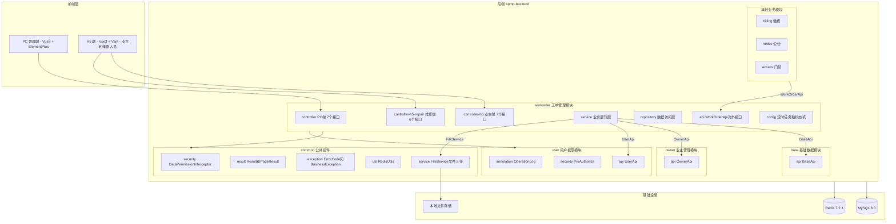
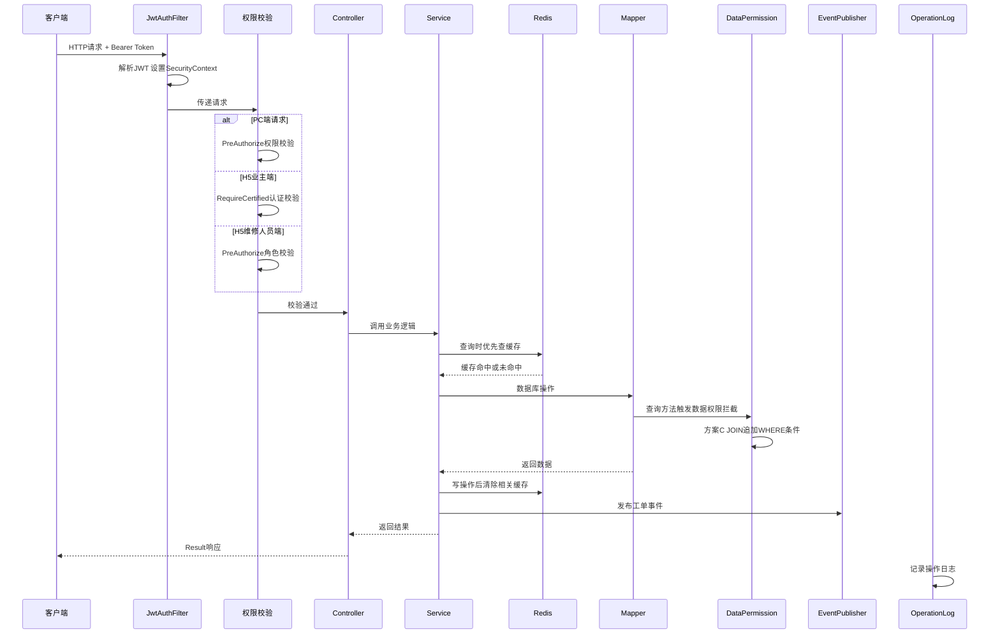
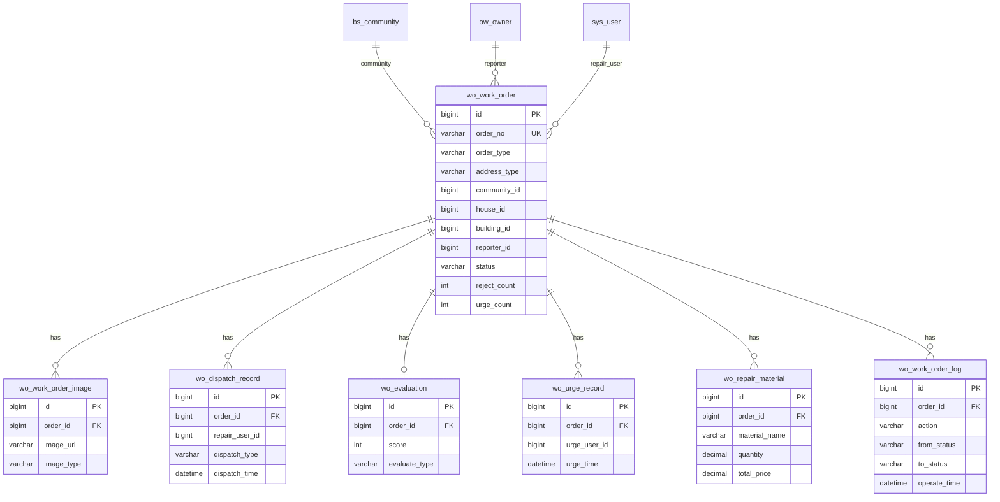

# CR04 - 工单管理 技术设计文档

| 字段 | 内容 |
|------|------|
| 文档名称 | 工单管理模块技术设计文档 |
| CR 编号 | CR04 |
| 版本 | 1.1 |
| 创建日期 | 2026-04-19 |
| 负责人 | 技术团队 |
| 状态 | 草稿 |
| 需求文档 | requirements.md（版本 2.0，已确认） |
| 依赖 | CR01（基础数据管理，已完成）、CR02（用户权限管理，已完成）、CR03（业主管理，已完成）、common 模块（已完成） |

---

## 一、概述

本设计文档定义 SPMP 智慧物业管理平台工单管理模块（`com.spmp.workorder`）的技术实现方案。该模块是平台的核心业务模块，负责报修工单的全生命周期管理，包括业主在线提交报修、工单派发（手动 + 自动）、维修人员处理、业主验收和满意度评价。

模块涉及三个端：
- PC 管理端（spmp-web-pc）：物业管理员/楼栋管家查看工单列表、派发、统计、导出
- H5 业主端（spmp-web-h5）：业主提交报修、查看进度、验收评价、催单
- H5 维修人员端（spmp-web-h5，共用应用，角色判断）：接单、处理、完成、转派

技术栈：Spring Boot 2.4.4 + Java 1.8 + MyBatis Plus + MySQL 8.0 + Redis 7.2.1

设计目标：
- 工单全生命周期管理（7 种状态、13 种流转操作）
- 手动派发 + 自动派发（楼栋优先 + 工作量均衡，V1 不含技能匹配）
- 维修材料记录、催单机制、验收不通过升级
- 统一文件上传服务（common 模块新建 FileService）
- Spring Event 异步通知（站内消息 + 短信预留）
- 定时任务（接单超时检测 + 自动验收）
- 数据权限方案C（房屋维度 + 业主维度双重路径）
- 工单列表 Redis 缓存（5 分钟 TTL）
- WorkOrderApi 对外接口（4 个方法）
- @OperationLog 操作日志 + wo_work_order_log 工单流转日志

---

## 二、架构

### 2.1 模块定位



### 2.2 内部分层架构

workorder 模块采用与 base/owner 模块一致的简化分层模式：

| 层 | 包 | 职责 |
|---|---|---|
| Controller | `controller` | PC 端 HTTP 接口，参数校验，调用 Service |
| Controller | `controller/h5` | H5 业主端 HTTP 接口，从 JWT 获取业主身份 |
| Controller | `controller/h5/repair` | H5 维修人员端 HTTP 接口，从 JWT 获取用户身份 |
| Service | `service` / `service/impl` | 业务逻辑编排，缓存管理，状态机，派发引擎 |
| Repository | `repository` | MyBatis Mapper 接口，数据访问 |
| Domain | `domain/entity` | DO 数据库实体 |
| Domain | `domain/dto` | 数据传输对象（入参/出参 DTO） |
| Domain | `domain/vo` | 值对象（VO，返回给前端） |
| API | `api` / `api/dto` | 对外接口定义 + 跨模块 DTO |
| Config | `config` | 模块级配置（定时任务、状态机、事件发布） |
| Constant | `constant` | 枚举、常量、错误码 |

### 2.3 请求处理流程



---

## 三、数据库设计

### 3.1 ER 图



### 3.2 DDL

#### 1. wo_work_order — 工单主表

```sql
CREATE TABLE `wo_work_order` (
    `id` BIGINT NOT NULL AUTO_INCREMENT COMMENT '主键',
    `order_no` VARCHAR(32) NOT NULL COMMENT '工单编号（WO+年月日+4位序号）',
    `order_type` VARCHAR(32) NOT NULL COMMENT '报修类型（字典编码 WORKORDER_TYPE）',
    `address_type` VARCHAR(20) NOT NULL DEFAULT 'HOUSE' COMMENT '地址类型（HOUSE-房屋 PUBLIC-公共区域）',
    `community_id` BIGINT NOT NULL COMMENT '小区ID（冗余，关联 bs_community.id）',
    `house_id` BIGINT DEFAULT NULL COMMENT '房屋ID（房屋报修时关联 bs_house.id）',
    `building_id` BIGINT DEFAULT NULL COMMENT '楼栋ID（公共区域报修时关联 bs_building.id）',
    `unit_id` BIGINT DEFAULT NULL COMMENT '单元ID（公共区域报修时关联 bs_unit.id，可选）',
    `reporter_id` BIGINT NOT NULL COMMENT '报修人（业主ID，关联 ow_owner.id）',
    `reporter_name` VARCHAR(64) NOT NULL COMMENT '报修人姓名（冗余）',
    `reporter_phone` VARCHAR(256) NOT NULL COMMENT '报修人手机号（AES-256 加密存储，冗余）',
    `description` TEXT NOT NULL COMMENT '问题描述',
    `status` VARCHAR(20) NOT NULL DEFAULT 'PENDING_DISPATCH' COMMENT '工单状态（PENDING_DISPATCH-待派发 PENDING_ACCEPT-待接单 IN_PROGRESS-处理中 PENDING_VERIFY-待验收 COMPLETED-已完成 CANCELLED-已取消 FORCE_CLOSED-已关闭）',
    `repair_user_id` BIGINT DEFAULT NULL COMMENT '当前维修人员ID（关联 sys_user.id）',
    `reject_count` INT NOT NULL DEFAULT 0 COMMENT '验收不通过次数（累计）',
    `urge_count` INT NOT NULL DEFAULT 0 COMMENT '催单次数（累计）',
    `last_urge_time` DATETIME DEFAULT NULL COMMENT '最近催单时间',
    `expected_complete_time` DATETIME DEFAULT NULL COMMENT '预计完成时间',
    `actual_start_time` DATETIME DEFAULT NULL COMMENT '实际开始时间（接单时间）',
    `actual_complete_time` DATETIME DEFAULT NULL COMMENT '实际完成时间（维修完成时间）',
    `repair_duration` INT DEFAULT NULL COMMENT '实际维修时长（分钟）',
    `cancel_reason` VARCHAR(512) DEFAULT NULL COMMENT '取消/关闭原因',
    `cancel_by` BIGINT DEFAULT NULL COMMENT '取消/关闭操作人ID',
    `del_flag` TINYINT NOT NULL DEFAULT 0 COMMENT '删除标记（0-正常 1-删除）',
    `create_time` DATETIME NOT NULL DEFAULT CURRENT_TIMESTAMP COMMENT '创建时间',
    `update_time` DATETIME NOT NULL DEFAULT CURRENT_TIMESTAMP ON UPDATE CURRENT_TIMESTAMP COMMENT '更新时间',
    `create_by` VARCHAR(64) NOT NULL DEFAULT '' COMMENT '创建人',
    `update_by` VARCHAR(64) NOT NULL DEFAULT '' COMMENT '更新人',
    PRIMARY KEY (`id`),
    UNIQUE KEY `uk_order_no` (`order_no`),
    KEY `idx_community_id` (`community_id`),
    KEY `idx_house_id` (`house_id`),
    KEY `idx_building_id` (`building_id`),
    KEY `idx_reporter_id` (`reporter_id`),
    KEY `idx_repair_user_id` (`repair_user_id`),
    KEY `idx_status` (`status`),
    KEY `idx_order_type` (`order_type`),
    KEY `idx_create_time` (`create_time`),
    KEY `idx_status_create_time` (`status`, `create_time`)
) ENGINE=InnoDB DEFAULT CHARSET=utf8mb4 COLLATE=utf8mb4_general_ci COMMENT='工单主表';
```

#### 2. wo_work_order_image — 工单图片表

```sql
CREATE TABLE `wo_work_order_image` (
    `id` BIGINT NOT NULL AUTO_INCREMENT COMMENT '主键',
    `order_id` BIGINT NOT NULL COMMENT '工单ID',
    `image_url` VARCHAR(512) NOT NULL COMMENT '图片URL',
    `image_type` VARCHAR(20) NOT NULL COMMENT '图片类型（REPORT-报修图片 REPAIR-维修图片 REJECT-验收不通过图片）',
    `sort_order` INT NOT NULL DEFAULT 0 COMMENT '排序',
    `create_time` DATETIME NOT NULL DEFAULT CURRENT_TIMESTAMP COMMENT '创建时间',
    PRIMARY KEY (`id`),
    KEY `idx_order_id` (`order_id`),
    KEY `idx_image_type` (`image_type`)
) ENGINE=InnoDB DEFAULT CHARSET=utf8mb4 COLLATE=utf8mb4_general_ci COMMENT='工单图片表';
```

#### 3. wo_dispatch_record — 派发记录表

```sql
CREATE TABLE `wo_dispatch_record` (
    `id` BIGINT NOT NULL AUTO_INCREMENT COMMENT '主键',
    `order_id` BIGINT NOT NULL COMMENT '工单ID',
    `repair_user_id` BIGINT NOT NULL COMMENT '维修人员ID（关联 sys_user.id）',
    `repair_user_name` VARCHAR(64) DEFAULT NULL COMMENT '维修人员姓名（冗余）',
    `dispatch_type` VARCHAR(20) NOT NULL COMMENT '派发类型（MANUAL-手动 AUTO-自动）',
    `dispatcher_id` BIGINT DEFAULT NULL COMMENT '派发人ID（手动派发时为管理员ID）',
    `dispatcher_name` VARCHAR(64) DEFAULT NULL COMMENT '派发人姓名（冗余）',
    `remark` VARCHAR(512) DEFAULT NULL COMMENT '备注',
    `dispatch_time` DATETIME NOT NULL DEFAULT CURRENT_TIMESTAMP COMMENT '派发时间',
    `del_flag` TINYINT NOT NULL DEFAULT 0 COMMENT '删除标记（0-正常 1-删除）',
    `create_time` DATETIME NOT NULL DEFAULT CURRENT_TIMESTAMP COMMENT '创建时间',
    `update_time` DATETIME NOT NULL DEFAULT CURRENT_TIMESTAMP ON UPDATE CURRENT_TIMESTAMP COMMENT '更新时间',
    `create_by` VARCHAR(64) NOT NULL DEFAULT '' COMMENT '创建人',
    `update_by` VARCHAR(64) NOT NULL DEFAULT '' COMMENT '更新人',
    PRIMARY KEY (`id`),
    KEY `idx_order_id` (`order_id`),
    KEY `idx_repair_user_id` (`repair_user_id`),
    KEY `idx_dispatch_time` (`dispatch_time`)
) ENGINE=InnoDB DEFAULT CHARSET=utf8mb4 COLLATE=utf8mb4_general_ci COMMENT='派发记录表';
```

#### 4. wo_repair_material — 维修材料表

```sql
CREATE TABLE `wo_repair_material` (
    `id` BIGINT NOT NULL AUTO_INCREMENT COMMENT '主键',
    `order_id` BIGINT NOT NULL COMMENT '工单ID',
    `material_name` VARCHAR(128) NOT NULL COMMENT '材料名称',
    `quantity` DECIMAL(10,2) NOT NULL COMMENT '数量',
    `unit` VARCHAR(20) DEFAULT NULL COMMENT '单位（个/米/千克等）',
    `unit_price` DECIMAL(10,2) NOT NULL COMMENT '单价',
    `total_price` DECIMAL(10,2) NOT NULL COMMENT '总价',
    `create_time` DATETIME NOT NULL DEFAULT CURRENT_TIMESTAMP COMMENT '创建时间',
    PRIMARY KEY (`id`),
    KEY `idx_order_id` (`order_id`)
) ENGINE=InnoDB DEFAULT CHARSET=utf8mb4 COLLATE=utf8mb4_general_ci COMMENT='维修材料表';
```

#### 5. wo_evaluation — 评价记录表

```sql
CREATE TABLE `wo_evaluation` (
    `id` BIGINT NOT NULL AUTO_INCREMENT COMMENT '主键',
    `order_id` BIGINT NOT NULL COMMENT '工单ID',
    `score` TINYINT NOT NULL COMMENT '评分（1-5星）',
    `content` VARCHAR(512) DEFAULT NULL COMMENT '评价内容',
    `evaluator_id` BIGINT NOT NULL COMMENT '评价人（业主ID）',
    `evaluate_time` DATETIME NOT NULL DEFAULT CURRENT_TIMESTAMP COMMENT '评价时间',
    `evaluate_type` VARCHAR(20) NOT NULL DEFAULT 'OWNER' COMMENT '评价类型（OWNER-业主评价 AUTO-自动验收默认）',
    `del_flag` TINYINT NOT NULL DEFAULT 0 COMMENT '删除标记（0-正常 1-删除）',
    `create_time` DATETIME NOT NULL DEFAULT CURRENT_TIMESTAMP COMMENT '创建时间',
    `update_time` DATETIME NOT NULL DEFAULT CURRENT_TIMESTAMP ON UPDATE CURRENT_TIMESTAMP COMMENT '更新时间',
    `create_by` VARCHAR(64) NOT NULL DEFAULT '' COMMENT '创建人',
    `update_by` VARCHAR(64) NOT NULL DEFAULT '' COMMENT '更新人',
    PRIMARY KEY (`id`),
    UNIQUE KEY `uk_order_id` (`order_id`),
    KEY `idx_evaluator_id` (`evaluator_id`),
    KEY `idx_score` (`score`)
) ENGINE=InnoDB DEFAULT CHARSET=utf8mb4 COLLATE=utf8mb4_general_ci COMMENT='评价记录表';
```

#### 6. wo_urge_record — 催单记录表

```sql
CREATE TABLE `wo_urge_record` (
    `id` BIGINT NOT NULL AUTO_INCREMENT COMMENT '主键',
    `order_id` BIGINT NOT NULL COMMENT '工单ID',
    `urge_user_id` BIGINT NOT NULL COMMENT '催单人（业主ID）',
    `urge_user_name` VARCHAR(64) DEFAULT NULL COMMENT '催单人姓名（冗余）',
    `urge_time` DATETIME NOT NULL DEFAULT CURRENT_TIMESTAMP COMMENT '催单时间',
    `create_time` DATETIME NOT NULL DEFAULT CURRENT_TIMESTAMP COMMENT '创建时间',
    PRIMARY KEY (`id`),
    KEY `idx_order_id` (`order_id`),
    KEY `idx_urge_time` (`urge_time`)
) ENGINE=InnoDB DEFAULT CHARSET=utf8mb4 COLLATE=utf8mb4_general_ci COMMENT='催单记录表';
```

#### 7. wo_work_order_log — 工单操作日志表

```sql
CREATE TABLE `wo_work_order_log` (
    `id` BIGINT NOT NULL AUTO_INCREMENT COMMENT '主键',
    `order_id` BIGINT NOT NULL COMMENT '工单ID',
    `action` VARCHAR(32) NOT NULL COMMENT '操作类型（CREATE-创建 DISPATCH-派发 ACCEPT-接单 COMPLETE-完成 VERIFY_PASS-验收通过 VERIFY_REJECT-验收不通过 TRANSFER-转派 CANCEL-取消 FORCE_CLOSE-强制关闭 AUTO_DISPATCH-自动派发 TIMEOUT_RETURN-超时退回 AUTO_VERIFY-自动验收 URGE-催单）',
    `from_status` VARCHAR(20) DEFAULT NULL COMMENT '变更前状态',
    `to_status` VARCHAR(20) DEFAULT NULL COMMENT '变更后状态',
    `operator_id` BIGINT DEFAULT NULL COMMENT '操作人ID',
    `operator_name` VARCHAR(64) DEFAULT NULL COMMENT '操作人姓名',
    `operator_type` VARCHAR(20) DEFAULT NULL COMMENT '操作人类型（OWNER-业主 ADMIN-管理员 REPAIR-维修人员 SYSTEM-系统）',
    `remark` VARCHAR(512) DEFAULT NULL COMMENT '备注',
    `operate_time` DATETIME NOT NULL DEFAULT CURRENT_TIMESTAMP COMMENT '操作时间',
    `create_time` DATETIME NOT NULL DEFAULT CURRENT_TIMESTAMP COMMENT '创建时间',
    PRIMARY KEY (`id`),
    KEY `idx_order_id` (`order_id`),
    KEY `idx_action` (`action`),
    KEY `idx_operate_time` (`operate_time`)
) ENGINE=InnoDB DEFAULT CHARSET=utf8mb4 COLLATE=utf8mb4_general_ci COMMENT='工单操作日志表';
```

### 3.3 DML — 初始化数据

#### 1. 报修类型字典数据

```sql
INSERT INTO `base_dict_category` (`id`, `category_code`, `category_name`, `description`, `sort_order`, `status`, `create_by`) VALUES
(100, 'WORKORDER_TYPE', '报修类型', '工单报修类型分类', 10, 'ENABLED', 'system');

INSERT INTO `base_dict` (`id`, `category_id`, `category_code`, `dict_code`, `dict_name`, `dict_value`, `sort_order`, `status`, `create_by`) VALUES
(1001, 100, 'WORKORDER_TYPE', 'WATER_ELECTRIC', '水电维修', 'WATER_ELECTRIC', 1, 'ENABLED', 'system'),
(1002, 100, 'WORKORDER_TYPE', 'DOOR_WINDOW', '门窗维修', 'DOOR_WINDOW', 2, 'ENABLED', 'system'),
(1003, 100, 'WORKORDER_TYPE', 'PIPELINE', '管道疏通', 'PIPELINE', 3, 'ENABLED', 'system'),
(1004, 100, 'WORKORDER_TYPE', 'PUBLIC_FACILITY', '公共设施', 'PUBLIC_FACILITY', 4, 'ENABLED', 'system'),
(1005, 100, 'WORKORDER_TYPE', 'OTHER', '其他', 'OTHER', 5, 'ENABLED', 'system');
```

#### 2. 菜单初始化数据（sys_menu 表，ID 从 12000 开始）

> **前端侧边栏分组**：所有 `workorder/` 前缀路由在 PC 侧边栏中归入"工单管理"分组子菜单（图标：Tickets）。

```sql
INSERT INTO `sys_menu` (`id`, `menu_name`, `parent_id`, `menu_type`, `path`, `component`, `permission`, `icon`, `sort`, `status`, `create_by`, `update_by`) VALUES
(12000, '工单管理', 0, 'D', '/workorder', NULL, NULL, 'tickets', 5, 0, 'system', 'system');

INSERT INTO `sys_menu` (`id`, `menu_name`, `parent_id`, `menu_type`, `path`, `component`, `permission`, `icon`, `sort`, `status`, `create_by`, `update_by`) VALUES
(12100, '工单列表', 12000, 'M', '/workorder/list', 'workorder/order/index', 'workorder:list', 'list', 1, 0, 'system', 'system'),
(12200, '工单统计', 12000, 'M', '/workorder/statistics', 'workorder/statistics/index', 'workorder:statistics', 'chart', 2, 0, 'system', 'system');

INSERT INTO `sys_menu` (`id`, `menu_name`, `parent_id`, `menu_type`, `path`, `component`, `permission`, `icon`, `sort`, `status`, `create_by`, `update_by`) VALUES
(12101, '工单查询', 12100, 'B', NULL, NULL, 'workorder:list', NULL, 1, 0, 'system', 'system'),
(12102, '工单详情', 12100, 'B', NULL, NULL, 'workorder:detail', NULL, 2, 0, 'system', 'system'),
(12103, '工单派发', 12100, 'B', NULL, NULL, 'workorder:dispatch', NULL, 3, 0, 'system', 'system'),
(12104, '工单取消', 12100, 'B', NULL, NULL, 'workorder:cancel', NULL, 4, 0, 'system', 'system'),
(12105, '工单导出', 12100, 'B', NULL, NULL, 'workorder:export', NULL, 5, 0, 'system', 'system'),
(12201, '统计查看', 12200, 'B', NULL, NULL, 'workorder:statistics', NULL, 1, 0, 'system', 'system');

INSERT INTO `sys_role_menu` (`role_id`, `menu_id`)
SELECT 1, id FROM `sys_menu` WHERE id >= 12000 AND id < 13000;
```

---

## 四、代码分层与包结构

```
com.spmp.workorder/
├── api/                                    # 对外 API 接口
│   ├── WorkOrderApi.java                   # 工单对外 API 接口（4 个方法）
│   └── dto/                                # 跨模块 DTO
│       ├── WorkOrderBriefDTO.java          # 工单摘要信息
│       ├── WorkOrderStatisticsDTO.java     # 工单统计信息
│       └── WorkOrderOwnerDTO.java          # 业主工单列表 DTO
├── controller/                             # PC 端 HTTP 接口层
│   ├── WorkOrderController.java            # 工单管理（列表/详情/派发/取消/导出）
│   └── WorkOrderStatisticsController.java  # 工单统计
│   └── h5/                                 # H5 端 HTTP 接口层
│       ├── H5WorkOrderController.java      # H5 业主端（提交/我的/详情/验收/评价/催单/取消）
│       └── repair/                         # H5 维修人员端
│           └── H5RepairController.java     # H5 维修人员端（工作台/待处理/历史/接单/完成/转派）
├── service/                                # 业务逻辑层
│   ├── WorkOrderService.java              # 工单核心服务接口
│   ├── WorkOrderQueryService.java          # 工单查询服务接口
│   ├── DispatchService.java                # 派发服务接口（手动 + 自动）
│   ├── WorkOrderStatisticsService.java     # 统计服务接口
│   ├── EvaluationService.java              # 评价服务接口
│   ├── UrgeService.java                    # 催单服务接口
│   ├── WorkOrderCacheService.java          # 缓存管理服务接口
│   └── impl/                               # 实现类
│       ├── WorkOrderServiceImpl.java
│       ├── WorkOrderQueryServiceImpl.java
│       ├── DispatchServiceImpl.java
│       ├── WorkOrderStatisticsServiceImpl.java
│       ├── EvaluationServiceImpl.java
│       ├── UrgeServiceImpl.java
│       ├── WorkOrderCacheServiceImpl.java
│       └── WorkOrderApiImpl.java           # 同时实现 WorkOrderApi
├── domain/                                 # 领域模型
│   ├── entity/                             # DO 数据库实体
│   │   ├── WorkOrderDO.java
│   │   ├── WorkOrderImageDO.java
│   │   ├── DispatchRecordDO.java
│   │   ├── RepairMaterialDO.java
│   │   ├── EvaluationDO.java
│   │   ├── UrgeRecordDO.java
│   │   └── WorkOrderLogDO.java
│   ├── dto/                                # 数据传输对象
│   │   ├── WorkOrderCreateDTO.java         # 业主提交报修
│   │   ├── WorkOrderQueryDTO.java          # PC 列表查询
│   │   ├── WorkOrderDispatchDTO.java       # 手动派发
│   │   ├── WorkOrderCancelDTO.java         # 取消/关闭
│   │   ├── WorkOrderVerifyDTO.java         # 验收
│   │   ├── WorkOrderEvaluateDTO.java       # 评价
│   │   ├── WorkOrderCompleteDTO.java       # 维修完成
│   │   ├── RepairMaterialDTO.java          # 维修材料
│   │   ├── StatisticsQueryDTO.java         # 统计查询
│   │   └── H5WorkOrderQueryDTO.java        # H5 我的工单查询
│   └── vo/                                 # 值对象
│       ├── WorkOrderListVO.java            # PC 列表 VO
│       ├── WorkOrderDetailVO.java          # 详情 VO
│       ├── WorkOrderSimpleVO.java          # H5 列表 VO
│       ├── WorkOrderProgressVO.java        # H5 进度 VO
│       ├── DispatchRecordVO.java           # 派发记录 VO
│       ├── RepairMaterialVO.java           # 维修材料 VO
│       ├── EvaluationVO.java               # 评价 VO
│       ├── WorkOrderLogVO.java             # 操作日志 VO
│       ├── StatisticsVO.java               # 统计看板 VO
│       ├── TrendDataVO.java                # 趋势图数据 VO
│       ├── RepairDashboardVO.java          # 维修人员工作台 VO
│       └── RepairStaffVO.java              # 维修人员选项 VO
├── repository/                             # 数据访问层
│   ├── WorkOrderMapper.java
│   ├── WorkOrderImageMapper.java
│   ├── DispatchRecordMapper.java
│   ├── RepairMaterialMapper.java
│   ├── EvaluationMapper.java
│   ├── UrgeRecordMapper.java
│   └── WorkOrderLogMapper.java
├── config/                                 # 模块级配置
│   ├── WorkOrderStateMachine.java          # 状态机（状态流转校验）
│   ├── OrderNoGenerator.java               # 工单编号生成器（Redis 自增）
│   ├── DispatchStrategyEngine.java         # 自动派发策略引擎
│   ├── WorkOrderEventPublisher.java        # 工单事件发布
│   ├── WorkOrderEventListener.java         # 工单事件监听器
│   ├── AcceptTimeoutTask.java              # 接单超时定时任务
│   └── AutoVerifyTask.java                 # 自动验收定时任务
└── constant/                               # 常量和枚举
    ├── WorkOrderErrorCode.java             # workorder 模块错误码（5000-5999）
    ├── WorkOrderConstants.java             # 常量定义
    ├── WorkOrderStatus.java                # 工单状态枚举
    ├── AddressType.java                    # 地址类型枚举
    ├── ImageType.java                      # 图片类型枚举
    ├── DispatchType.java                   # 派发类型枚举
    ├── WorkOrderAction.java                # 操作类型枚举
    └── EvaluateType.java                   # 评价类型枚举
```

---

## 五、组件与接口设计

### 5.1 PC 端 — 工单管理（WorkOrderController + WorkOrderQueryService + WorkOrderService）

#### WorkOrderController

```java
@RestController
@RequestMapping("/api/v1/workorder/orders")
public class WorkOrderController {

    @GetMapping
    @PreAuthorize("@perm.check('workorder:list')")
    public PageResult<WorkOrderListVO> listWorkOrders(WorkOrderQueryDTO queryDTO);

    @GetMapping("/{id}")
    @PreAuthorize("@perm.check('workorder:detail')")
    public Result<WorkOrderDetailVO> getWorkOrderDetail(@PathVariable Long id);

    @PutMapping("/{id}/dispatch")
    @PreAuthorize("@perm.check('workorder:dispatch')")
    @OperationLog(module = "工单管理", type = "DISPATCH", description = "派发工单")
    public Result<Void> dispatchWorkOrder(@PathVariable Long id, @Valid @RequestBody WorkOrderDispatchDTO dispatchDTO);

    @PutMapping("/{id}/cancel")
    @PreAuthorize("@perm.check('workorder:cancel')")
    @OperationLog(module = "工单管理", type = "CANCEL", description = "取消/关闭工单")
    public Result<Void> cancelWorkOrder(@PathVariable Long id, @Valid @RequestBody WorkOrderCancelDTO cancelDTO);

    @GetMapping("/statistics")
    @PreAuthorize("@perm.check('workorder:statistics')")
    public Result<StatisticsVO> getStatistics(StatisticsQueryDTO queryDTO);

    @GetMapping("/export")
    @PreAuthorize("@perm.check('workorder:export')")
    @OperationLog(module = "工单管理", type = "EXPORT", description = "导出工单")
    public void exportWorkOrders(WorkOrderQueryDTO queryDTO, HttpServletResponse response);

    @GetMapping("/staff")
    @PreAuthorize("@perm.check('workorder:dispatch')")
    public Result<List<RepairStaffVO>> listRepairStaff(@RequestParam(required = false) Long communityId);
}
```

#### WorkOrderService

```java
public interface WorkOrderService {

    /** 派发工单（手动选择维修人员，状态 PENDING_DISPATCH → PENDING_ACCEPT） */
    void dispatchWorkOrder(Long id, WorkOrderDispatchDTO dispatchDTO);

    /** 取消/强制关闭工单 */
    void cancelWorkOrder(Long id, WorkOrderCancelDTO cancelDTO);

    /** 维修人员接单（状态 PENDING_ACCEPT → IN_PROGRESS） */
    void acceptWorkOrder(Long id, Long repairUserId);

    /** 维修完成（状态 IN_PROGRESS → PENDING_VERIFY，含材料+时长） */
    void completeWorkOrder(Long id, WorkOrderCompleteDTO completeDTO);

    /** 转派（状态 IN_PROGRESS → PENDING_DISPATCH） */
    void transferWorkOrder(Long id, Long repairUserId, String reason);

    /** 验收（通过 → COMPLETED，不通过 → IN_PROGRESS） */
    void verifyWorkOrder(Long id, WorkOrderVerifyDTO verifyDTO);
}
```

### 5.2 H5 业主端（H5WorkOrderController）

```java
@RestController
@RequestMapping("/api/v1/workorder/h5/orders")
public class H5WorkOrderController {

    @PostMapping
    @RequireCertified
    @OperationLog(module = "工单管理", type = "CREATE", description = "提交报修")
    public Result<Long> createWorkOrder(@Valid @RequestBody WorkOrderCreateDTO createDTO);

    @GetMapping("/mine")
    @RequireCertified
    public PageResult<WorkOrderSimpleVO> listMyWorkOrders(H5WorkOrderQueryDTO queryDTO);

    @GetMapping("/{id}")
    @RequireCertified
    public Result<WorkOrderDetailVO> getWorkOrderDetail(@PathVariable Long id);

    @PutMapping("/{id}/verify")
    @RequireCertified
    @OperationLog(module = "工单管理", type = "VERIFY", description = "验收工单")
    public Result<Void> verifyWorkOrder(@PathVariable Long id, @Valid @RequestBody WorkOrderVerifyDTO verifyDTO);

    @PostMapping("/{id}/evaluate")
    @RequireCertified
    @OperationLog(module = "工单管理", type = "EVALUATE", description = "评价工单")
    public Result<Void> evaluateWorkOrder(@PathVariable Long id, @Valid @RequestBody WorkOrderEvaluateDTO evaluateDTO);

    @PostMapping("/{id}/urge")
    @RequireCertified
    @OperationLog(module = "工单管理", type = "URGE", description = "催单")
    public Result<Void> urgeWorkOrder(@PathVariable Long id);

    @PutMapping("/{id}/cancel")
    @RequireCertified
    @OperationLog(module = "工单管理", type = "CANCEL", description = "取消工单")
    public Result<Void> cancelWorkOrder(@PathVariable Long id, @Valid @RequestBody WorkOrderCancelDTO cancelDTO);
}
```

### 5.3 H5 维修人员端（H5RepairController）

```java
@RestController
@RequestMapping("/api/v1/workorder/h5/repair")
public class H5RepairController {

    @GetMapping("/dashboard")
    public Result<RepairDashboardVO> getDashboard();

    @GetMapping("/pending")
    public PageResult<WorkOrderSimpleVO> listPendingOrders(H5WorkOrderQueryDTO queryDTO);

    @GetMapping("/history")
    public PageResult<WorkOrderSimpleVO> listHistoryOrders(H5WorkOrderQueryDTO queryDTO);

    @PutMapping("/orders/{id}/accept")
    @OperationLog(module = "工单管理", type = "ACCEPT", description = "接单")
    public Result<Void> acceptWorkOrder(@PathVariable Long id);

    @PutMapping("/orders/{id}/complete")
    @OperationLog(module = "工单管理", type = "COMPLETE", description = "完成维修")
    public Result<Void> completeWorkOrder(@PathVariable Long id, @Valid @RequestBody WorkOrderCompleteDTO completeDTO);

    @PutMapping("/orders/{id}/transfer")
    @OperationLog(module = "工单管理", type = "TRANSFER", description = "转派工单")
    public Result<Void> transferWorkOrder(@PathVariable Long id, @RequestParam String reason);
}
```

### 5.4 核心 DTO/VO 定义

```java
@Data
public class WorkOrderCreateDTO {
    @NotBlank(message = "报修类型不能为空")
    private String orderType;
    @NotBlank(message = "问题描述不能为空")
    @Size(max = 1000, message = "问题描述不能超过1000个字符")
    private String description;
    @NotBlank(message = "地址类型不能为空")
    private String addressType;  // HOUSE / PUBLIC
    @NotNull(message = "小区不能为空")
    private Long communityId;
    private Long houseId;        // 房屋报修必填
    private Long buildingId;     // 公共区域报修必填
    private Long unitId;         // 公共区域报修可选
    private List<String> imageUrls;  // 报修图片 URL 列表（最多 5 张）
}

@Data
public class WorkOrderCompleteDTO {
    @NotBlank(message = "处理说明不能为空")
    @Size(max = 1000, message = "处理说明不能超过1000个字符")
    private String repairDescription;
    @NotNull(message = "维修时长不能为空")
    @Min(value = 1, message = "维修时长至少1分钟")
    private Integer repairDuration;
    private List<String> imageUrls;          // 维修图片（最多 5 张）
    private List<RepairMaterialDTO> materials; // 维修材料列表
}

@Data
public class RepairMaterialDTO {
    @NotBlank(message = "材料名称不能为空")
    private String materialName;
    @NotNull(message = "数量不能为空")
    private BigDecimal quantity;
    private String unit;
    @NotNull(message = "单价不能为空")
    private BigDecimal unitPrice;
}

@Data
public class WorkOrderVerifyDTO {
    @NotNull(message = "验收结果不能为空")
    private Boolean passed;
    private String rejectReason;     // 不通过时必填
    private List<String> rejectImageUrls;  // 不通过时必填，图片证据
    private Integer score;           // 通过时：1-5 星
    private String evaluateContent;  // 通过时：评价内容
}

@Data
public class WorkOrderDispatchDTO {
    @NotNull(message = "维修人员不能为空")
    private Long repairUserId;
    private String remark;
    private LocalDateTime expectedCompleteTime;
}

@Data
public class WorkOrderCancelDTO {
    @NotBlank(message = "取消原因不能为空")
    @Size(max = 512, message = "取消原因不能超过512个字符")
    private String cancelReason;
    private String cancelType;  // CANCEL / FORCE_CLOSE
}

@Data
public class StatisticsQueryDTO {
    private String timeRange;    // TODAY / WEEK / MONTH / CUSTOM
    private LocalDate startDate;
    private LocalDate endDate;
    private Long communityId;
    private Long buildingId;
}

@Data
public class WorkOrderQueryDTO {
    private String status;
    private String orderType;
    private Long communityId;
    private Long buildingId;
    private LocalDate startDate;
    private LocalDate endDate;
    private String keyword;      // 工单编号/报修人模糊搜索
    @Min(1) private Integer pageNum = 1;
    @Min(1) @Max(100) private Integer pageSize = 10;
}
```

### 5.5 对外 API（WorkOrderApi）

```java
public interface WorkOrderApi {

    /** 工单摘要信息（供 notice、billing 调用） */
    WorkOrderBriefDTO getWorkOrderBrief(Long workOrderId);

    /** 楼栋待处理工单数（供 base 统计展示调用） */
    int countPendingByBuildingId(Long buildingId);

    /** 按小区统计工单数（供首页仪表板调用） */
    WorkOrderStatisticsDTO countByCommunityId(Long communityId);

    /** 业主的工单列表（供其他模块展示调用） */
    List<WorkOrderOwnerDTO> listByOwnerId(Long ownerId);
}
```

---

## 六、工单状态机设计

### 6.1 状态枚举

```java
public enum WorkOrderStatus {
    PENDING_DISPATCH("PENDING_DISPATCH", "待派发"),
    PENDING_ACCEPT("PENDING_ACCEPT", "待接单"),
    IN_PROGRESS("IN_PROGRESS", "处理中"),
    PENDING_VERIFY("PENDING_VERIFY", "待验收"),
    COMPLETED("COMPLETED", "已完成"),
    CANCELLED("CANCELLED", "已取消"),
    FORCE_CLOSED("FORCE_CLOSED", "已关闭");
}
```

### 6.2 状态机实现

```java
@Component
public class WorkOrderStateMachine {

    private static final Map<WorkOrderStatus, Set<WorkOrderStatus>> TRANSITIONS = new EnumMap<>(WorkOrderStatus.class);

    static {
        TRANSITIONS.put(PENDING_DISPATCH, EnumSet.of(PENDING_ACCEPT, CANCELLED));
        TRANSITIONS.put(PENDING_ACCEPT, EnumSet.of(IN_PROGRESS, PENDING_DISPATCH, CANCELLED));
        TRANSITIONS.put(IN_PROGRESS, EnumSet.of(PENDING_VERIFY, PENDING_DISPATCH, FORCE_CLOSED));
        TRANSITIONS.put(PENDING_VERIFY, EnumSet.of(COMPLETED, IN_PROGRESS, FORCE_CLOSED));
    }

    public void checkTransition(WorkOrderStatus from, WorkOrderStatus to) {
        Set<WorkOrderStatus> allowed = TRANSITIONS.get(from);
        if (allowed == null || !allowed.contains(to)) {
            throw new BusinessException(WorkOrderErrorCode.INVALID_STATUS_TRANSITION,
                "工单状态不允许从 " + from.getDesc() + " 变更为 " + to.getDesc());
        }
    }
}
```

---

## 七、工单编号生成方案

采用 Redis 自增方案，每日自动重置：

```java
@Component
public class OrderNoGenerator {

    private static final String SEQ_KEY_PREFIX = "workorder:seq:";

    @Autowired
    private RedisUtils redisUtils;

    public String generate() {
        String today = LocalDate.now().format(DateTimeFormatter.BASIC_ISO_DATE);
        String key = SEQ_KEY_PREFIX + today;
        Long seq = redisUtils.incr(key, 1);
        redisUtils.expire(key, 25, TimeUnit.HOURS);
        return "WO" + today + String.format("%04d", seq);
    }
}
```

降级方案：Redis 不可用时，通过数据库 `SELECT MAX(order_no) FROM wo_work_order WHERE order_no LIKE CONCAT('WO', #{today}, '%')` 获取当日最大序号 +1。

---

## 八、自动派发策略引擎

V1 版本实现两种策略：楼栋优先 + 工作量均衡（不含技能匹配）。

```java
@Component
public class DispatchStrategyEngine {

    @Autowired
    private UserApi userApi;
    @Autowired
    private WorkOrderMapper workOrderMapper;

    /**
     * 自动选择维修人员：
     * 1. 查询该小区下所有 REPAIR_STAFF 用户
     * 2. 策略一：楼栋优先 - 如果工单关联楼栋，优先选负责该楼栋的维修人员
     * 3. 策略二：工作量均衡 - 选当前处理中工单数最少的维修人员
     * 4. 无合适人选返回 null，工单保持待派发状态
     */
    public Long autoSelectRepairUser(WorkOrderDO workOrder) {
        List<UserBriefDTO> staffList = userApi.getUsersByRoleCode("REPAIR_STAFF");
        if (CollectionUtils.isEmpty(staffList)) {
            return null;
        }

        // 策略一：楼栋优先
        if (workOrder.getBuildingId() != null) {
            Long preferredUserId = findPreferredByBuilding(staffList, workOrder.getBuildingId());
            if (preferredUserId != null) {
                return preferredUserId;
            }
        }

        // 策略二：工作量均衡
        return findLeastBusyUser(staffList);
    }

    private Long findLeastBusyUser(List<UserBriefDTO> staffList) {
        List<Long> staffIds = staffList.stream().map(UserBriefDTO::getUserId).collect(Collectors.toList());
        Map<Long, Integer> workloadMap = workOrderMapper.countInProgressByUserIds(staffIds);
        return staffList.stream()
            .min(Comparator.comparingInt(s -> workloadMap.getOrDefault(s.getUserId(), 0)))
            .map(UserBriefDTO::getUserId)
            .orElse(null);
    }
}
```

---

## 九、文件上传方案

### 9.1 common 模块新增 FileService

在 common 模块中新建统一文件上传服务，工单模块及其他模块复用：

```java
// com.spmp.common.service.FileService
public interface FileService {

    /** 上传文件，返回文件访问 URL */
    String upload(MultipartFile file, String category);

    /** 删除文件 */
    void delete(String fileUrl);
}
```

### 9.2 配置

```yaml
# application.yml
file:
  upload:
    path: ${FILE_UPLOAD_PATH:/data/spmp/uploads}
    max-size: 5MB
    allowed-types: image/jpeg,image/png,image/gif,image/webp
```

### 9.3 FileServiceImpl 安全校验设计

FileServiceImpl 实现三重安全校验，防止恶意文件上传：

```java
@Service
public class FileServiceImpl implements FileService {

    @Value("${file.upload.max-size:5MB}")
    private DataSize maxFileSize;

    @Value("${file.upload.allowed-types:image/jpeg,image/png,image/gif,image/webp}")
    private String allowedTypesConfig;

    // 校验1：文件大小
    private void validateFileSize(MultipartFile file) {
        if (file.getSize() > maxFileSize.toBytes()) {
            throw new BusinessException(4003, "文件大小超过限制");
        }
    }

    // 校验2：MIME Type 白名单
    private void validateFileType(MultipartFile file) {
        List<String> allowedTypes = Arrays.asList(allowedTypesConfig.split(","));
        if (!allowedTypes.contains(file.getContentType())) {
            throw new BusinessException(4005, "不支持的文件类型");
        }
    }

    // 校验3：文件头魔数校验（防止伪造扩展名）
    private void validateMagicBytes(MultipartFile file) {
        // JPEG: FFD8FF, PNG: 89504E47, GIF: 47494638, WEBP(RIFF): 52494646
        byte[] header = readFirstBytes(file, 8);
        String hex = bytesToHex(header).toUpperCase();
        boolean valid = IMAGE_MAGIC_BYTES.stream().anyMatch(hex::startsWith);
        if (!valid) throw new BusinessException(4005, "文件内容与类型不匹配");
    }
}
```

### 9.4 FileController

```java
// com.spmp.common.controller.FileController
@RestController
@RequestMapping("/api/v1/common/files")
public class FileController {

    @PostMapping("/upload")
    public Result<String> upload(@RequestParam("file") MultipartFile file,
                                  @RequestParam(defaultValue = "workorder") String category);

    @GetMapping("/{category}/{filename}")
    public ResponseEntity<Resource> download(@PathVariable String category, @PathVariable String filename);
}
```

### 9.5 前端文件上传设计

#### 9.5.1 上传 API 封装

PC 端（`spmp-web-pc/src/api/common/upload.ts`）和 H5 端（`spmp-web-h5/src/api/common/upload.ts`）统一封装：

```typescript
// upload.ts
export const UPLOAD_CONSTANTS = {
  ALLOWED_TYPES: ['image/jpeg', 'image/png', 'image/gif', 'image/webp'],
  MAX_SIZE: 5 * 1024 * 1024,  // 5MB
  MAX_COUNT: 5,
  ACCEPT: '.jpg,.jpeg,.png,.gif,.webp'
}

// 上传单个文件，返回 URL
export function uploadFile(file: File, category = 'workorder'): Promise<string>

// 前端本地校验（文件类型 + 大小）
export function validateFile(file: File): string | null

// 批量上传
export function uploadFiles(files: File[], category = 'workorder'): Promise<string[]>
```

#### 9.5.2 上传组件集成方案

| 端 | 组件库 | 上传组件 | 集成方式 |
|------|------|---------|---------|
| PC 管理端 | Element Plus | `el-upload` | 图片预览使用 `el-image` + `preview-src-list` |
| H5 业主端 | Vant 4 | `van-uploader` | `after-read` 回调调用 uploadFile，上传状态通过 `status/message` 展示 |
| H5 维修人员端 | Vant 4 | `van-uploader` | 同业主端 |

#### 9.5.3 上传流程

```
用户选择图片 → 前端本地校验（类型+大小）
  ├─ 校验失败 → 提示错误，移除文件
  └─ 校验通过 → 显示"上传中"状态
                → 调用 POST /api/v1/common/files/upload
                  ├─ 成功 → 记录返回的 URL，状态变为"已完成"
                  └─ 失败 → 状态变为"上传失败"，允许重试
用户点击提交 → 将所有已上传的 URL 列表随表单一起提交到业务接口
```

#### 9.5.4 集成页面清单

| 页面 | 文件路径 | 上传场景 |
|------|---------|---------|
| H5 提交报修 | `spmp-web-h5/src/views/workorder/WorkorderView.vue` | `van-uploader`，提交时传 `imageUrls` |
| H5 工单详情 | `spmp-web-h5/src/views/workorder/detail.vue` | 验收不通过时 `van-uploader`，传 `rejectImageUrls`；报修图片只读预览 |
| H5 维修处理 | `spmp-web-h5/src/views/repair/handle.vue` | 完成维修时 `van-uploader`，传 `imageUrls` |
| PC 工单详情 | `spmp-web-pc/src/views/workorder/order/detail.vue` | `el-image` + `preview-src-list` 只读预览 |
```

---

## 十、Spring Event 通知方案

### 10.1 事件定义

```java
public class WorkOrderEvent extends ApplicationEvent {
    private final Long orderId;
    private final String action;       // DISPATCH / ACCEPT / COMPLETE / VERIFY_REJECT / TIMEOUT / URGE / CANCEL
    private final Long targetUserId;   // 通知目标用户ID
    private final Map<String, Object> data;

    public WorkOrderEvent(Object source, Long orderId, String action, Long targetUserId, Map<String, Object> data) {
        super(source);
        this.orderId = orderId;
        this.action = action;
        this.targetUserId = targetUserId;
        this.data = data;
    }
}
```

### 10.2 事件发布

```java
@Component
public class WorkOrderEventPublisher {

    @Autowired
    private ApplicationEventPublisher eventPublisher;

    public void publishDispatch(Long orderId, Long repairUserId, String orderNo) {
        Map<String, Object> data = new HashMap<>();
        data.put("orderNo", orderNo);
        data.put("message", "您有新的维修工单：" + orderNo);
        eventPublisher.publishEvent(new WorkOrderEvent(this, orderId, "DISPATCH", repairUserId, data));
    }

    public void publishAccept(Long orderId, Long ownerId, String orderNo) { ... }
    public void publishComplete(Long orderId, Long ownerId, String orderNo) { ... }
    public void publishVerifyReject(Long orderId, Long repairUserId, String orderNo) { ... }
    public void publishTimeout(Long orderId, Long managerId, String orderNo) { ... }
    public void publishUrge(Long orderId, Long managerId, Long repairUserId, String orderNo) { ... }
    public void publishCancel(Long orderId, Long repairUserId, String orderNo) { ... }
}
```

### 10.3 事件监听器

```java
@Component
@Slf4j
public class WorkOrderEventListener {

    @Async
    @EventListener
    public void handleWorkOrderEvent(WorkOrderEvent event) {
        log.info("收到工单事件：orderId={}, action={}, targetUserId={}",
            event.getOrderId(), event.getAction(), event.getTargetUserId());

        // 1. 记录站内消息（写入通知表，待 notice 模块实现后对接）
        log.info("[站内消息] userId={}, message={}", event.getTargetUserId(), event.getData().get("message"));

        // 2. 短信通知（预留接口，当前仅记录日志）
        log.info("[短信通知-预留] userId={}, message={}", event.getTargetUserId(), event.getData().get("message"));
    }
}
```

---

## 十一、定时任务方案

### 11.1 接单超时检测

```java
@Component
@Slf4j
public class AcceptTimeoutTask {

    @Autowired
    private WorkOrderMapper workOrderMapper;
    @Autowired
    private WorkOrderEventPublisher eventPublisher;

    @Scheduled(fixedRate = 30 * 60 * 1000) // 每 30 分钟
    public void checkAcceptTimeout() {
        LocalDateTime remindTime = LocalDateTime.now().minusHours(2);
        LocalDateTime returnTime = LocalDateTime.now().minusHours(3);

        // 2 小时未接单 → 提醒
        List<WorkOrderDO> remindOrders = workOrderMapper.selectList(
            new LambdaQueryWrapper<WorkOrderDO>()
                .eq(WorkOrderDO::getStatus, "PENDING_ACCEPT")
                .le(WorkOrderDO::getUpdateTime, remindTime)
                .isNull(WorkOrderDO::getCancelReason)
        );
        remindOrders.forEach(order -> {
            eventPublisher.publishTimeout(order.getId(), order.getRepairUserId(), order.getOrderNo());
        });

        // 3 小时未接单 → 退回待派发
        List<WorkOrderDO> returnOrders = workOrderMapper.selectList(
            new LambdaQueryWrapper<WorkOrderDO>()
                .eq(WorkOrderDO::getStatus, "PENDING_ACCEPT")
                .le(WorkOrderDO::getUpdateTime, returnTime)
                .isNull(WorkOrderDO::getCancelReason)
        );
        returnOrders.forEach(order -> {
            order.setStatus("PENDING_DISPATCH");
            order.setRepairUserId(null);
            workOrderMapper.updateById(order);
            // 记录操作日志
            // 通知楼栋管家
            eventPublisher.publishTimeoutReturn(order.getId(), order.getCommunityId(), order.getOrderNo());
        });
    }
}
```

### 11.2 自动验收

```java
@Component
@Slf4j
public class AutoVerifyTask {

    @Autowired
    private WorkOrderMapper workOrderMapper;
    @Autowired
    private EvaluationMapper evaluationMapper;

    @Scheduled(fixedRate = 60 * 60 * 1000) // 每 1 小时
    public void autoVerify() {
        LocalDateTime verifyDeadline = LocalDateTime.now().minusDays(7);

        List<WorkOrderDO> orders = workOrderMapper.selectList(
            new LambdaQueryWrapper<WorkOrderDO>()
                .eq(WorkOrderDO::getStatus, "PENDING_VERIFY")
                .le(WorkOrderDO::getActualCompleteTime, verifyDeadline)
        );

        orders.forEach(order -> {
            order.setStatus("COMPLETED");
            workOrderMapper.updateById(order);

            // 自动创建 5 星评价
            EvaluationDO evaluation = new EvaluationDO();
            evaluation.setOrderId(order.getId());
            evaluation.setScore(5);
            evaluation.setEvaluateType("AUTO");
            evaluation.setEvaluatorId(order.getReporterId());
            evaluationMapper.insert(evaluation);
        });

        log.info("自动验收完成，处理 {} 条工单", orders.size());
    }
}
```

---

## 十二、数据权限方案

### 12.1 方案C 双重路径

PC 端工单列表查询通过 DataPermissionInterceptor 自动追加 WHERE 条件：

**路径1：通过 community_id 直接关联**

```sql
-- wo_work_order 已冗余 community_id
-- DataPermissionInterceptor 追加：
SELECT wo.* FROM wo_work_order wo
WHERE wo.community_id IN (
    SELECT bc.id FROM bs_community bc
    INNER JOIN bs_district bd ON bc.district_id = bd.id
    WHERE /* 数据权限条件 */
)
```

**路径2：通过 reporter_id 关联业主房产绑定**

```sql
SELECT wo.* FROM wo_work_order wo
WHERE wo.reporter_id IN (
    SELECT pb.owner_id FROM ow_property_binding pb
    INNER JOIN bs_house bh ON pb.house_id = bh.id
    INNER JOIN bs_unit bu ON bh.unit_id = bu.id
    INNER JOIN bs_building bb ON bu.building_id = bb.id
    INNER JOIN bs_community bc ON bb.community_id = bc.id
    WHERE /* 数据权限条件 */
)
```

### 12.2 实现方式

在 WorkOrderMapper 的分页查询方法上标注 `@DataPermission` 注解，DataPermissionInterceptor 自动拼接 SQL。由于 `wo_work_order` 已冗余 `community_id`，路径1 为主路径，路径2 作为补充（当工单无 community_id 时使用）。

---

## 十三、缓存方案

### 13.1 缓存 Key 设计

| Key 模式 | TTL | 说明 |
|---------|-----|------|
| `workorder:list:{hash}` | 5 分钟 | 工单列表缓存，hash = 查询参数 MD5 |
| `workorder:detail:{id}` | 5 分钟 | 工单详情缓存 |
| `workorder:seq:{yyyyMMdd}` | 25 小时 | 工单编号序列 |

### 13.2 缓存清除策略

- 工单任何写操作（派发/接单/完成/验收/取消/催单）后，清除该工单详情缓存和相关列表缓存
- 列表缓存采用 key 前缀模糊匹配清除（`workorder:list:*`），或通过维护 key 集合清除
- 维修人员工作台数据不缓存，实时查询

---

## 十四、操作日志方案

### 14.1 @OperationLog 使用

关键操作使用 `@OperationLog` 注解记录到 `sys_operation_log` 表：

| 操作 | 注解 | 说明 |
|------|------|------|
| 提交报修 | `@OperationLog(module = "工单管理", type = "CREATE")` | 业主提交 |
| 派发工单 | `@OperationLog(module = "工单管理", type = "DISPATCH")` | 手动派发 |
| 取消/关闭 | `@OperationLog(module = "工单管理", type = "CANCEL")` | 取消/关闭 |
| 导出 | `@OperationLog(module = "工单管理", type = "EXPORT")` | Excel 导出 |
| 验收 | `@OperationLog(module = "工单管理", type = "VERIFY")` | 业主验收 |
| 评价 | `@OperationLog(module = "工单管理", type = "EVALUATE")` | 业主评价 |
| 催单 | `@OperationLog(module = "工单管理", type = "URGE")` | 业主催单 |
| 接单 | `@OperationLog(module = "工单管理", type = "ACCEPT")` | 维修人员接单 |
| 完成 | `@OperationLog(module = "工单管理", type = "COMPLETE")` | 维修完成 |
| 转派 | `@OperationLog(module = "工单管理", type = "TRANSFER")` | 维修人员转派 |

### 14.2 wo_work_order_log 工单流转日志

每次工单状态变更，Service 层主动写入 `wo_work_order_log` 表，记录：
- 操作类型、变更前状态、变更后状态
- 操作人 ID、姓名、类型（OWNER/ADMIN/REPAIR/SYSTEM）
- 操作时间和备注

工单详情页展示完整的流转时间线。

---

## 十五、跨模块调用方案

### 15.1 调用矩阵

| 调用方 | 被调用 API | 方法 | 场景 |
|--------|-----------|------|------|
| workorder | BaseApi | `getCommunityById()` | 工单创建时校验小区 |
| workorder | BaseApi | `getBuildingById()` | 工单创建时校验楼栋 |
| workorder | BaseApi | `getHouseById()` | 房屋报修时校验房屋 |
| workorder | OwnerApi | `getOwnerById()` | 获取报修人信息 |
| workorder | OwnerApi | `checkOwnerCertified()` | 校验业主认证状态 |
| workorder | UserApi | `getUsersByRoleCode("REPAIR_STAFF")` | 查询维修人员列表 |
| workorder | UserApi | `getUserById()` | 获取维修人员信息 |
| notice | WorkOrderApi | `getWorkOrderBrief()` | 公告关联工单 |
| billing | WorkOrderApi | `getWorkOrderBrief()` | 缴费关联维修费用 |
| base | WorkOrderApi | `countPendingByBuildingId()` | 楼栋统计展示 |

---

## 十六、错误处理

### 错误码定义（5000-5999）

| 错误码 | 常量名 | 说明 |
|--------|--------|------|
| 5001 | WORK_ORDER_NOT_FOUND | 工单不存在 |
| 5002 | INVALID_STATUS_TRANSITION | 状态流转不合法 |
| 5003 | WORK_ORDER_ALREADY_DISPATCHED | 工单已派发 |
| 5004 | WORK_ORDER_ALREADY_ACCEPTED | 工单已接单 |
| 5005 | WORK_ORDER_ALREADY_CANCELLED | 工单已取消 |
| 5006 | WORK_ORDER_ALREADY_COMPLETED | 工单已完成 |
| 5007 | REPAIR_USER_NOT_FOUND | 维修人员不存在 |
| 5008 | NO_REPAIR_STAFF_AVAILABLE | 无可用维修人员 |
| 5009 | REJECT_LIMIT_EXCEEDED | 验收不通过次数超限 |
| 5010 | OWNER_NOT_CERTIFIED | 业主未认证 |
| 5011 | WORK_ORDER_NOT_YOURS | 非本人工单 |
| 5012 | IMAGE_LIMIT_EXCEEDED | 图片数量超限 |
| 5013 | EXPORT_LIMIT_EXCEEDED | 导出数量超限（1000 条） |
| 5014 | DUPLICATE_ORDER_NO | 工单编号重复 |
| 5015 | DISPATCH_RECORD_NOT_FOUND | 派发记录不存在 |
| 5016 | EVALUATION_ALREADY_EXISTS | 评价已存在 |
| 5017 | VERIFY_REJECT_REASON_REQUIRED | 验收不通过原因必填 |
| 5018 | VERIFY_REJECT_IMAGE_REQUIRED | 验收不通过图片必填 |
| 5019 | CANCEL_REASON_REQUIRED | 取消原因必填 |
| 5020 | WORK_ORDER_IN_PROGRESS | 工单处理中，不可操作 |
