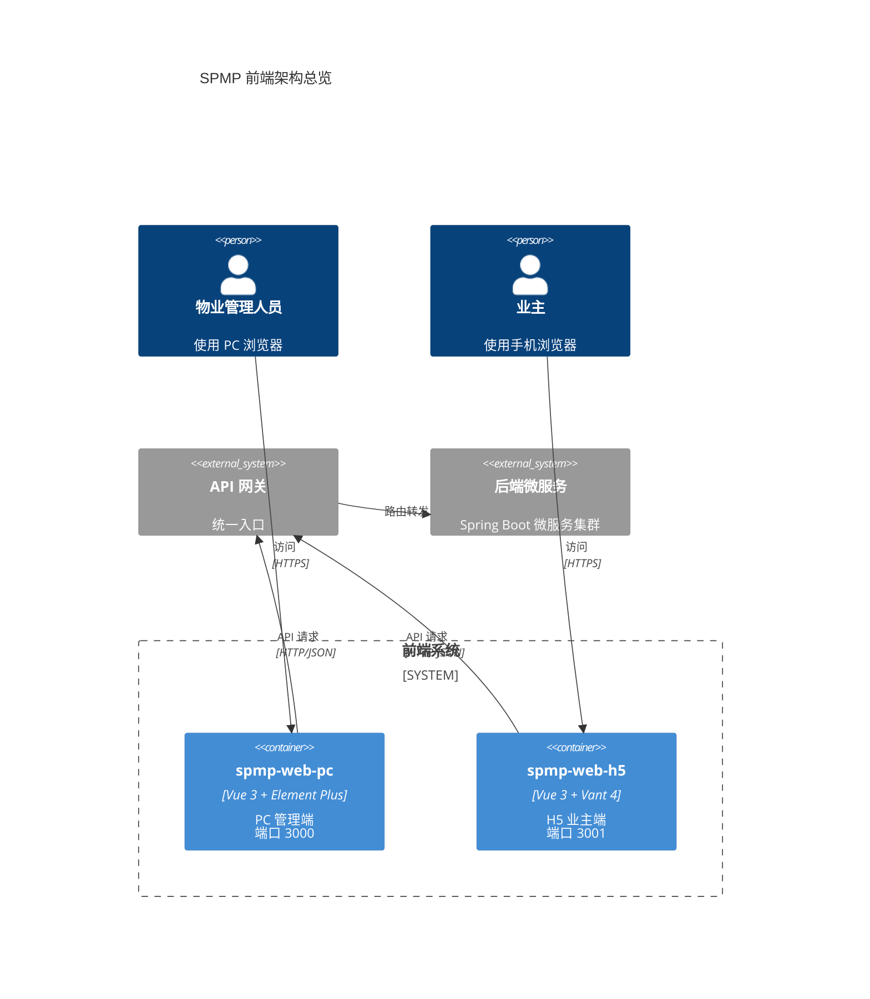
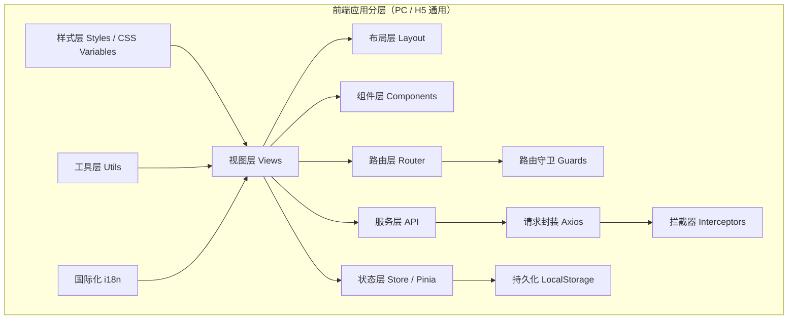
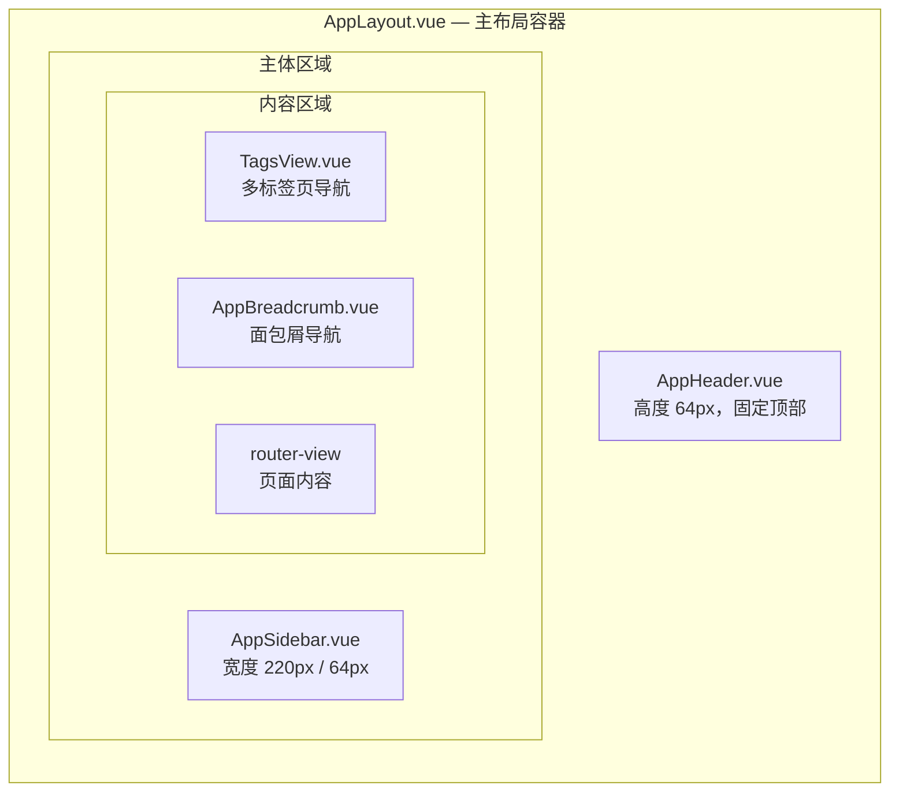
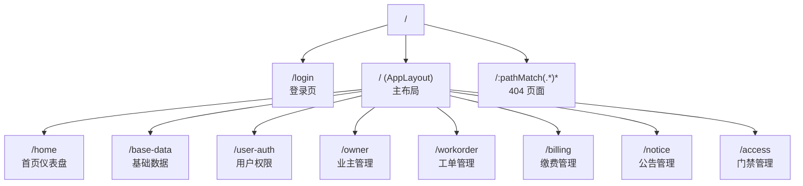
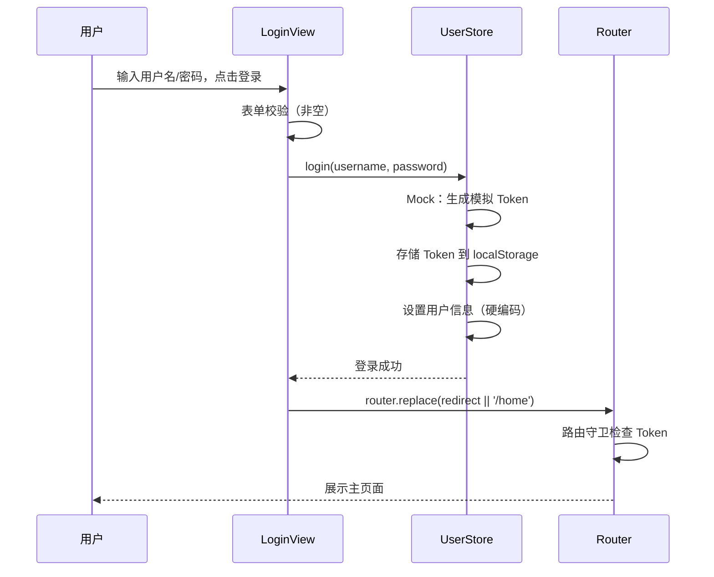
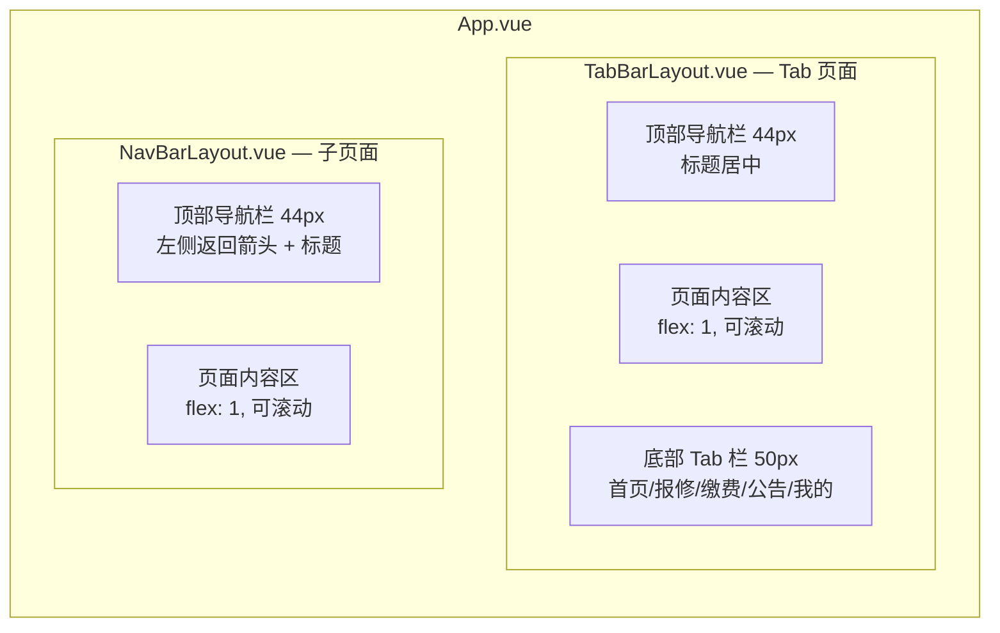
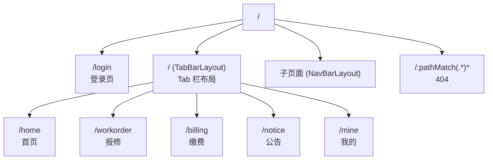
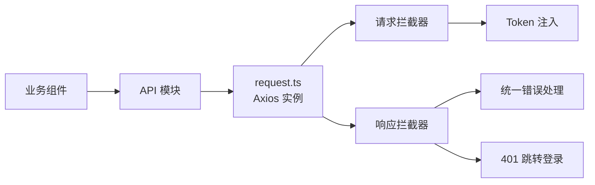
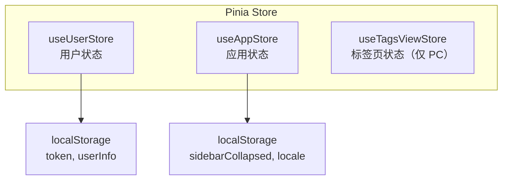
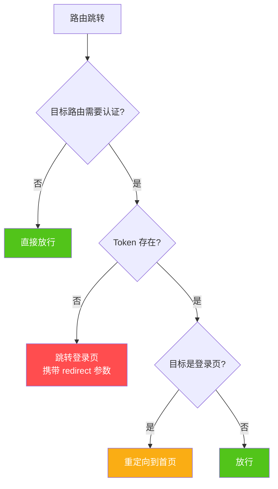

# CR01 - 前端框架搭建 技术设计文档

| 项目 | 内容 |
|------|------|
| 需求编号 | FE-CR01 |
| 需求名称 | 前端主体页面框架搭建 |
| 版本 | 1.0 |
| 创建日期 | 2026-04-17 |
| 状态 | 草稿 |

---

## 一、概述

### 1.1 项目定位

本设计方案覆盖 SPMP 智慧物业管理平台的两个前端项目：

- **spmp-web-pc**：PC 管理端，面向物业管理人员，提供完整的后台管理界面
- **spmp-web-h5**：H5 业主端，面向小区业主，提供移动端物业服务入口

两个项目完全独立，各自拥有独立的 `package.json`、构建配置和开发服务器，公共代码各自维护。

### 1.2 设计范围

- 工程骨架搭建（Vite + Vue 3 + TypeScript）
- 布局组件开发（PC 端三栏布局 + Tags View、H5 端 Tab 栏布局）
- 路由框架（静态路由 + 动态路由注册预留）
- 请求封装（Axios 拦截器、错误处理、Token 注入）
- 状态管理（Pinia user/app store）
- Mock 登录流程（前端硬编码模拟）
- 全局样式（CSS 变量与 UI 规范对齐）
- 代码规范（ESLint + Prettier + TypeScript 严格模式）
- 国际化预留（vue-i18n 基础配置）

### 1.3 技术选型确认

| 类别 | PC 管理端 | H5 业主端 |
|------|-----------|-----------|
| 框架 | Vue 3.4 + Composition API + `<script setup>` | 同左 |
| 构建 | Vite 5 | 同左 |
| 语言 | TypeScript 5 | 同左 |
| UI 库 | Element Plus 2.7 | Vant 4 |
| 路由 | Vue Router 4（history 模式） | 同左 |
| 状态管理 | Pinia 2 | 同左 |
| HTTP | Axios 1.7 | 同左 |
| CSS 方案 | CSS 变量 + Element Plus 样式 | CSS 变量 + Vant 样式 + postcss-px-to-viewport |
| 国际化 | vue-i18n 9（预留） | 同左 |
| 开发端口 | 3000 | 3001 |

### 1.4 整体架构图



### 1.5 前端分层架构




### 1.6 项目工程结构

两个项目完全独立，分别位于 `src/spmp-web-pc/` 和 `src/spmp-web-h5/`。

#### PC 管理端目录结构

```
src/spmp-web-pc/
├── public/
│   └── favicon.ico
├── src/
│   ├── api/                        # API 接口定义（占位）
│   │   └── index.ts
│   ├── assets/                     # 静态资源
│   │   └── icons/                  # SVG 图标
│   ├── components/                 # 公共组件
│   ├── layout/                     # 布局组件
│   │   ├── AppLayout.vue           # 主布局容器
│   │   ├── AppHeader.vue           # 顶部导航栏
│   │   ├── AppSidebar.vue          # 侧边菜单栏
│   │   ├── AppBreadcrumb.vue       # 面包屑导航
│   │   └── TagsView.vue            # 多标签页
│   ├── locales/                    # 国际化资源（预留）
│   │   ├── zh-CN.ts
│   │   └── en-US.ts
│   ├── router/                     # 路由配置
│   │   ├── index.ts                # 路由实例
│   │   ├── static-routes.ts        # 静态路由
│   │   └── guard.ts                # 路由守卫
│   ├── store/                      # Pinia 状态管理
│   │   ├── index.ts
│   │   └── modules/
│   │       ├── user.ts             # 用户状态
│   │       ├── app.ts              # 应用状态（侧边栏折叠等）
│   │       └── tags-view.ts        # 标签页状态
│   ├── styles/                     # 全局样式
│   │   ├── variables.css           # CSS 变量
│   │   └── global.css              # 全局样式重置
│   ├── types/                      # TypeScript 类型定义
│   │   └── index.ts
│   ├── utils/                      # 工具函数
│   │   └── request.ts              # Axios 封装
│   ├── views/                      # 页面组件
│   │   ├── login/
│   │   │   └── LoginView.vue
│   │   ├── home/
│   │   │   └── HomeView.vue
│   │   ├── error/
│   │   │   └── NotFoundView.vue
│   │   └── placeholder/
│   │       └── PlaceholderView.vue
│   ├── App.vue
│   └── main.ts
├── index.html
├── vite.config.ts
├── tsconfig.json
├── tsconfig.node.json
├── package.json
├── .eslintrc.cjs
├── .prettierrc
├── .env.development
└── .env.production
```

#### H5 业主端目录结构

```
src/spmp-web-h5/
├── public/
│   └── favicon.ico
├── src/
│   ├── api/
│   │   └── index.ts
│   ├── assets/
│   │   └── icons/
│   ├── components/
│   ├── layout/
│   │   ├── TabBarLayout.vue        # 底部 Tab 栏布局
│   │   └── NavBarLayout.vue        # 顶部导航栏布局
│   ├── locales/
│   │   ├── zh-CN.ts
│   │   └── en-US.ts
│   ├── router/
│   │   ├── index.ts
│   │   ├── static-routes.ts
│   │   └── guard.ts
│   ├── store/
│   │   ├── index.ts
│   │   └── modules/
│   │       ├── user.ts
│   │       └── app.ts
│   ├── styles/
│   │   ├── variables.css
│   │   └── global.css
│   ├── types/
│   │   └── index.ts
│   ├── utils/
│   │   └── request.ts
│   ├── views/
│   │   ├── login/
│   │   │   └── LoginView.vue
│   │   ├── home/
│   │   │   └── HomeView.vue
│   │   ├── workorder/
│   │   │   └── WorkorderView.vue
│   │   ├── billing/
│   │   │   └── BillingView.vue
│   │   ├── notice/
│   │   │   └── NoticeView.vue
│   │   ├── mine/
│   │   │   └── MineView.vue
│   │   └── error/
│   │       └── NotFoundView.vue
│   ├── App.vue
│   └── main.ts
├── index.html
├── vite.config.ts
├── tsconfig.json
├── tsconfig.node.json
├── package.json
├── postcss.config.cjs
├── .eslintrc.cjs
├── .prettierrc
├── .env.development
└── .env.production
```

---

## 二、PC 管理端（spmp-web-pc）组件与接口设计

### 2.1 布局组件设计

#### 整体布局结构



#### AppLayout.vue — 主布局容器

- 职责：组合顶部导航、侧边栏、标签页、面包屑和内容区
- 使用 Element Plus 的 `el-container` / `el-header` / `el-aside` / `el-main` 布局组件
- 通过 `appStore.sidebarCollapsed` 控制侧边栏折叠状态

```typescript
// 组件 Props：无
// 依赖 Store：useAppStore（sidebarCollapsed）
// 子组件：AppHeader, AppSidebar, TagsView, AppBreadcrumb, router-view
```

模板结构：

```html
<template>
  <el-container class="app-layout">
    <AppHeader />
    <el-container>
      <AppSidebar />
      <el-main class="app-main">
        <TagsView />
        <AppBreadcrumb />
        <router-view />
      </el-main>
    </el-container>
  </el-container>
</template>
```

#### AppHeader.vue — 顶部导航栏

- 高度：64px，固定顶部，`z-index: 1000`
- 左侧：Logo 图标 + 系统名称「智慧物业管理平台」+ 侧边栏折叠按钮
- 右侧：用户头像 + 用户名 + 下拉菜单（个人中心、退出登录）
- 背景色：`#FFFFFF`，底部 1px 边框 `#D9D9D9`

```typescript
// 组件 Props：无
// 事件：无（通过 store 操作）
// 依赖 Store：useUserStore（用户信息）、useAppStore（侧边栏折叠）
```

#### AppSidebar.vue — 侧边菜单栏

- 默认宽度 220px，折叠后 64px
- 使用 `el-menu` 组件，`router` 模式
- 菜单数据来源：`static-routes.ts` 中的路由 meta 信息
- 支持多级菜单递归渲染
- 高亮当前路由对应的菜单项
- 预留：后续从后端 API 动态获取菜单数据

```typescript
// 组件 Props：无
// 依赖 Store：useAppStore（sidebarCollapsed）
// 依赖 Router：useRoute（当前路由高亮）
```

#### AppBreadcrumb.vue — 面包屑导航

- 根据当前路由的 `matched` 数组自动生成面包屑
- 使用 `el-breadcrumb` 组件
- 首项固定为「首页」，链接到 `/home`
- 最后一项不可点击（当前页面）

```typescript
// 组件 Props：无
// 依赖 Router：useRoute（matched 路由链）
```

#### TagsView.vue — 多标签页

- 位于面包屑上方，展示已访问的页面标签
- 使用 `el-tag` 组件渲染标签列表
- 功能：
  - 点击标签切换页面
  - 关闭单个标签（首页标签不可关闭）
  - 右键菜单：关闭当前、关闭其他、关闭全部
- 标签数据存储在 `tagsViewStore` 中
- 路由切换时自动添加标签

```typescript
// 组件 Props：无
// 依赖 Store：useTagsViewStore（标签列表、添加/删除操作）
// 依赖 Router：useRoute, useRouter
```

### 2.2 路由架构设计

#### 路由结构



#### 静态路由定义（static-routes.ts）

```typescript
import type { RouteRecordRaw } from 'vue-router'

// 不需要布局的路由
export const constantRoutes: RouteRecordRaw[] = [
  {
    path: '/login',
    name: 'login',
    component: () => import('@/views/login/LoginView.vue'),
    meta: { title: '登录', requiresAuth: false, hidden: true }
  },
  {
    path: '/:pathMatch(.*)*',
    name: 'not-found',
    component: () => import('@/views/error/NotFoundView.vue'),
    meta: { title: '404', requiresAuth: false, hidden: true }
  }
]

// 需要布局的业务路由（框架搭建阶段静态配置，后续改为动态注册）
export const asyncRoutes: RouteRecordRaw[] = [
  {
    path: '/',
    component: () => import('@/layout/AppLayout.vue'),
    redirect: '/home',
    children: [
      {
        path: 'home',
        name: 'home',
        component: () => import('@/views/home/HomeView.vue'),
        meta: { title: '首页', icon: 'HomeFilled', affix: true }
      },
      {
        path: 'base-data',
        name: 'base-data',
        component: () => import('@/views/placeholder/PlaceholderView.vue'),
        meta: { title: '基础数据', icon: 'Setting' }
      },
      {
        path: 'user-auth',
        name: 'user-auth',
        component: () => import('@/views/placeholder/PlaceholderView.vue'),
        meta: { title: '用户权限', icon: 'User' }
      },
      {
        path: 'owner',
        name: 'owner',
        component: () => import('@/views/placeholder/PlaceholderView.vue'),
        meta: { title: '业主管理', icon: 'UserFilled' }
      },
      {
        path: 'workorder',
        name: 'workorder',
        component: () => import('@/views/placeholder/PlaceholderView.vue'),
        meta: { title: '工单管理', icon: 'Tickets' }
      },
      {
        path: 'billing',
        name: 'billing',
        component: () => import('@/views/placeholder/PlaceholderView.vue'),
        meta: { title: '缴费管理', icon: 'Wallet' }
      },
      {
        path: 'notice',
        name: 'notice',
        component: () => import('@/views/placeholder/PlaceholderView.vue'),
        meta: { title: '公告管理', icon: 'Bell' }
      },
      {
        path: 'access',
        name: 'access',
        component: () => import('@/views/placeholder/PlaceholderView.vue'),
        meta: { title: '门禁管理', icon: 'Lock' }
      }
    ]
  }
]
```

#### 动态路由注册机制（预留）

```typescript
// router/index.ts 中预留动态路由注册方法
export function setupDynamicRoutes(menus: MenuItem[]): void {
  // 1. 调用 GET /api/v1/auth/menus 获取用户菜单权限
  // 2. 将菜单数据转换为 RouteRecordRaw[]
  // 3. 使用 router.addRoute() 动态注册
  // 4. 添加 404 兜底路由（动态路由注册后再添加）
}
```

### 2.3 菜单配置数据结构

7 个业务模块的菜单定义，从路由 `meta` 中提取：

| 菜单名称 | 路由路径 | 图标 | 说明 |
|----------|----------|------|------|
| 首页 | `/home` | HomeFilled | 仪表盘占位 |
| 基础数据 | `/base-data` | Setting | 小区/楼栋/房屋管理 |
| 用户权限 | `/user-auth` | User | 用户/角色/权限管理 |
| 业主管理 | `/owner` | UserFilled | 业主信息管理 |
| 工单管理 | `/workorder` | Tickets | 报修工单管理 |
| 缴费管理 | `/billing` | Wallet | 账单/缴费管理 |
| 公告管理 | `/notice` | Bell | 社区公告管理 |
| 门禁管理 | `/access` | Lock | 访客/门禁管理 |

菜单渲染逻辑：遍历 `asyncRoutes` 的 children，过滤 `meta.hidden !== true` 的路由项，使用 `meta.title` 和 `meta.icon` 渲染菜单。

### 2.4 登录页与 Mock 登录流程



Mock 登录实现要点：
- 登录表单：用户名 + 密码，使用 `el-form` + 表单校验（非空即可）
- Token 模拟：`login()` 方法直接生成 `mock-token-{timestamp}` 存入 `localStorage`
- 用户信息硬编码：`{ username: '管理员', avatar: '', roles: ['admin'] }`
- 登录成功后跳转：优先跳转 `route.query.redirect`，否则跳转 `/home`

### 2.5 占位页面与 404 页面

#### PlaceholderView.vue — 模块占位页

- 根据当前路由 `meta.title` 动态显示模块名称
- 页面居中显示：「{模块名} — 开发中」
- 使用 `el-empty` 组件，description 为模块名称
- 样式简洁，符合 UI 规范

#### NotFoundView.vue — 404 页面

- 居中显示 404 提示信息
- 提供「返回首页」按钮，点击跳转 `/home`
- 使用 `el-result` 组件，`sub-title="页面不存在"`

### 2.6 Tags View 设计

#### 标签页状态管理（tags-view store）

```typescript
interface TagView {
  name: string        // 路由 name
  path: string        // 路由 path
  title: string       // 显示标题（来自 meta.title）
  affix?: boolean     // 是否固定（不可关闭，如首页）
}

interface TagsViewState {
  visitedViews: TagView[]   // 已访问的标签列表
}
```

#### 标签页操作

| 操作 | 方法 | 说明 |
|------|------|------|
| 添加标签 | `addView(route)` | 路由切换时自动调用，去重 |
| 关闭标签 | `closeView(view)` | 关闭指定标签，affix 标签不可关闭 |
| 关闭其他 | `closeOtherViews(view)` | 保留当前标签和 affix 标签 |
| 关闭全部 | `closeAllViews()` | 仅保留 affix 标签，跳转首页 |

#### 交互细节

- 标签栏水平滚动，标签过多时可左右滚动
- 当前激活标签高亮（主色 `#1890FF`）
- 右键点击标签弹出上下文菜单
- 关闭标签后自动激活相邻标签


---

## 三、H5 业主端（spmp-web-h5）组件与接口设计

### 3.1 布局组件设计

#### 整体布局结构



#### TabBarLayout.vue — 底部 Tab 栏布局

- 职责：包裹 Tab 级页面，提供底部导航和顶部标题栏
- 使用 Vant 的 `van-tabbar` + `van-tabbar-item` 组件
- 顶部使用 `van-nav-bar`，标题根据当前路由 `meta.title` 动态显示
- 底部 Tab 栏固定，适配 iPhone 安全区域（`safe-area-inset-bottom`）

```typescript
// 组件 Props：无
// 依赖 Router：useRoute（当前 Tab 高亮）、useRouter（Tab 切换）
```

Tab 栏配置：

| Tab | 图标 | 路由路径 | 路由名称 |
|-----|------|----------|----------|
| 首页 | `wap-home-o` | `/home` | `h5-home` |
| 报修 | `orders-o` | `/workorder` | `h5-workorder` |
| 缴费 | `balance-o` | `/billing` | `h5-billing` |
| 公告 | `bell` | `/notice` | `h5-notice` |
| 我的 | `contact` | `/mine` | `h5-mine` |

模板结构：

```html
<template>
  <div class="tabbar-layout">
    <van-nav-bar :title="currentTitle" fixed placeholder />
    <div class="tabbar-content">
      <router-view v-slot="{ Component }">
        <transition :name="transitionName">
          <component :is="Component" />
        </transition>
      </router-view>
    </div>
    <van-tabbar v-model="activeTab" route safe-area-inset-bottom>
      <van-tabbar-item icon="wap-home-o" to="/home">首页</van-tabbar-item>
      <van-tabbar-item icon="orders-o" to="/workorder">报修</van-tabbar-item>
      <van-tabbar-item icon="balance-o" to="/billing">缴费</van-tabbar-item>
      <van-tabbar-item icon="bell" to="/notice">公告</van-tabbar-item>
      <van-tabbar-item icon="contact" to="/mine">我的</van-tabbar-item>
    </van-tabbar>
  </div>
</template>
```

#### NavBarLayout.vue — 顶部导航栏布局

- 职责：包裹非 Tab 级子页面（如详情页、表单页）
- 顶部 `van-nav-bar`：左侧返回箭头，标题居中
- 点击返回箭头调用 `router.back()`
- 无底部 Tab 栏

```typescript
// 组件 Props：无
// 依赖 Router：useRoute（标题）、useRouter（返回）
```

### 3.2 路由架构设计

#### 路由结构



#### 静态路由定义（static-routes.ts）

```typescript
import type { RouteRecordRaw } from 'vue-router'

export const constantRoutes: RouteRecordRaw[] = [
  {
    path: '/login',
    name: 'h5-login',
    component: () => import('@/views/login/LoginView.vue'),
    meta: { title: '登录', requiresAuth: false }
  },
  {
    path: '/:pathMatch(.*)*',
    name: 'h5-not-found',
    component: () => import('@/views/error/NotFoundView.vue'),
    meta: { title: '页面不存在', requiresAuth: false }
  }
]

export const tabRoutes: RouteRecordRaw[] = [
  {
    path: '/',
    component: () => import('@/layout/TabBarLayout.vue'),
    redirect: '/home',
    children: [
      {
        path: 'home',
        name: 'h5-home',
        component: () => import('@/views/home/HomeView.vue'),
        meta: { title: '首页', tabBar: true }
      },
      {
        path: 'workorder',
        name: 'h5-workorder',
        component: () => import('@/views/workorder/WorkorderView.vue'),
        meta: { title: '报修', tabBar: true }
      },
      {
        path: 'billing',
        name: 'h5-billing',
        component: () => import('@/views/billing/BillingView.vue'),
        meta: { title: '缴费', tabBar: true }
      },
      {
        path: 'notice',
        name: 'h5-notice',
        component: () => import('@/views/notice/NoticeView.vue'),
        meta: { title: '公告', tabBar: true }
      },
      {
        path: 'mine',
        name: 'h5-mine',
        component: () => import('@/views/mine/MineView.vue'),
        meta: { title: '我的', tabBar: true }
      }
    ]
  }
]
```

#### 页面切换过渡动画

- Tab 页面之间使用左右滑动动画
- 根据 Tab 索引判断方向：目标 Tab 索引 > 当前索引 → `slide-left`，反之 → `slide-right`
- 子页面进入使用 `slide-left`，返回使用 `slide-right`
- 通过路由守卫 `beforeEach` 中设置 `transitionName`

```css
/* 左滑进入 */
.slide-left-enter-active,
.slide-left-leave-active {
  transition: transform 0.3s ease;
}
.slide-left-enter-from { transform: translateX(100%); }
.slide-left-leave-to { transform: translateX(-100%); }

/* 右滑返回 */
.slide-right-enter-active,
.slide-right-leave-active {
  transition: transform 0.3s ease;
}
.slide-right-enter-from { transform: translateX(-100%); }
.slide-right-leave-to { transform: translateX(100%); }
```

### 3.3 首页快捷入口卡片设计

首页展示 4 个快捷入口卡片，使用 `van-grid` 组件：

| 入口 | 图标 | 跳转路由 | 说明 |
|------|------|----------|------|
| 报修 | `orders-o` | `/workorder` | 在线报修 |
| 缴费 | `balance-o` | `/billing` | 在线缴费 |
| 公告 | `bell` | `/notice` | 社区公告 |
| 访客预约 | `friends-o` | `/visitor`（占位） | 访客预约 |

首页布局：
- 顶部：欢迎语 + 小区名称（硬编码占位）
- 中部：快捷入口卡片（2×2 网格）
- 下部：最新公告摘要列表（占位，显示「暂无公告」）

### 3.4 登录页与 Mock 登录流程

与 PC 端逻辑一致，使用 Vant 组件：

- 表单：`van-field` 输入用户名/密码 + `van-button` 提交
- Mock 逻辑：同 PC 端，生成模拟 Token 存入 `localStorage`
- 登录成功后 `router.replace('/home')`

### 3.5 移动端适配方案

#### postcss-px-to-viewport 配置

```javascript
// postcss.config.cjs
module.exports = {
  plugins: {
    'postcss-px-to-viewport-8-plugin': {
      viewportWidth: 375,       // 设计稿基准宽度
      unitPrecision: 5,         // 转换精度
      viewportUnit: 'vw',       // 转换单位
      selectorBlackList: ['.ignore'],  // 忽略的选择器
      minPixelValue: 1,         // 最小转换像素
      mediaQuery: false,        // 不转换媒体查询中的 px
      exclude: [/node_modules\/vant/]  // 排除 Vant 组件（Vant 已内置适配）
    }
  }
}
```

#### 安全区域适配

```css
/* 底部安全区域 */
.safe-area-bottom {
  padding-bottom: constant(safe-area-inset-bottom); /* iOS < 11.2 */
  padding-bottom: env(safe-area-inset-bottom);       /* iOS >= 11.2 */
}
```


---

## 四、公共基础设施设计

> 以下基础设施在 PC 端和 H5 端各自独立实现，逻辑一致，仅 UI 组件引用不同。

### 4.1 Axios 请求封装

#### 封装结构



#### request.ts 设计

```typescript
import axios, { type AxiosInstance, type AxiosRequestConfig, type AxiosResponse } from 'axios'

// 统一响应结构（与后端 Result<T> 对齐）
interface ApiResponse<T = any> {
  code: number
  message: string
  data: T
  traceId?: string
}

const service: AxiosInstance = axios.create({
  baseURL: import.meta.env.VITE_API_BASE_URL,
  timeout: 15000,
  headers: { 'Content-Type': 'application/json' }
})

// 请求拦截器：注入 Token
service.interceptors.request.use(
  (config) => {
    const token = localStorage.getItem('access_token')
    if (token) {
      config.headers.Authorization = `Bearer ${token}`
    }
    return config
  },
  (error) => Promise.reject(error)
)

// 响应拦截器：统一错误处理
service.interceptors.response.use(
  (response: AxiosResponse<ApiResponse>) => {
    const res = response.data
    if (res.code !== 200) {
      // 业务错误：弹出提示
      showErrorMessage(res.message || '请求失败')
      return Promise.reject(new Error(res.message))
    }
    return res.data as any
  },
  (error) => {
    if (error.response?.status === 401) {
      // Token 过期或未登录，清除状态并跳转登录页
      localStorage.removeItem('access_token')
      window.location.href = '/login'
      return Promise.reject(error)
    }
    showErrorMessage(error.message || '网络异常')
    return Promise.reject(error)
  }
)

export default service
```

其中 `showErrorMessage` 在 PC 端使用 `ElMessage.error()`，H5 端使用 `showToast()`。

#### 环境变量配置

```bash
# .env.development
VITE_API_BASE_URL=/api/v1

# .env.production
VITE_API_BASE_URL=/api/v1
```

#### Vite Proxy 配置

```typescript
// vite.config.ts 中的 server.proxy
server: {
  port: 3000, // PC 端 3000，H5 端 3001
  proxy: {
    '/api': {
      target: 'http://localhost:8080',
      changeOrigin: true
    }
  }
}
```

### 4.2 Pinia 状态管理设计

#### Store 结构



#### useUserStore — 用户状态

```typescript
interface UserState {
  token: string
  username: string
  avatar: string
  roles: string[]
}

// Actions
interface UserActions {
  login(username: string, password: string): Promise<void>
  logout(): void
  getUserInfo(): Promise<void>  // 预留：调用 GET /api/v1/auth/me
}
```

- `login()`：Mock 阶段直接生成 Token 并存储，设置硬编码用户信息
- `logout()`：清除 Token 和用户信息，跳转登录页
- `getUserInfo()`：预留方法，后续对接 API 获取真实用户信息
- Token 持久化到 `localStorage`，key 为 `access_token`

#### useAppStore — 应用状态

```typescript
// PC 端
interface AppState {
  sidebarCollapsed: boolean   // 侧边栏是否折叠
  locale: string              // 当前语言（预留）
}

// H5 端
interface AppState {
  locale: string              // 当前语言（预留）
}
```

- `sidebarCollapsed` 持久化到 `localStorage`
- `toggleSidebar()`：切换侧边栏折叠状态

#### useTagsViewStore — 标签页状态（仅 PC 端）

```typescript
interface TagsViewState {
  visitedViews: TagView[]
}

interface TagsViewActions {
  addView(route: RouteLocationNormalized): void
  closeView(view: TagView): TagView | undefined  // 返回关闭后应激活的标签
  closeOtherViews(view: TagView): void
  closeAllViews(): void
}
```

### 4.3 路由守卫框架设计

#### 守卫流程



#### guard.ts 实现

```typescript
import type { Router } from 'vue-router'

export function setupRouterGuard(router: Router): void {
  router.beforeEach((to, from, next) => {
    const token = localStorage.getItem('access_token')

    // 不需要认证的页面直接放行
    if (to.meta.requiresAuth === false) {
      return next()
    }

    // 未登录，跳转登录页
    if (!token) {
      return next({
        path: '/login',
        query: { redirect: to.fullPath }
      })
    }

    // 已登录访问登录页，重定向到首页
    if (to.path === '/login') {
      return next({ path: '/home' })
    }

    // 预留：权限检查
    // if (to.meta.permission && !hasPermission(to.meta.permission)) {
    //   return next({ name: 'forbidden' })
    // }

    next()
  })
}
```

### 4.4 CSS 变量与全局样式设计

#### variables.css — CSS 变量定义

```css
:root {
  /* 主色 */
  --color-primary: #1890FF;
  --color-primary-hover: #40A9FF;
  --color-primary-active: #096DD9;

  /* 功能色 */
  --color-success: #52C41A;
  --color-warning: #FAAD14;
  --color-error: #FF4D4F;
  --color-info: #1890FF;

  /* 中性色 */
  --color-text-primary: #262626;
  --color-text-regular: #595959;
  --color-text-secondary: #8C8C8C;
  --color-text-disabled: #BFBFBF;
  --color-border: #D9D9D9;
  --color-bg-page: #F5F5F5;
  --color-bg-white: #FFFFFF;

  /* 业务状态色 */
  --color-status-pending: #FAAD14;
  --color-status-processing: #1890FF;
  --color-status-completed: #52C41A;
  --color-status-cancelled: #8C8C8C;
  --color-status-overdue: #FF4D4F;

  /* 间距 */
  --spacing-xs: 4px;
  --spacing-sm: 8px;
  --spacing-md: 12px;
  --spacing-lg: 16px;
  --spacing-xl: 24px;
  --spacing-xxl: 32px;

  /* 字体 */
  --font-family: -apple-system, BlinkMacSystemFont, 'Segoe UI', Roboto,
    'Helvetica Neue', Arial, 'Noto Sans', sans-serif,
    'Apple Color Emoji', 'Segoe UI Emoji';

  /* PC 端布局 */
  --header-height: 64px;
  --sidebar-width: 220px;
  --sidebar-collapsed-width: 64px;
  --content-padding: 24px;

  /* H5 端布局 */
  --h5-navbar-height: 44px;
  --h5-tabbar-height: 50px;

  /* 圆角 */
  --border-radius-sm: 4px;
  --border-radius-md: 8px;
  --border-radius-lg: 12px;

  /* 阴影 */
  --shadow-sm: 0 1px 2px rgba(0, 0, 0, 0.06);
  --shadow-md: 0 2px 8px rgba(0, 0, 0, 0.08);
  --shadow-lg: 0 4px 16px rgba(0, 0, 0, 0.12);
}
```

#### global.css — 全局样式重置

```css
@import './variables.css';

*,
*::before,
*::after {
  box-sizing: border-box;
  margin: 0;
  padding: 0;
}

html, body, #app {
  height: 100%;
  font-family: var(--font-family);
  font-size: 14px;
  line-height: 22px;
  color: var(--color-text-regular);
  background-color: var(--color-bg-page);
  -webkit-font-smoothing: antialiased;
  -moz-osx-font-smoothing: grayscale;
}

a {
  color: var(--color-primary);
  text-decoration: none;
}

/* 滚动条美化（PC 端） */
::-webkit-scrollbar {
  width: 6px;
  height: 6px;
}
::-webkit-scrollbar-thumb {
  background: var(--color-text-disabled);
  border-radius: 3px;
}
::-webkit-scrollbar-track {
  background: transparent;
}
```

### 4.5 ESLint + Prettier + TypeScript 配置方案

#### .eslintrc.cjs

```javascript
module.exports = {
  root: true,
  env: { browser: true, es2021: true, node: true },
  extends: [
    'eslint:recommended',
    'plugin:vue/vue3-recommended',
    'plugin:@typescript-eslint/recommended',
    'prettier'
  ],
  parser: 'vue-eslint-parser',
  parserOptions: {
    parser: '@typescript-eslint/parser',
    ecmaVersion: 'latest',
    sourceType: 'module'
  },
  rules: {
    'vue/multi-word-component-names': 'off',
    '@typescript-eslint/no-explicit-any': 'warn',
    '@typescript-eslint/no-unused-vars': ['warn', { argsIgnorePattern: '^_' }]
  }
}
```

#### .prettierrc

```json
{
  "semi": false,
  "singleQuote": true,
  "tabWidth": 2,
  "trailingComma": "none",
  "printWidth": 100,
  "endOfLine": "auto"
}
```

#### tsconfig.json 关键配置

```json
{
  "compilerOptions": {
    "target": "ES2020",
    "module": "ESNext",
    "moduleResolution": "bundler",
    "strict": true,
    "jsx": "preserve",
    "resolveJsonModule": true,
    "isolatedModules": true,
    "esModuleInterop": true,
    "lib": ["ES2020", "DOM", "DOM.Iterable"],
    "skipLibCheck": true,
    "noEmit": true,
    "paths": {
      "@/*": ["./src/*"]
    },
    "types": ["vite/client"]
  },
  "include": ["src/**/*.ts", "src/**/*.d.ts", "src/**/*.vue"],
  "exclude": ["node_modules", "dist"]
}
```

### 4.6 国际化预留（vue-i18n）

#### 基础配置

```typescript
// locales/index.ts
import { createI18n } from 'vue-i18n'
import zhCN from './zh-CN'
import enUS from './en-US'

const i18n = createI18n({
  legacy: false,           // 使用 Composition API 模式
  locale: 'zh-CN',         // 默认语言
  fallbackLocale: 'en-US',
  messages: {
    'zh-CN': zhCN,
    'en-US': enUS
  }
})

export default i18n
```

#### 语言包结构（占位）

```typescript
// locales/zh-CN.ts
export default {
  common: {
    confirm: '确定',
    cancel: '取消',
    save: '保存',
    delete: '删除',
    search: '查询',
    reset: '重置',
    loading: '加载中...',
    noData: '暂无数据'
  },
  login: {
    title: '智慧物业管理平台',
    username: '用户名',
    password: '密码',
    submit: '登录'
  }
}
```


---

## 五、数据模型定义

### 5.1 TypeScript 类型定义

#### 通用类型

```typescript
// types/api.ts — API 响应类型
/** 后端统一响应结构 */
interface ApiResponse<T = any> {
  code: number
  message: string
  data: T
  traceId?: string
}

/** 分页请求参数 */
interface PageParams {
  pageNum: number
  pageSize: number
}

/** 分页响应数据 */
interface PageResult<T> {
  list: T[]
  total: number
  pageNum: number
  pageSize: number
}
```

#### 用户相关类型

```typescript
// types/user.ts
/** 登录请求参数 */
interface LoginParams {
  username: string
  password: string
}

/** 登录响应数据 */
interface LoginResult {
  token: string
  refreshToken?: string
}

/** 用户信息 */
interface UserInfo {
  userId: string
  username: string
  realName: string
  avatar: string
  roles: string[]
  permissions: string[]
}
```

#### 路由与菜单类型

```typescript
// types/router.ts
import 'vue-router'

/** 扩展路由 meta 类型 */
declare module 'vue-router' {
  interface RouteMeta {
    title?: string           // 页面标题（菜单名称、面包屑、标签页）
    icon?: string            // 菜单图标（Element Plus / Vant 图标名）
    hidden?: boolean         // 是否在菜单中隐藏
    requiresAuth?: boolean   // 是否需要认证（默认 true）
    affix?: boolean          // 是否固定在标签页（不可关闭）
    permission?: string      // 权限标识（预留）
    tabBar?: boolean         // H5 端：是否为 Tab 栏页面
    noCache?: boolean        // 是否不缓存（预留 keep-alive）
  }
}

/** 菜单项（后端返回 / 前端静态配置） */
interface MenuItem {
  id: string
  parentId: string | null
  name: string              // 路由 name
  path: string              // 路由 path
  component: string         // 组件路径
  title: string             // 菜单标题
  icon?: string             // 菜单图标
  sort: number              // 排序
  hidden: boolean           // 是否隐藏
  children?: MenuItem[]     // 子菜单
}
```

#### Tags View 类型（PC 端）

```typescript
// types/tags-view.ts
/** 标签页项 */
interface TagView {
  name: string              // 路由 name
  path: string              // 路由完整路径
  fullPath: string          // 包含 query 的完整路径
  title: string             // 标签标题
  affix?: boolean           // 是否固定
  query?: Record<string, string>
}
```

#### 应用状态类型

```typescript
// types/app.ts
/** 应用全局状态 */
interface AppState {
  sidebarCollapsed: boolean   // 侧边栏折叠（仅 PC）
  locale: string              // 当前语言
}
```


---

## 六、正确性属性

*正确性属性是指在系统所有有效执行中都应保持为真的特征或行为——本质上是对系统应做什么的形式化陈述。属性是人类可读规格与机器可验证正确性保证之间的桥梁。*

### Property 1: Mock 登录 Token 存储往返

*对于任意*非空用户名和非空密码组合，调用 `userStore.login(username, password)` 后，`localStorage.getItem('access_token')` 应返回非空 Token 字符串，且 `userStore.token` 应与之一致。

**Validates: Requirements 1.2, 2.2**

### Property 2: 导航项路由映射正确性

*对于任意*静态路由配置中的导航项（PC 端菜单项或 H5 端 Tab 项），其 `path` 应对应一个已注册的路由，且该路由的 `meta.title` 应与导航项显示的标题一致。

**Validates: Requirements 1.5, 2.4**

### Property 3: 面包屑根据路由链生成

*对于任意*已注册的路由，面包屑生成函数应根据 `route.matched` 数组产出面包屑项列表，其中第一项始终为「首页」，最后一项为当前路由的 `meta.title`，且面包屑项数量等于 `matched` 数组中非隐藏路由的数量。

**Validates: Requirements 1.6**

### Property 4: 未知路径匹配 404

*对于任意*不在静态路由和动态路由配置中的路径字符串，路由解析结果应匹配到 `not-found` 路由。

**Validates: Requirements 1.7**

### Property 5: 请求拦截器 Token 注入

*对于任意* HTTP 请求，当 `localStorage` 中存在 `access_token` 时，请求拦截器应在请求头中添加 `Authorization: Bearer {token}`；当 Token 不存在时，请求头中不应包含 `Authorization` 字段。

**Validates: Requirements 3.1**

### Property 6: 路由守卫认证检查

*对于任意*路由跳转，当目标路由 `meta.requiresAuth !== false` 且 `localStorage` 中无 Token 时，守卫应重定向到 `/login` 并携带 `redirect` 查询参数；当 Token 存在时，应放行。

**Validates: Requirements 3.2**


---

## 七、错误处理

### 7.1 网络错误处理

| 错误类型 | HTTP 状态码 | 处理方式 |
|----------|------------|----------|
| 网络断开 | 无响应 | Toast 提示「网络异常，请检查网络连接」 |
| 请求超时 | 超时 | Toast 提示「请求超时，请稍后重试」 |
| 未认证 | 401 | 清除 Token，跳转登录页 |
| 无权限 | 403 | Toast 提示「无权限访问」 |
| 资源不存在 | 404 | Toast 提示「请求的资源不存在」 |
| 服务器错误 | 500 | Toast 提示「服务器异常，请稍后重试」 |
| 业务错误 | 200 + code≠200 | Toast 提示后端返回的 `message` |

处理位置：统一在 Axios 响应拦截器中处理，PC 端使用 `ElMessage.error()`，H5 端使用 `showToast()`。

### 7.2 路由异常处理

| 场景 | 处理方式 |
|------|----------|
| 访问不存在的路径 | 匹配通配符路由，展示 404 页面 |
| 未登录访问受保护页面 | 路由守卫重定向到登录页，携带 `redirect` 参数 |
| 登录后访问登录页 | 路由守卫重定向到首页 |
| 组件加载失败（懒加载） | 全局错误处理，提示用户刷新页面 |

### 7.3 全局错误捕获

```typescript
// main.ts 中配置
app.config.errorHandler = (err, instance, info) => {
  console.error('全局错误:', err, info)
  // 可接入错误上报服务（预留）
}
```

### 7.4 表单校验错误

- PC 端：使用 `el-form` 内置校验，错误信息显示在表单项下方
- H5 端：使用 Vant `van-field` 的 `rules` 属性，错误信息显示在输入框下方
- 登录表单校验规则：用户名非空、密码非空

---

## 八、测试策略

### 8.1 测试方法概述

采用单元测试 + 属性测试的双重测试策略：

- **单元测试**：验证具体示例、边界条件和错误场景
- **属性测试**：验证跨所有输入的通用属性

两者互补，单元测试捕获具体 Bug，属性测试验证通用正确性。

### 8.2 测试工具选型

| 工具 | 用途 |
|------|------|
| Vitest | 单元测试框架（与 Vite 深度集成） |
| @vue/test-utils | Vue 组件测试工具 |
| fast-check | 属性测试库（Property-Based Testing） |
| jsdom | 浏览器环境模拟 |

### 8.3 单元测试计划

| 测试目标 | 测试内容 | 类型 |
|----------|----------|------|
| UserStore.login() | Mock 登录成功后 Token 存储、用户信息设置 | 示例测试 |
| UserStore.logout() | 退出后 Token 清除、状态重置 | 示例测试 |
| 路由守卫 | 未登录重定向、已登录放行、登录页重定向 | 示例测试 |
| Axios 拦截器 | Token 注入、401 处理、业务错误处理 | 示例测试 |
| 面包屑生成 | 首页固定、多级路由面包屑 | 示例测试 |
| TagsView Store | 添加/关闭/关闭其他/关闭全部标签 | 示例测试 |
| PC 端菜单渲染 | 7 个模块菜单项存在 | 示例测试 |
| H5 端 Tab 栏 | 5 个 Tab 项存在 | 示例测试 |
| 首页快捷入口 | 4 个卡片入口存在 | 示例测试 |
| 404 页面 | 未知路径展示 404 | 示例测试 |

### 8.4 属性测试计划

属性测试库：**fast-check**（JavaScript/TypeScript 属性测试库）

每个属性测试最少运行 100 次迭代。每个测试必须以注释标注对应的设计文档属性编号。

| 属性编号 | 属性名称 | 测试标签 |
|----------|----------|----------|
| Property 1 | Mock 登录 Token 存储往返 | Feature: CR01-前端框架搭建, Property 1: Mock 登录 Token 存储往返 |
| Property 2 | 导航项路由映射正确性 | Feature: CR01-前端框架搭建, Property 2: 导航项路由映射正确性 |
| Property 3 | 面包屑根据路由链生成 | Feature: CR01-前端框架搭建, Property 3: 面包屑根据路由链生成 |
| Property 4 | 未知路径匹配 404 | Feature: CR01-前端框架搭建, Property 4: 未知路径匹配 404 |
| Property 5 | 请求拦截器 Token 注入 | Feature: CR01-前端框架搭建, Property 5: 请求拦截器 Token 注入 |
| Property 6 | 路由守卫认证检查 | Feature: CR01-前端框架搭建, Property 6: 路由守卫认证检查 |

#### 属性测试示例

```typescript
import fc from 'fast-check'
import { describe, it, expect } from 'vitest'

describe('Property Tests', () => {
  // Feature: CR01-前端框架搭建, Property 1: Mock 登录 Token 存储往返
  it('对于任意非空用户名和密码，登录后 Token 应被正确存储', () => {
    fc.assert(
      fc.property(
        fc.string({ minLength: 1 }),  // 非空用户名
        fc.string({ minLength: 1 }),  // 非空密码
        async (username, password) => {
          const store = useUserStore()
          await store.login(username, password)
          const token = localStorage.getItem('access_token')
          expect(token).toBeTruthy()
          expect(store.token).toBe(token)
        }
      ),
      { numRuns: 100 }
    )
  })

  // Feature: CR01-前端框架搭建, Property 5: 请求拦截器 Token 注入
  it('对于任意请求，Token 存在时应注入 Authorization 头', () => {
    fc.assert(
      fc.property(
        fc.string({ minLength: 1 }),  // 随机 Token
        fc.string({ minLength: 1 }),  // 随机 URL 路径
        (token, path) => {
          localStorage.setItem('access_token', token)
          // 验证请求拦截器添加了正确的 Authorization 头
          const config = requestInterceptor({ headers: {}, url: path })
          expect(config.headers.Authorization).toBe(`Bearer ${token}`)
        }
      ),
      { numRuns: 100 }
    )
  })
})
```

### 8.5 测试文件组织

```
src/
├── __tests__/
│   ├── unit/
│   │   ├── store/
│   │   │   ├── user.test.ts
│   │   │   ├── app.test.ts
│   │   │   └── tags-view.test.ts    # 仅 PC 端
│   │   ├── utils/
│   │   │   └── request.test.ts
│   │   └── router/
│   │       └── guard.test.ts
│   └── property/
│       ├── login.property.test.ts
│       ├── navigation.property.test.ts
│       ├── breadcrumb.property.test.ts
│       ├── router.property.test.ts
│       ├── request.property.test.ts
│       └── guard.property.test.ts
```

